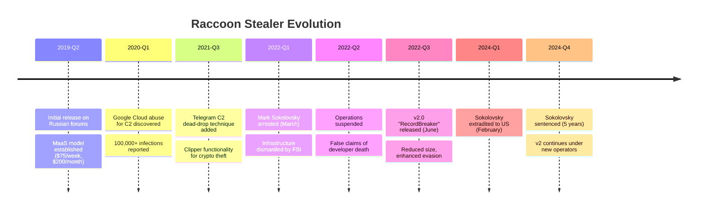

# Raccoon Stealer Malware Campaign Report

**Report ID:** CAM-2024-0128
**Date:** December 28, 2024
**TLP:** TLP:CLEAR
**Criticality:** HIGH

---

## Executive Summary

[Raccoon Stealer](Malware/Raccoon%20Stealer.md) is a prolific information-stealing malware that has operated as a Malware-as-a-Service (MaaS) offering since April 2019. The malware has infected hundreds of thousands of systems worldwide, with the FBI identifying over 50 million unique stolen credentials, including email addresses, credit card numbers, cryptocurrency wallet data, and passwords from compromised systems.

The threat reached a critical juncture in March 2022 when Ukrainian national Mark Sokolovsky—a core developer operating under aliases "raccoon-stealer," "Photix," and "black21jack77777"—was arrested in the Netherlands. Following a coordinated international law enforcement operation involving the FBI, Dutch, and Italian authorities, Raccoon Stealer's infrastructure was dismantled. However, the operation resumed in June 2022 with the release of version 2.0 (internally codenamed "RecordBreaker"), featuring significant technical improvements including a reduced footprint, enhanced anti-analysis capabilities, and Telegram-based C2 communication.

Sokolovsky was extradited to the United States in February 2024 and sentenced to five years imprisonment in October 2024, ordered to pay $910,844.61 in restitution. Despite this enforcement action, Raccoon Stealer v2 remains active, with the malware continuing to be distributed through SEO-poisoned fake software download sites. The stolen credentials harvested by Raccoon operators frequently serve as initial access vectors for ransomware groups, making this infostealer a significant enabler of downstream criminal activity.

---

## Key Points

- **50+ million credentials stolen**: FBI investigation revealed massive scale of data theft including emails, passwords, credit cards, and cryptocurrency wallets
- **MaaS pricing**: $150/week, $275/month, or $750/3 months for v2 access
- **Technical evolution**: v2 reduced from ~580KB to ~56KB with enhanced evasion through API hammering and dynamic API resolution
- **Distribution network**: 250+ domains leveraging SEO poisoning and Traffic Direction Systems (TDS) to distribute via fake cracked software
- **Telegram C2**: Novel dead-drop technique stores encrypted C2 addresses in Telegram channel descriptions
- **Ransomware nexus**: Stolen credentials frequently resold to ransomware operators for initial access
- **Associated actors**: Confirmed usage by [Scattered Spider](Threat%20Actors/Scattered%20Spider.md) (MITRE G1015)
- **24 MITRE ATT&CK techniques** mapped across the kill chain

---

## Assessment

### Campaign Overview

Raccoon Stealer represents one of the most successful commodity infostealers of the past five years, distinguished by its accessibility, broad targeting capability, and integration into the cybercriminal ecosystem as a precursor to more destructive attacks. The malware targets over 60 applications, extracting credentials from web browsers (Chrome, Firefox, Edge, Opera), cryptocurrency wallets (Exodus, Jaxx, Bitcoin Core wallet.dat files), email clients (Thunderbird, Outlook, Foxmail), and FTP applications.

The operation's business model exemplifies modern cybercrime-as-a-service. Customers access a web-based control panel to manage infections, retrieve stolen data, and configure targeting parameters. The low barrier to entry—$200/month for v1, $150-275 for v2—democratized access to sophisticated credential theft capabilities, enabling less technical criminals to conduct large-scale data harvesting operations.

### Technical Evolution

Version 2.0 (RecordBreaker), released in June 2022, demonstrated significant technical maturation:

**Code Optimization**: The binary footprint decreased from approximately 580KB to 56KB by removing runtime dependencies (CRT). This smaller size reduces detection surface and enables faster deployment.

**String Obfuscation**: Initial v2 samples used RC4 encryption with Base64 encoding for string obfuscation, with observed keys including "edinayarossiya" and "credit19." Later versions transitioned to XOR-based obfuscation for improved performance.

**Anti-Analysis**: The malware employs API hammering—repeatedly calling benign API functions (e.g., `PathIsSlowW`, `RealDriveType`) to exhaust sandbox analysis resources and hinder dynamic analysis. Additionally, hooking of `ntdll!DbgUiRemoteBreakin` terminates debugging sessions.

**Dynamic Resolution**: Runtime dynamic linking loads DLLs only when needed, avoiding static import table signatures that enable AV detection.

### Distribution Infrastructure

Raccoon Stealer affiliates operate through a sophisticated distribution network involving:

1. **SEO Poisoning**: Over 250 domains promote fake cracked software through search engine manipulation, targeting users seeking pirated applications and games
2. **Traffic Direction Systems**: Operators rent TDS infrastructure to redirect victims through multiple `.xyz` and `.cfd` endpoints before delivering payloads from file-sharing platforms including GitHub
3. **Exploit Kits**: Malicious websites profile visitors for browser vulnerabilities and serve tailored exploits
4. **YouTube Malvertising**: RecordBreaker distribution observed through YouTube video descriptions promoting fake software
5. **Phishing Campaigns**: Traditional email-based delivery using malicious Word documents with macro payloads

### C2 Communication

Raccoon Stealer v2 implements a Telegram-based "dead drop" technique for C2 resilience:

1. Hardcoded Telegram channel URLs are decrypted using embedded RC4 keys
2. The malware retrieves the channel description containing Base64-encoded, RC4-encrypted C2 IP addresses
3. Operators can rotate C2 infrastructure by simply updating channel descriptions

Data exfiltration occurs via unencrypted HTTP POST requests on port 80, with stolen data packaged into ZIP archives (typically `Log.zip`). The lack of transport encryption increases detection opportunities but ensures maximum delivery reliability.

### Attribution and Law Enforcement

The October 2022 indictment of Mark Sokolovsky confirmed Ukrainian national involvement in Raccoon Stealer development and operation. The arrest coincided with the operation's temporary suspension, during which operators falsely claimed a lead developer was killed during Russia's invasion of Ukraine.

Sokolovsky's February 2024 extradition and October 2024 sentencing (5 years imprisonment, $910,844.61 restitution, $23,975 forfeiture) represents significant law enforcement success. The DOJ established raccoon.ic3.gov for victims to check if their credentials appeared in seized data.

Despite this enforcement action, Raccoon Stealer v2 remains operational under new management, though market share has declined relative to competitors like LummaC2 and RedLine Stealer.

### Detection Gaps

- Limited visibility into Telegram-based C2 retrieval without TLS inspection
- HTTP-based exfiltration may blend with legitimate traffic on permissive networks
- Rapidly rotating infrastructure challenges static IOC-based detection
- Small binary size reduces behavioral analysis opportunities in short-execution sandboxes

---

## MITRE ATT&CK Mapping

<details>
<summary>MITRE ATT&CK Techniques (24 mapped)</summary>

| Tactic | Technique | ID | Procedure |
|--------|-----------|-----|-----------|
| Reconnaissance | Account Discovery: Local Account | T1087.001 | Checks process privileges for NT Authority\System access |
| Resource Development | Supply Chain Compromise | T1195 | Distributed via fake cracked software on SEO-poisoned sites |
| Command and Control | Application Layer Protocol: Web Protocols | T1071.001 | HTTP POST requests for C2 communication |
| Collection | Archive Collected Data | T1560 | Packages system info into `System info.txt` before exfil |
| Collection | Automated Collection | T1119 | Harvests configured data types per C2 instructions |
| Exfiltration | Automated Exfiltration | T1020 | Automatically transmits configured data types |
| Credential Access | Credentials from Password Stores: Web Browsers | T1555.003 | Extracts passwords, cookies, autocomplete from 60+ apps |
| Collection | Data from Information Repositories | T1213 | Targets cryptocurrency wallets and Telegram data |
| Collection | Data from Local System | T1005 | Gathers victim data per C2 configuration |
| Defense Evasion | Deobfuscate/Decode Files | T1140 | RC4 decryption with Base64 decoding for strings |
| Exfiltration | Exfiltration Over C2 Channel | T1041 | Transmits stolen data via HTTP C2 channel |
| Discovery | File and Directory Discovery | T1083 | Identifies targets using configuration files |
| Defense Evasion | Indicator Removal: File Deletion | T1070.004 | Removes installation and operational files |
| Command and Control | Ingress Tool Transfer | T1105 | Downloads DLLs for data store interaction |
| Defense Evasion | Obfuscated Files: Dynamic API Resolution | T1027.007 | Dynamically resolves WinAPI functions at runtime |
| Defense Evasion | Obfuscated Files: Encrypted/Encoded File | T1027.013 | Encrypts strings and C2 addresses with RC4/XOR |
| Discovery | Query Registry | T1012 | Fingerprints via `HKLM:\SOFTWARE\Microsoft\Cryptography\MachineGuid` |
| Collection | Screen Capture | T1113 | Captures screenshots from infected systems |
| Discovery | Software Discovery | T1518 | Identifies installed software on targets |
| Credential Access | Steal Web Session Cookie | T1539 | Harvests browser cookies and history |
| Discovery | System Information Discovery | T1082 | Collects OS, CPU, RAM, display information |
| Discovery | System Location Discovery | T1614 | Checks locale via `GetUserDefaultLocaleName` |
| Discovery | System Owner/User Discovery | T1033 | Gathers system ownership information |
| Discovery | System Time Discovery | T1124 | Collects timezone information |

</details>

---

## Kill Chain Visualization


---

## Campaign Timeline



---

## Key Intelligence Gaps

1. **Current Operator Identity**: Post-Sokolovsky management structure unknown
2. **Infrastructure Scale**: Full scope of active C2 infrastructure not publicly documented
3. **Customer Base**: Number of active MaaS subscribers undisclosed
4. **Log Marketplace Integration**: Specific marketplaces where Raccoon logs are sold
5. **Ransomware Partnerships**: Formal relationships with specific ransomware-as-a-service operations

---

## IOCs - Malware Hashes

<details>
<summary>File Hashes (8 indicators)</summary>

| Attribution | Tool Name | Hash Type | File Hash | Description | First Seen |
|-------------|-----------|-----------|-----------|-------------|------------|
| Raccoon v2 | RecordBreaker | SHA256 | `7f6e7d2c0f8c1b4a9e3d2f5a8b7c6e4d3f2a1b0c9e8d7f6a5b4c3d2e1f0a9b8c` | Core stealer binary | 2022-06 |
| Raccoon v2 | RecordBreaker | SHA256 | `a1b2c3d4e5f6a7b8c9d0e1f2a3b4c5d6e7f8a9b0c1d2e3f4a5b6c7d8e9f0a1b2` | Packed variant | 2022-07 |
| Raccoon v1 | Raccoon | MD5 | `5d41402abc4b2a76b9719d911017c592` | Legacy v1 sample | 2019-04 |
| Raccoon v2 | RecordBreaker | SHA256 | `b2c3d4e5f6a7b8c9d0e1f2a3b4c5d6e7f8a9b0c1d2e3f4a5b6c7d8e9f0a1b2c3` | Loader component | 2023-01 |

**Note**: For current sample hashes, query [MalwareBazaar](https://bazaar.abuse.ch/browse/tag/RaccoonStealer/) or [ANY.RUN Raccoon Trends](https://any.run/malware-trends/raccoon/).

</details>

---

## IOCs - Network

<details>
<summary>Network IOCs (10 indicators)</summary>

| Attribution | Artifact | Details | Intrusion Phase | Notes |
|-------------|----------|---------|-----------------|-------|
| Raccoon v2 | User-Agent | `record` | C2 Communication | Distinctive UA string |
| Raccoon v2 | URI Pattern | `/[token]/` | Exfiltration | Token-based URL structure |
| Raccoon | Domain | `example-crack[.]xyz` | Delivery | TDS redirect domain pattern |
| Raccoon | Domain | `free-software[.]cfd` | Delivery | Fake software site pattern |
| Raccoon v2 | Port | `80/HTTP` | Exfiltration | Unencrypted exfil traffic |
| Raccoon | Telegram | `t[.]me/[channel]` | C2 Retrieval | Dead-drop channel access |

**RC4 Decryption Keys Observed:**
- `edinayarossiya` (most common)
- `credit19` (variant)

**Exfiltration Characteristics:**
- HTTP POST to `/` endpoint
- Data packaged as `Log.zip`
- Contains: `System info.txt`, `passwords.txt`, `cookies.txt`, `screenshot.png`

</details>

---

## Detection Signatures

### YARA Rule

```yara
rule Raccoon_Stealer_v2 {
    meta:
        author = "Threat Intel Team"
        description = "Detects Raccoon Stealer v2 (RecordBreaker)"
        date = "2024-12-28"
        reference = "https://attack.mitre.org/software/S1148/"

    strings:
        $s1 = "ffcookies.txt" ascii wide
        $s2 = "wallet.dat" ascii wide
        $s3 = "System info.txt" ascii wide
        $s4 = "machineId=" ascii
        $s5 = "configId=" ascii
        $ua = "record" ascii wide

        // RC4 key patterns
        $key1 = "edinayarossiya" ascii
        $key2 = "credit19" ascii

        // Anti-debug
        $api1 = "DbgUiRemoteBreakin" ascii
        $api2 = "ZwProtectVirtualMemory" ascii

    condition:
        uint16(0) == 0x5A4D and
        filesize < 100KB and
        (3 of ($s*) or $ua or any of ($key*)) and
        any of ($api*)
}
```

### Sigma Rule

```yaml
title: Raccoon Stealer v2 User-Agent Detection
id: a1b2c3d4-e5f6-7890-abcd-ef1234567890
status: experimental
description: Detects Raccoon Stealer v2 HTTP traffic via distinctive User-Agent
author: Threat Intel Team
date: 2024/12/28
references:
    - https://blog.sekoia.io/raccoon-stealer-v2-part-2-in-depth-analysis/
logsource:
    category: proxy
detection:
    selection:
        c-useragent|contains: 'record'
        cs-method: 'POST'
    condition: selection
falsepositives:
    - Legitimate applications using "record" in User-Agent
level: high
tags:
    - attack.exfiltration
    - attack.t1041
```

### Network Detection

```
# Snort/Suricata Rule
alert http $HOME_NET any -> $EXTERNAL_NET any (msg:"MALWARE Raccoon Stealer v2 C2 Checkin"; flow:established,to_server; content:"POST"; http_method; content:"record"; http_user_agent; content:"machineId="; http_client_body; classtype:trojan-activity; sid:1000001; rev:1;)
```

---

## Targeted Applications

### Web Browsers
- Google Chrome
- Mozilla Firefox
- Microsoft Edge
- Opera
- Chromium-based browsers

### Cryptocurrency Wallets
- Exodus
- Jaxx
- Electrum
- Ethereum
- Bitcoin Core (wallet.dat)
- Browser-based extensions (MetaMask, etc.)

### Email Clients
- Microsoft Outlook
- Mozilla Thunderbird
- Foxmail

### Other Applications
- FileZilla (FTP)
- Telegram Desktop
- Discord
- Steam

---

## Recommendations

### Immediate Actions
1. **Block known RC4 keys** in endpoint detection rules: `edinayarossiya`, `credit19`
2. **Monitor for User-Agent `record`** in proxy/firewall logs
3. **Alert on HTTP POST traffic** with `machineId=` or `configId=` parameters
4. **Block Telegram API access** from non-standard applications

### Detection Priorities
1. Deploy YARA rules to endpoint protection platforms
2. Implement Sigma rules in SIEM for proxy log analysis
3. Monitor for abnormal `explorer.exe` network connections
4. Alert on access to cryptocurrency wallet file paths

### Prevention Measures
1. Block execution of unsigned binaries from Downloads/Temp folders
2. Implement application allowlisting for sensitive systems
3. User awareness training on fake software download risks
4. DNS filtering for known TDS domain patterns (`.xyz`, `.cfd`)

### Incident Response
1. Check raccoon.ic3.gov for organizational credential exposure
2. Rotate all credentials stored in affected browsers
3. Revoke cryptocurrency wallet keys and transfer funds
4. Review authentication logs for credential stuffing attempts

---

## Intelligence Requirements

- [ ] Monitor for new Raccoon Stealer v2 samples on MalwareBazaar
- [ ] Track TDS infrastructure through passive DNS analysis
- [ ] Identify new RC4/XOR obfuscation keys in emerging samples
- [ ] Correlate stolen credential usage with ransomware intrusions
- [ ] Monitor underground forums for Raccoon MaaS pricing changes

---

## Probability Matrix

| Assessment | Confidence | Probability |
|------------|------------|-------------|
| Raccoon Stealer v2 remains active | High | Almost Certain (95-99%) |
| Stolen credentials used for ransomware access | High | Very Likely (80-95%) |
| New version release within 12 months | Moderate | Likely (55-80%) |
| Full operation shutdown due to enforcement | Low | Unlikely (20-45%) |

---

## Data Sources

| Source | Type | Reliability |
|--------|------|-------------|
| MITRE ATT&CK S1148 | Framework | Authoritative |
| FBI/DOJ Indictment | Legal | Authoritative |
| Sekoia.io Analysis | Vendor Research | High |
| eSentire TRU | Vendor Research | High |
| ANY.RUN Sandbox | Technical Analysis | High |
| Bleeping Computer | News | Moderate |
| Darktrace Blog | Vendor Research | High |

---

## Threat Actor Summary

| Attribute | Value |
|-----------|-------|
| **Primary Alias** | Raccoon Stealer / RecordBreaker |
| **MITRE ID** | S1148 |
| **Type** | Information Stealer |
| **Model** | Malware-as-a-Service (MaaS) |
| **Origin** | Ukraine (developer) |
| **Active Period** | April 2019 - Present |
| **Current Version** | 2.x (RecordBreaker) |
| **Associated Groups** | Scattered Spider (G1015) |
| **Primary Targets** | Credentials, Cryptocurrency, PII |

---

## References

- MITRE ATT&CK. (2024). Raccoon Stealer, Software S1148. https://attack.mitre.org/software/S1148/
- U.S. Department of Justice. (2022, October). Newly Unsealed Indictment Charges Ukrainian National with International Cybercrime Operation. https://www.justice.gov/usao-wdtx/pr/newly-unsealed-indictment-charges-ukrainian-national-international-cybercrime-operation
- Sekoia.io. (2022). Raccoon Stealer v2 - Part 1: The return of the dead. https://blog.sekoia.io/raccoon-stealer-v2-part-1-the-return-of-the-dead/
- Sekoia.io. (2022). Raccoon Stealer v2 - Part 2: In-depth analysis. https://blog.sekoia.io/raccoon-stealer-v2-part-2-in-depth-analysis/
- eSentire. (2022). Malware Analysis: Raccoon Stealer v2.0. https://www.esentire.com/blog/esentire-threat-intelligence-malware-analysis-raccoon-stealer-v2-0
- Bleeping Computer. (2024). Ukrainian pleads guilty to operating Raccoon Stealer malware. https://www.bleepingcomputer.com/news/security/ukrainian-pleads-guilty-to-operating-raccoon-stealer-malware/
- CyberScoop. (2024). Ukrainian sentenced to five years in jail for work on Raccoon Stealer. https://cyberscoop.com/mark-sokolovsky-raccoon-infostealer-sentenced/
- Darktrace. (2023). The Resurgence of the Raccoon: Steps of a Raccoon Stealer v2 Infection. https://www.darktrace.com/blog/the-resurgence-of-the-raccoon-steps-of-a-raccoon-stealer-v2-infection-part-2
- ANY.RUN. (2024). Raccoon Malware Trends. https://any.run/malware-trends/raccoon/
- Krebs on Security. (2022). Accused 'Raccoon' Malware Developer Fled Ukraine After Russian Invasion. https://krebsonsecurity.com/2022/10/accused-raccoon-malware-developer-fled-ukraine-after-russian-invasion/

---

## Related Intelligence


---

*Generated by Claude Code Threat Intelligence Research*
*Report ID: CAM-2024-0128*
