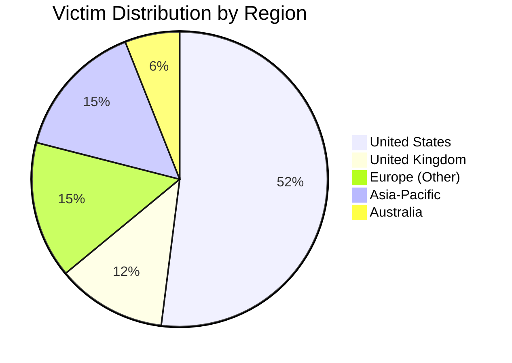
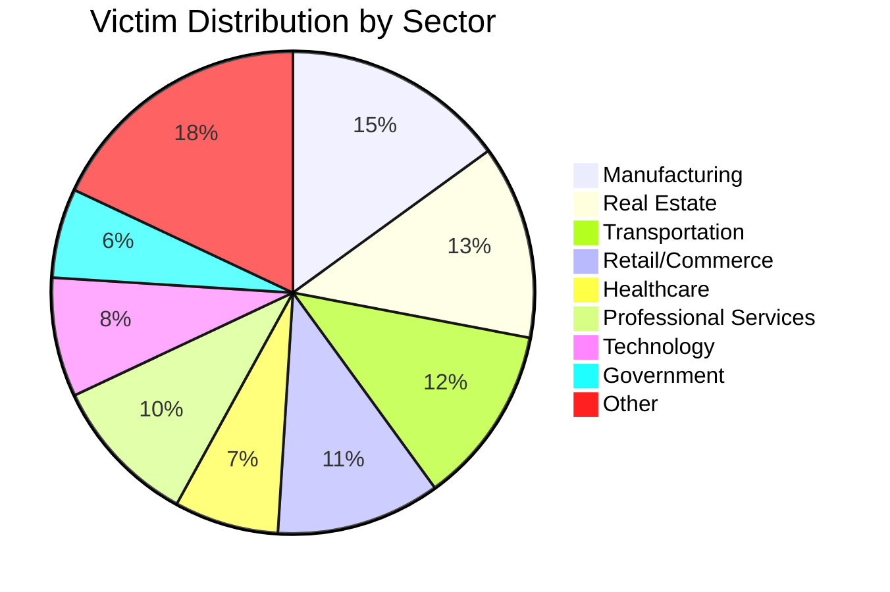
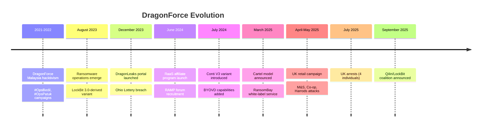

# DragonForce Ransomware Group - Threat Actor Profile

**Report ID:** CTID-047-2025
**Report Date:** December 27, 2025
**TLP:** TLP:CLEAR
**Criticality:** HIGH
**Confidence:** HIGH

---

## Executive Summary

[DragonForce](Threat%20Actors/DragonForce.md) is a Ransomware-as-a-Service (RaaS) operation that emerged in August 2023 and has evolved into one of the most significant ransomware threats of 2025. Originally associated with a Malaysian hacktivist collective, the group transformed from politically motivated operations to a profit-driven ransomware cartel.

DragonForce gained significant prominence following high-profile attacks against UK retailers including Marks & Spencer, Co-op, and Harrods in April-May 2025, causing over $600 million in combined financial losses. The group operates a sophisticated affiliate program offering 80% revenue share and has pioneered a "white-label" cartel model through their RansomBay service, allowing affiliates to create custom-branded ransomware operations.

Their collaboration with [Scattered Spider](Threat%20Actors/Scattered%20Spider.md) (UNC3944) has resulted in devastating attacks combining elite social engineering capabilities with robust ransomware infrastructure. We assess with high confidence that DragonForce will continue expanding operations throughout 2026, particularly through their newly announced coalition with Qilin and LockBit.

---

## Key Points

- **Active Threat:** DragonForce has claimed 170+ victims since August 2023, with attacks accelerating in 2025
- **Cartel Model:** Launched RansomBay white-label service in March 2025, enabling affiliates to operate custom-branded ransomware operations
- **High-Impact Operations:** UK retail campaign (M&S, Co-op, Harrods) caused $600M+ in damages and 46-day operational disruption
- **Scattered Spider Alliance:** Functions as ransomware provider for Scattered Spider social engineering attacks
- **Technical Evolution:** Operates both LockBit 3.0-derived and Conti V3-derived ransomware variants with BYOVD capabilities
- **Coalition Expansion:** Announced partnership with Qilin and LockBit in September 2025

---

## Threat Actor Summary

| Attribute | Details |
|-----------|---------|
| **Primary Name** | DragonForce |
| **Aliases** | DragonForce Ransomware, DragonForce Cartel |
| **First Observed** | August 2023 |
| **Suspected Origin** | Malaysia (hacktivist origin); international operations with Russian infrastructure ties |
| **Actor Type** | Ransomware-as-a-Service (RaaS) Operator / Cartel |
| **Motivation** | Financial |
| **Sponsorship** | None (Criminal) |
| **Status** | ACTIVE |

### Known Affiliations

| Entity | Relationship | Confidence |
|--------|--------------|------------|
| Scattered Spider (UNC3944) | Affiliate / Initial Access Broker | HIGH |
| RansomHub | Absorbed affiliates after April 2025 shutdown | HIGH |
| Qilin | Coalition partner (September 2025) | MODERATE |
| LockBit | Coalition partner (September 2025) | MODERATE |
| The Com | Overlapping membership | MODERATE |

---

## Assessment

DragonForce represents a sophisticated evolution in ransomware operations, combining proven criminal methodologies with innovative business models. The group's trajectory from Malaysian hacktivism to a multinational ransomware cartel demonstrates calculated strategic planning and operational discipline.

### Operational Maturity

DragonForce exhibits high operational maturity across multiple dimensions. Their affiliate program, launched in June 2024, provides comprehensive infrastructure including dedicated .onion control panels, configurable encryption parameters, multi-platform support (Windows, Linux, ESXi, NAS), and technical support services. The 80/20 revenue split (affiliate/operator) remains competitive within the RaaS ecosystem, attracting experienced affiliates from disbanded operations.

The March 2025 introduction of the "ransomware cartel" model represents a significant innovation. Through RansomBay, affiliates can operate under custom branding with personalized ransom notes, file extensions, and dedicated leak sites. This attribution obfuscation capability complicates incident response and threat intelligence efforts while lowering barriers to entry for new cybercriminals.

### Technical Capabilities

DragonForce operates two distinct ransomware variants. The original variant, deployed from August 2023, derives from the leaked LockBit 3.0 (Black) builder and provides standard encryption capabilities. In July 2024, the group introduced a second variant based on the Conti V3 codebase, featuring enhanced anti-analysis techniques, BYOVD (Bring Your Own Vulnerable Driver) capabilities for EDR bypass, and ChaCha8 encryption.

The BYOVD technique, which deploys legitimate but vulnerable kernel drivers to terminate security software, demonstrates sophisticated understanding of endpoint protection mechanisms. Known vulnerable drivers include RogueKiller Anti-Rootkit Driver, enabling systematic neutralization of security tools before encryption.

### Strategic Partnerships

The Scattered Spider collaboration represents DragonForce's most significant operational partnership. Scattered Spider provides elite social engineering capabilities and help desk manipulation techniques for initial access, while DragonForce supplies ransomware infrastructure and handles extortion operations. This division of labor enabled the devastating UK retail campaign, where Scattered Spider's access through a third-party supplier (TCS) led to DragonForce ransomware deployment across Marks & Spencer's VMware ESXi environment.

The September 2025 coalition announcement with Qilin and LockBit signals ambition to create a dominant force within the ransomware ecosystem. While operational details remain unclear, this alliance likely facilitates affiliate sharing, infrastructure pooling, and coordinated pressure on victims.

### Targeting Evolution

Initial DragonForce operations targeted manufacturing, real estate, and transportation sectors opportunistically. The 2025 pivot toward retail represents strategic targeting of organizations with high revenue, significant operational technology dependencies, and time-sensitive business operations. Retail organizations now comprise 11% of victims, up from 6% in 2022-2023.

We assess with moderate confidence that DragonForce will continue targeting sectors with:
- High public visibility (reputation pressure)
- Complex supply chain dependencies (third-party access vectors)
- Time-sensitive operations (payment pressure)
- Limited security maturity relative to value

---

## TTPs Narrative

DragonForce operations follow a consistent kill chain pattern refined through collaboration with skilled initial access brokers.

**Initial Access** typically occurs through compromised valid accounts obtained via phishing, credential stuffing, or third-party compromise. The UK retail campaign demonstrated supply chain compromise through the TCS managed service provider relationship. DragonForce affiliates also exploit internet-facing vulnerabilities, with documented exploitation of Log4Shell ([CVE-2021-44228](Vulnerabilities/CVE-2021-44228.md)), Ivanti Connect Secure vulnerabilities ([CVE-2023-46805](Vulnerabilities/CVE-2023-46805.md), [CVE-2024-21887](Vulnerabilities/CVE-2024-21887.md)), and SimpleHelp RMM flaws.

**Persistence** is established through [SystemBC](Malware/SystemBC.md) backdoors and abuse of legitimate remote access tools, particularly AnyDesk. Registry modifications and scheduled tasks provide additional persistence mechanisms.

**Privilege Escalation** leverages [Mimikatz](Malware/Mimikatz.md) for credential harvesting from LSASS memory, with NTDS.dit extraction enabling domain-wide compromise. Access token manipulation achieves SYSTEM privileges on individual hosts.

**Defense Evasion** represents a core DragonForce capability. The BYOVD technique deploys vulnerable kernel drivers to terminate EDR/XDR processes before encryption. Windows Event Log clearing removes forensic evidence, while payload obfuscation impedes static analysis.

**Lateral Movement** occurs primarily through RDP and SMB, facilitated by harvested credentials. [Cobalt Strike](Malware/Cobalt%20Strike.md) beacons enable C2-directed movement, while legitimate RMM tools (SimpleHelp) provide additional capabilities.

**Impact** involves AES-256 or ChaCha8 file encryption (variant-dependent), Volume Shadow Copy deletion preventing local recovery, and ransom note deployment. The `.dragonforce_encrypted` extension marks affected files.

---

## Infrastructure

### Command and Control

DragonForce maintains C2 infrastructure across multiple geographic regions. Early campaign analysis identified infrastructure in Iran, suggesting international hosting for operational security.

**Known C2 Addresses (Defanged):**
- `2[.]147[.]68[.]96`
- `185[.]59[.]221[.]75`
- `69[.]4[.]234[.]20`

### Data Leak Sites

DragonForce operates the "DragonLeaks" portal for victim shaming and extortion leverage. Countdown timers precede data publication, with negotiation portals integrated for ransom discussions.

Tor Hidden Services (5 addresses)

| Address | Purpose |
|---------|---------|
| `3pktcrcbmssvrnwe5skburdwe2h3v6ibdnn5kbjqihsg6eu6s6b7ryqd[.]onion` | Primary leak site |
| `rrrbay3nf4c2wxmhprc6eotjlpqkeowfuobodic4x4nzqtosx3ebirid[.]onion` | RansomBay portal |
| `rrrbayguhgtgxrdg5myxkdc2cxei25u6brknfqkl3a35nse7f2arblyd[.]onion` | Alternate RansomBay |
| `rrrbaygxp3f2qtgvfqk6ffhdrm24ucxvbr6mhxsga4faefqyd77w7tqd[.]onion` | Alternate RansomBay |
| `z3wqggtxft7id3ibr7srivv5gjof5fwg76slewnzwwakjuf3nlhukdid[.]onion` | Negotiation portal |

---

## Victims

### Geographic Distribution

### Sector Targeting

### Notable Victims

| Organization | Date | Sector | Impact |
|--------------|------|--------|--------|
| Marks & Spencer | April 2025 | Retail | 46-day online suspension; ~$380M profit impact |
| Co-op | May 2025 | Retail | 6.5M member records; ~$260M lost sales |
| Harrods | May 2025 | Retail | Contained with minimal impact |
| Ohio State Lottery | December 2023 | Government | 600+ GB data exfiltrated |
| Coca-Cola Singapore | 2024 | Consumer Goods | Data breach |
| Yakult Australia | 2024 | Consumer Goods | Data breach |
| Government of Palau | 2024 | Government | Systems compromised |

**Total Claimed Victims:** 170+ organizations

---

## Attribution

### Assessment

We assess with **HIGH confidence** that DragonForce operates as an organized cybercriminal group primarily motivated by financial gain. While historical connections to DragonForce Malaysia hacktivism exist, the ransomware operation has publicly stated goals incompatible with hacktivist ideology.

### Evidence

| Factor | Observation | Weight |
|--------|-------------|--------|
| **Operational Consistency** | Consistent TTPs across 170+ victims | Strong |
| **Infrastructure** | Dedicated, maintained leak sites and C2 | Strong |
| **Business Model** | Structured RaaS with 80/20 split | Strong |
| **Tool Development** | Multiple ransomware variants with ongoing development | Moderate |
| **Scattered Spider Link** | Confirmed by CISA, FBI, Mandiant | Strong |

### Alternative Hypotheses

| Hypothesis | Assessment | Rationale |
|------------|------------|-----------|
| Malaysian State Nexus | Unlikely | DragonForce Malaysia denied involvement; stated objectives differ |
| Russian State Nexus | Low-Moderate Confidence | Allegations from RansomHub; infrastructure ties; CIS targeting restrictions |
| Pure Cybercrime | High Confidence | Behavior consistent with financially motivated ransomware operators |

---

## Key Intelligence Gaps

| Gap Area | Priority | Impact |
|----------|----------|--------|
| Leadership identity and structure | HIGH | Attribution and disruption opportunities |
| Coalition operational details (Qilin/LockBit) | HIGH | Predictive intelligence for future operations |
| True DragonForce Malaysia relationship | MEDIUM | Attribution clarity |
| Total affiliate count | MEDIUM | Threat scope assessment |
| Russian/FSB connection specifics | MEDIUM | Geopolitical context |
| Financial intelligence (wallets, payments) | MEDIUM | Disruption opportunities |

---

## MITRE ATT&CK Mapping

MITRE ATT&CK Techniques (23 techniques)

| Tactic | Technique | ID | Procedure |
|--------|-----------|-----|-----------|
| Initial Access | Valid Accounts | T1078 | Compromised credentials from phishing, credential stuffing |
| Initial Access | External Remote Services | T1133 | RDP/VPN exploitation |
| Initial Access | Exploit Public-Facing Application | T1190 | Log4Shell, Ivanti CVEs, SimpleHelp vulnerabilities |
| Initial Access | Phishing | T1566 | Spear-phishing for credential theft |
| Initial Access | Trusted Relationship | T1199 | Third-party/MSP compromise (TCS in UK retail campaign) |
| Execution | PowerShell | T1059.001 | Encoded commands for payload execution |
| Execution | Ingress Tool Transfer | T1105 | Ransomware and tool deployment |
| Persistence | Valid Accounts | T1078 | Maintained access via compromised credentials |
| Persistence | Create or Modify System Process | T1543 | Service installation for SystemBC |
| Persistence | Boot or Logon Autostart Execution | T1547 | Registry keys, Startup folder |
| Privilege Escalation | Access Token Manipulation | T1134 | Token impersonation for SYSTEM |
| Privilege Escalation | Exploitation for Privilege Escalation | T1068 | Vulnerable driver exploitation |
| Defense Evasion | Indicator Removal | T1070 | Windows Event Log clearing |
| Defense Evasion | Impair Defenses | T1562 | BYOVD to disable EDR/AV |
| Defense Evasion | Obfuscated Files or Information | T1027 | Payload encryption/packing |
| Credential Access | OS Credential Dumping: LSASS Memory | T1003.001 | Mimikatz, procdump credential harvesting |
| Credential Access | OS Credential Dumping: NTDS | T1003.003 | Active Directory extraction |
| Discovery | File and Directory Discovery | T1083 | Pre-encryption enumeration |
| Discovery | Network Service Scanning | T1046 | SoftPerfect Network Scanner |
| Lateral Movement | Remote Desktop Protocol | T1021.001 | Primary lateral movement |
| Lateral Movement | SMB/Windows Admin Shares | T1021.002 | Network propagation |
| Impact | Data Encrypted for Impact | T1486 | AES-256/ChaCha8 encryption |
| Impact | Inhibit System Recovery | T1490 | Volume Shadow Copy deletion |

---

## Indicators of Compromise

### File Hashes (MD5)

Malware Hashes (12 indicators)

| Hash | Description |
|------|-------------|
| `cd54780ee2213a05468fa0d24eedd576` | DragonForce ransomware |
| `6c755a742f2b2e5c1820f57d0338365f` | DragonForce ransomware |
| `9a218d69ecafe65eae264d2fdb52f1aa` | DragonForce ransomware |
| `770c1dc157226638f8ad1ac9669f4883` | DragonForce ransomware |
| `91acae0fff5ecbf0b65c3ddebb5a824a` | DragonForce ransomware |
| `b97812a2e6be54e725defbab88357fa2` | DragonForce ransomware |
| `bbe65e9ef2fc18f40e1a56047f9e52a4` | DragonForce ransomware |
| `d44071f255785c73909d64f824331ebf` | DragonForce ransomware |
| `2dd7cd2bf15eec7d62689435fca9c49c` | DragonForce ransomware |
| `e4a4fc96188310b7b07e7c0525b5c0aa` | DragonForce ransomware |
| `15634dc79981e7fba25fb8530cedb981` | DragonForce ransomware |
| `4da3d898b4255e87bfd7bb998387cc4b` | DragonForce ransomware |

### Network Indicators

| Type | Indicator | Context |
|------|-----------|---------|
| IP | `2[.]147[.]68[.]96` | C2 server |
| IP | `185[.]59[.]221[.]75` | C2 server |
| IP | `69[.]4[.]234[.]20` | C2 server |

### File System Indicators

| Type | Value |
|------|-------|
| Encrypted File Extension | `.dragonforce_encrypted` |
| Ransom Note | `README.txt` |
| Filename Encoding | Base32 |

---

## CVEs Exploited

| CVE | Product | CVSS | Status |
|-----|---------|------|--------|
| CVE-2021-44228 | Apache Log4j | 10.0 | Patched |
| CVE-2023-46805 | Ivanti Connect Secure | 8.2 | Patched |
| CVE-2024-21887 | Ivanti Connect Secure | 9.1 | Patched |
| CVE-2024-21412 | Microsoft Windows SmartScreen | 8.1 | Patched |
| CVE-2024-57727 | SimpleHelp RMM | 9.8 | Patched |
| CVE-2024-57726 | SimpleHelp RMM | 9.8 | Patched |

---

## Timeline

---

## Probability Matrix

| Term | Probability Range |
|------|-------------------|
| Almost Certainly | 95-99% |
| Very Likely | 80-95% |
| Likely | 55-80% |
| Roughly Even Chance | 45-55% |
| Unlikely | 20-45% |
| Very Unlikely | 5-20% |
| Almost Certainly Not | 1-5% |

---

## Intelligence Requirements

1. What is the operational structure of the Qilin/LockBit/DragonForce coalition?
2. Who are the core operators behind DragonForce?
3. What is the true nature of alleged Russian/FSB connections?
4. Which sectors will DragonForce prioritize in 2026?
5. How many affiliates currently operate under the DragonForce umbrella?

---

## Recommendations

### Immediate Actions (0-30 days)

1. Ingest DragonForce IOCs into security monitoring platforms
2. Audit and secure RMM tool deployments (AnyDesk, SimpleHelp)
3. Review and strengthen help desk verification procedures
4. Validate backup integrity and test offline recovery capabilities
5. Patch Ivanti, SimpleHelp, and Log4j vulnerabilities

### Short-Term Actions (30-90 days)

1. Deploy BYOVD mitigations (vulnerable driver blocklists)
2. Conduct threat hunt for DragonForce TTPs in environment
3. Implement network segmentation to limit lateral movement
4. Review and monitor third-party/MSP access and security posture
5. Deploy phishing-resistant MFA across the enterprise

### Medium-Term Actions (90+ days)

1. Conduct ransomware tabletop exercises
2. Establish or update incident response retainers
3. Implement comprehensive DLP solutions
4. Review cyber insurance coverage and exclusions

---

## Data Sources

| Source | Type | Reliability |
|--------|------|-------------|
| CISA | Government Advisory | A - Reliable |
| Mandiant/GTIG | Vendor Intelligence | A - Reliable |
| CrowdStrike | Vendor Intelligence | A - Reliable |
| Trend Micro | Vendor Intelligence | A - Reliable |
| SentinelOne | Vendor Intelligence | A - Reliable |
| Group-IB | Vendor Intelligence | B - Usually Reliable |
| Check Point | Vendor Intelligence | B - Usually Reliable |
| Sophos | Vendor Intelligence | B - Usually Reliable |
| BleepingComputer | Media | B - Usually Reliable |
| The Record | Media | B - Usually Reliable |

---

## References

Check Point. (2025). *DragonForce ransomware: Redefining hybrid extortion in 2025*. Check Point Blog. https://blog.checkpoint.com/security/dragonforce-ransomware-redefining-hybrid-extortion-in-2025/

CISA. (2023). *Scattered Spider advisory (AA23-320A)*. Cybersecurity and Infrastructure Security Agency. https://www.cisa.gov/news-events/cybersecurity-advisories/aa23-320a

CISA. (2025). *Updated advisory on Scattered Spider group*. Cybersecurity and Infrastructure Security Agency. https://www.cisa.gov/news-events/alerts/2025/07/29/cisa-and-partners-release-updated-advisory-scattered-spider-group

Cyble. (2025). *DragonForce ransomware group threat actor profile*. Cyble. https://cyble.com/threat-actor-profiles/dragonforce-ransomware-group/

Group-IB. (2024). *DragonForce ransomware group analysis*. Group-IB Blog. https://www.group-ib.com/blog/dragonforce-ransomware/

Resecurity. (2024). *DragonForce ransomware reverse engineering report*. Resecurity Blog. https://www.resecurity.com/blog/article/dragonforce-ransomware-reverse-engineering-report

SentinelOne. (2025). *DragonForce ransomware gang: From hacktivists to high street extortionists*. SentinelOne Blog. https://www.sentinelone.com/blog/dragonforce-ransomware-gang-from-hacktivists-to-high-street-extortionists/

Sophos. (2025). *DragonForce targets rivals in a play for dominance*. Sophos News. https://news.sophos.com/en-us/2025/05/21/dragonforce-targets-rivals-in-a-play-for-dominance/

Trend Micro. (2024). *Ransomware spotlight: DragonForce*. Trend Micro. https://www.trendmicro.com/vinfo/us/security/news/ransomware-spotlight/ransomware-spotlight-dragonforce

---

## Related Intelligence

---

**Report Version:** 1.0
**Prepared By:** Claude Code Threat Intelligence
**Classification:** TLP:CLEAR

*This threat intelligence report was compiled from open-source intelligence. Organizations should validate indicators against their own threat landscape and adjust defensive measures accordingly.*