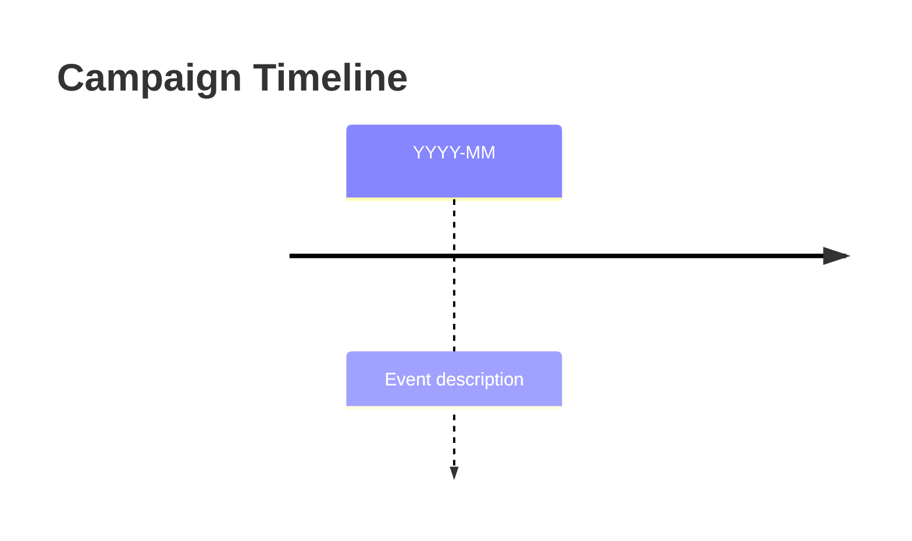
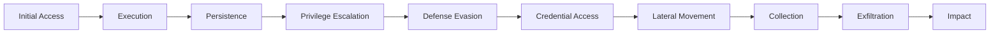

# {{title}}

## Overview

## Threat Actor

[Threat_Actor_Name](Threat%20Actors/Threat_Actor_Name.md)

## Timeline

## Targeted Sectors

- [Sector_Name](Sector_Name.md)

## Targeted Countries

- [Country_Name](Country_Name.md)

## Attack Chain

## TTPs

### Initial Access

### Execution

### Persistence

### Command and Control

## Malware Used

- [Malware_Name](Malware/Malware_Name.md)

## MITRE ATT&CK

| Tactic | Technique | Procedure |
|--------|-----------|-----------|
|        |           |           |

## IOCs

Network Indicators

| Type | Indicator | Context | First Seen |
|------|-----------|---------|------------|
|      |           |         |            |

File Indicators

| Hash Type | Hash | Filename | Description |
|-----------|------|----------|-------------|
|           |      |          |             |

## CVEs Exploited

| CVE | CVSS | Description |
|-----|------|-------------|
|     |      |             |

## Detection Signatures

### YARA

### Sigma

## Intelligence Gaps

-

## References

-

---

## Related Intelligence

