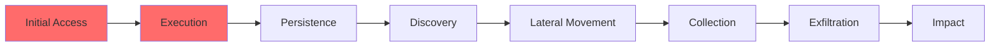

# {{title}}

## Executive Summary

## Incident Details

**Incident ID:**
**Target:** [Company_Name](Company_Name.md)
**Sector:** [Sector_Name](Sector_Name.md)
**Date Detected:**
**Attribution:** [Threat_Actor_Name](Threat%20Actors/Threat_Actor_Name.md)

## Timeline

```mermaid
timeline
    title Incident Timeline
    YYYY-MM-DD HH:MM : Event description
```

## Kill Chain Analysis



## Attack Vectors

- [Attack_Vector_Name](Attack_Vector_Name.md)

## Malware Identified

- [Malware_Name](Malware/Malware_Name.md)

## TTPs Observed

| Tactic | Technique | Evidence |
|--------|-----------|----------|
|        |           |          |

## TTPs Predicted (Based on Actor History)

| Tactic | Technique | Likelihood |
|--------|-----------|------------|
|        |           |            |

## IOCs

<details>
<summary>Network Indicators</summary>

| Type | Indicator | Context | Observed |
|------|-----------|---------|----------|
|      |           |         |          |

</details>

<details>
<summary>Host Indicators</summary>

| Type | Indicator | Context |
|------|-----------|---------|
|      |           |         |

</details>

## Hunting Guidance

### Log Sources

### Detection Queries

## Alternative Attribution

| Threat Actor | Confidence | Rationale |
|--------------|------------|-----------|
|              |            |           |

## Impact Assessment

## Recommendations

### Immediate Actions

1.

### Short-term Actions

1.

### Long-term Actions

1.

## Intelligence Gaps

-

## References

-

---

## Related Intelligence


