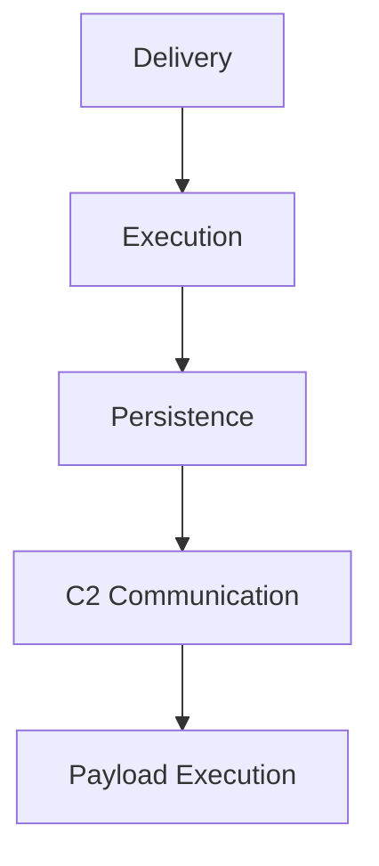

# {{title}}

## Overview

## Classification

**Type:**
**Family:**
**Platform:**

## Associated Threat Actors

- [Threat_Actor_Name](Threat%20Actors/Threat_Actor_Name.md)

## Capabilities

-

## Technical Analysis

### Execution Flow



### Persistence Mechanisms

### C2 Communication

### Evasion Techniques

## MITRE ATT&CK

| Tactic | Technique | Procedure |
|--------|-----------|-----------|
|        |           |           |

## IOCs

<details>
<summary>File Indicators</summary>

| Hash Type | Hash | Filename | Description |
|-----------|------|----------|-------------|
| MD5       |      |          |             |
| SHA1      |      |          |             |
| SHA256    |      |          |             |

</details>

<details>
<summary>Network Indicators</summary>

| Type | Indicator | Context |
|------|-----------|---------|
|      |           |         |

</details>

## Detection

### YARA Rules

```yara
rule Malware_Name {
    meta:
        description = ""
        author = ""
        date = ""
    strings:
        $s1 = ""
    condition:
        any of them
}
```

### Sigma Rules

## Campaigns

- [Campaign_Name](Campaigns/Campaign_Name.md)

## References

-

---

## Related Intelligence


