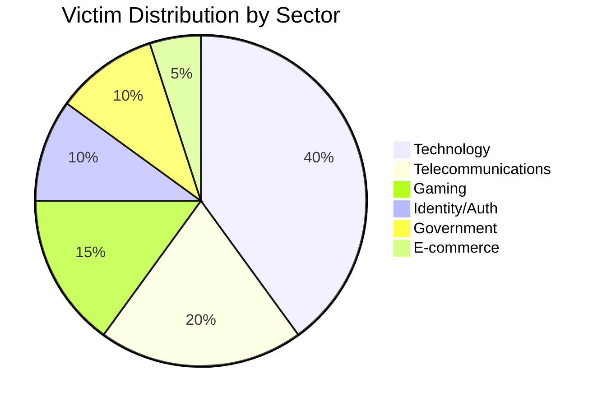
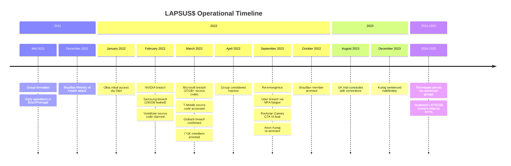

# LAPSUS$ - Threat Actor Profile

| **Report ID** | CTID-003-2025 |
|---------------|---------------|
| **Date** | 2025-12-27 |
| **TLP** | TLP:CLEAR |
| **Criticality** | MEDIUM |
| **Confidence** | HIGH |

---

## Executive Summary

[LAPSUS$](Threat%20Actors/LAPSUS%24.md) (also tracked as DEV-0537, Strawberry Tempest, Slippy Spider, Group G1004) was a transnational cybercriminal group primarily composed of teenagers aged 16-21 from the United Kingdom and Brazil. Active from mid-2021 through late 2022, the group specialized in large-scale social engineering, data theft, and extortion operations—notably without deploying ransomware.

LAPSUS$ achieved notoriety for successfully breaching some of the world's most prominent technology companies including Microsoft, NVIDIA, Samsung, Okta, Uber, and Rockstar Games. The group's attack methodology—combining SIM swapping, MFA fatigue attacks, insider recruitment, and help desk social engineering—exposed critical weaknesses in enterprise identity and access management systems that remain relevant today.

Core members were arrested in March 2022 and convicted in August 2023, with ringleader Arion Kurtaj (age 18) sentenced indefinitely to a secure hospital. Despite dismantlement of the original group, LAPSUS$ techniques and methodologies live on through successor collectives, most notably the 2025 "Scattered LAPSUS$ Hunters" supergroup alliance with [Scattered Spider](Threat%20Actors/Scattered%20Spider.md) and [ShinyHunters](Threat%20Actors/ShinyHunters.md).

---

## Key Points

- **HISTORICAL THREAT - LEGACY ACTIVE**: Original LAPSUS$ group dismantled following 2022-2023 arrests; techniques adopted by successor groups
- **JUVENILE OPERATORS**: Core members were teenagers who compromised major enterprises using low-cost, widely-available techniques
- **EXTORTION WITHOUT RANSOMWARE**: Focus on data theft and public leaking rather than encryption-based ransomware
- **MFA FATIGUE PIONEER**: Popularized prompt bombing attacks that overwhelm users with authentication requests
- **INSIDER RECRUITMENT**: Publicly advertised payments of $20,000/week for employee access credentials
- **SIM SWAP SPECIALISTS**: Leveraged telecom insider bribes to hijack victim phone numbers for MFA bypass

---

## Assessment

### Capabilities

LAPSUS$ demonstrated capabilities in three primary domains:

**Social Engineering at Scale**: The group combined multiple social engineering vectors including voice phishing (vishing) against IT help desks, MFA fatigue attacks (sending repeated push notifications until victims accept), and direct recruitment of corporate insiders. They publicly advertised on Telegram for employees willing to provide access credentials, offering substantial payments that attracted insider threats.

**Identity System Exploitation**: LAPSUS$ systematically targeted identity and access management (IAM) systems, particularly authentication providers like Okta. By compromising identity infrastructure, they gained access to multiple downstream victim organizations. Their understanding of enterprise IAM architectures enabled lateral movement across cloud and on-premises environments.

**Third-Party Supply Chain Compromise**: Several high-profile attacks leveraged third-party contractors and suppliers. The Okta breach originated through a compromised account at customer support contractor Sitel. This supply chain attack methodology amplified the group's reach beyond direct targeting.

### Significance

The CISA Cyber Safety Review Board conducted a comprehensive review of LAPSUS$ attacks, concluding that the group "employed low-cost techniques, well-known and available to other threat actors, revealing weak points in our cyber infrastructure that could be vulnerable to future attacks." The Board's findings emphasized that teenagers with relatively basic technical skills successfully compromised well-resourced enterprises, highlighting systemic weaknesses in:

1. SMS-based multi-factor authentication
2. IT help desk identity verification procedures
3. Third-party vendor access controls
4. Insider threat detection capabilities

### Evolution

| Period | Activity |
|--------|----------|
| Mid-2021 | Formation; early operations in Brazil and Portugal |
| December 2021 | Brazilian Ministry of Health attack (first major operation) |
| January 2022 | Initial access to Okta via Sitel contractor |
| February 2022 | NVIDIA breach; Samsung breach |
| March 2022 | Microsoft, T-Mobile, Vodafone, Globant attacks |
| March 2022 | Seven UK members arrested (ages 16-21) |
| April 2022 | Group considered inactive |
| September 2022 | Re-emergence: Uber and Rockstar Games breaches |
| September 2022 | Arion Kurtaj re-arrested |
| October 2022 | Brazilian member arrested in Bahia |
| August 2023 | UK trial concludes; convictions secured |
| December 2023 | Arion Kurtaj sentenced indefinitely to secure hospital |
| 2024-2025 | Techniques persist via Scattered LAPSUS$ Hunters alliance |

---

## Threat Actor Summary

| **Attribute** | **Details** |
|--------------|-------------|
| **Primary Names** | LAPSUS$, DEV-0537, Strawberry Tempest |
| **Other Aliases** | Slippy Spider (CrowdStrike), G1004 (MITRE) |
| **Origin** | United Kingdom, Brazil |
| **Suspected Affiliation** | Cybercriminal; loosely connected to "The Com" underground community |
| **Active Period** | Mid-2021 - September 2022 |
| **Current Status** | Inactive (core members arrested/convicted) |
| **Motivation** | Financial gain, notoriety, entertainment |
| **Target Industries** | Technology, Telecommunications, Gaming, Identity/Authentication, Government, E-commerce |
| **Target Regions** | Global (primary: US, UK, Latin America) |

### Known Members

| Name | Details | Status |
|------|---------|--------|
| Arion Kurtaj | UK, age 16-18 at time of attacks; group ringleader | Convicted August 2023; sentenced indefinitely to secure hospital (unfit to stand trial) |
| Unknown 17-year-old | UK; charged alongside Kurtaj | Convicted August 2023 |
| Brazilian Affiliate | Arrested October 2022 in Feira de Santana, Bahia | Convicted (Operation Dark Cloud) |
| 5 Additional Members | UK; ages 16-21; arrested March 2022 | Various outcomes |

---

## TTPs Narrative

LAPSUS$ employed a distinctive attack methodology centered on identity compromise rather than technical exploitation:

### Initial Access

**SIM Swapping**: The group's signature technique involved bribing telecommunications employees (reportedly $20,000/week) to transfer victim phone numbers to attacker-controlled SIM cards. This enabled interception of SMS-based MFA codes and password reset messages.

**MFA Fatigue (Prompt Bombing)**: LAPSUS$ pioneered the technique of spamming users with repeated MFA push notifications—often at inconvenient times like late night—until victims accepted the authentication request out of frustration or confusion. This technique was later adopted broadly by Scattered Spider and other threat actors.

**Help Desk Social Engineering**: Group members called IT help desks, impersonating employees and requesting password resets or MFA re-enrollment. They prepared extensively with reconnaissance on employee details, organizational structure, and verification procedures.

**Insider Recruitment**: LAPSUS$ publicly posted recruitment advertisements on Telegram, web forums, and the dark web seeking employees at specific companies (particularly telecommunications providers AT&T, Verizon, T-Mobile) willing to provide credentials or perform actions for payment.

### Credential Access & Privilege Escalation

Once initial access was achieved, LAPSUS$ employed standard post-exploitation techniques:

- **Mimikatz** for credential dumping from memory
- **DCSync** attacks to extract credentials from domain controllers
- **NTDS.dit** extraction via ntdsutil
- **Redline Stealer** for harvesting saved passwords

### Collection & Exfiltration

The group systematically targeted:

- Source code repositories (GitHub, Azure DevOps, GitLab)
- Cloud storage and collaboration platforms
- Email systems (often configuring forwarding rules for persistence)
- Identity provider configurations

### Impact

Unlike ransomware groups, LAPSUS$ focused on:

- **Data theft and public leaking** on Telegram channels
- **Extortion demands** threatening to release sensitive data
- **Destructive actions** including deleting cloud resources and VMs
- **Reputational damage** through public announcements of compromises

---

## Infrastructure

LAPSUS$ maintained minimal persistent infrastructure, instead relying on:

- **NordVPN** and other commercial VPN services for anonymization
- **Virtual Private Servers (VPS)** for temporary operations
- **Telegram channels** for communication, victim announcements, and insider recruitment
- **Stolen credentials** purchased from underground forums and data brokers

The group's infrastructure-light approach made attribution and takedown more challenging.

---

## Victims

### Confirmed Victim Organizations

| Date | Organization | Sector | Impact |
|------|-------------|--------|--------|
| December 2021 | Brazilian Ministry of Health | Government | Systems compromised |
| January-March 2022 | Okta | Identity/Auth | 2.5% of customers exposed via Sitel contractor |
| February 2022 | NVIDIA | Technology | DLSS source code leaked; employee credentials stolen |
| February 2022 | Vodafone | Telecommunications | 200GB source code claimed |
| March 2022 | Samsung | Technology | 190GB data leaked (Galaxy device source code) |
| March 2022 | Mercado Libre | E-commerce | 300,000 customer records accessed |
| March 2022 | Ubisoft | Gaming | Security incident confirmed |
| March 2022 | T-Mobile | Telecommunications | Source code repositories accessed |
| March 2022 | Microsoft | Technology | 37GB+ source code (Bing, Cortana) leaked |
| March 2022 | Globant | Technology | Network breach confirmed |
| September 2022 | Uber | Technology | Full internal access via MFA fatigue |
| September 2022 | Rockstar Games | Gaming | GTA VI development footage leaked |

### Targeted Sectors



### Geographic Targeting

Primary focus on large multinational organizations, with attacks affecting:

- United States (Microsoft, NVIDIA, Uber, Okta, T-Mobile)
- South Korea (Samsung)
- France (Ubisoft)
- United Kingdom (Vodafone, BT, EE)
- Argentina (Mercado Libre, Globant)
- Brazil (Ministry of Health)

---

## Attribution

**Confidence Level**: HIGH

Attribution to LAPSUS$ is well-established based on:

1. **Law enforcement arrests and prosecutions** in the UK and Brazil
2. **Court convictions** of multiple members in August 2023
3. **Public claims** by the group on Telegram channels
4. **Victim confirmation** of breach details matching group claims
5. **Microsoft and Mandiant investigations** identifying DEV-0537/LAPSUS$

The group's composition as primarily UK and Brazilian teenagers aged 16-21 was confirmed through legal proceedings. Ringleader Arion Kurtaj reportedly accumulated approximately $14 million in Bitcoin from cybercriminal activities.

---

## Key Intelligence Gaps

| Gap | Priority | Collection Requirement |
|-----|----------|----------------------|
| Complete membership roster | Medium | Only 2 members publicly identified from court proceedings |
| Full financial infrastructure | Low | Bitcoin wallets and money laundering networks |
| Detailed insider network | Medium | Identities of bribed telecom employees |
| Pre-formation activities | Low | Connections to predecessor groups (Cyberteam, Recursion Team) |
| Current member activities | Medium | Whether any former members remain active in successor groups |

---

## MITRE ATT&CK Mapping

<details>
<summary>MITRE ATT&CK Techniques (22 techniques)</summary>

| Tactic | Technique | ID | Procedure |
|--------|-----------|-----|-----------|
| Reconnaissance | Gather Victim Identity Information | T1589 | Collected employee details for social engineering |
| Resource Development | Compromise Accounts | T1586.002 | Purchased stolen credentials from underground forums |
| Resource Development | Acquire Infrastructure: VPS | T1583.003 | Used virtual private servers for operations |
| Initial Access | External Remote Services | T1133 | Exploited VPN, RDP, and VDI access |
| Initial Access | Valid Accounts | T1078 | Used compromised employee credentials |
| Initial Access | Phishing: Spearphishing Voice | T1566.004 | Vishing calls to IT help desks |
| Initial Access | Phishing for Information: Spearphishing Voice | T1598.004 | Calling help desks to gather information |
| Persistence | Create Account: Cloud Account | T1136.003 | Created cloud accounts with admin privileges |
| Persistence | Account Manipulation: Additional Cloud Roles | T1098.003 | Assigned administrative roles to controlled accounts |
| Privilege Escalation | Exploitation for Privilege Escalation | T1068 | Exploited unpatched servers for elevated access |
| Credential Access | OS Credential Dumping: DCSync | T1003.006 | Extracted credentials from domain controllers |
| Credential Access | OS Credential Dumping: NTDS | T1003.003 | Dumped Active Directory database |
| Credential Access | Credentials from Password Stores | T1555 | Harvested saved passwords from browsers and password managers |
| Credential Access | Multi-Factor Authentication Request Generation | T1621 | MFA fatigue/prompt bombing attacks |
| Discovery | Account Discovery | T1087 | Enumerated accounts across environments |
| Lateral Movement | Remote Services: RDP | T1021.001 | Used RDP for lateral movement |
| Collection | Data from Local System | T1005 | Collected source code and sensitive data |
| Collection | Data from Information Repositories | T1213 | Accessed code repositories and collaboration platforms |
| Collection | Email Collection: Email Forwarding Rule | T1114.003 | Configured email forwarding for persistence |
| Exfiltration | Exfiltration Over Web Service | T1567 | Exfiltrated data via cloud services |
| Impact | Data Destruction | T1485 | Deleted cloud resources and VMs |
| Impact | Service Stop | T1489 | Shut down services via VMware ESXi |

</details>

---

## Tools & Software

| Tool | Purpose | Notes |
|------|---------|-------|
| [Mimikatz](Malware/Mimikatz.md) | Credential dumping | Standard post-exploitation tool |
| [Redline Stealer](Malware/Redline%20Stealer.md) | Password harvesting | Information stealer malware |
| AD Explorer | Active Directory enumeration | Sysinternals tool used legitimately |
| RVTools | VMware management | Used to identify and manage VMs |
| ntdsutil | AD database extraction | Native Windows tool |
| NordVPN | Traffic anonymization | Commercial VPN for operational security |

---

## Detection Opportunities

### Log Sources

- Azure AD / Entra ID sign-in logs
- MFA push notification logs (Okta, Duo, Microsoft Authenticator)
- VPN authentication logs
- Help desk ticketing systems (ServiceNow, etc.)
- Cloud admin audit logs

### Detection Queries

**Azure AD - MFA Fatigue Detection:**

```kql
SigninLogs
| where ResultType == 50074 // MFA required
| summarize MFAAttempts = count() by UserPrincipalName, bin(TimeGenerated, 1h)
| where MFAAttempts > 10
| order by MFAAttempts desc
```

**Okta - Rapid MFA Push Attempts:**

```sql
eventType="system.push.send_factor_verify_push"
| stats count by actor.alternateId, _time span=1h
| where count > 5
```

**Help Desk Password Reset Anomalies:**

- Monitor for password resets where callback numbers don't match employee records
- Alert on multiple password reset requests for privileged accounts
- Track help desk tickets opened shortly before major access events

### Hunting Indicators

- Excessive MFA push requests (>5 in short period)
- Help desk password reset requests with unrecognized callback numbers
- New cloud admin accounts created outside normal provisioning processes
- VPN logins from residential proxy or commercial VPN IP ranges
- Mass repository cloning or large data transfers from DevOps platforms
- Unusual email forwarding rule creation

---

## Recommendations

### Immediate Actions

1. **Implement phishing-resistant MFA** (FIDO2/WebAuthn, hardware keys); disable SMS/voice fallback
2. **Enable MFA number matching** to prevent prompt bombing attacks
3. **Establish out-of-band verification** for help desk password reset requests
4. **Review third-party contractor access** and implement just-in-time provisioning

### Medium-Term Improvements

5. **Deploy insider threat monitoring** with behavioral analytics
6. **Implement SIM swap protections** with mobile carriers (account PINs, port locks)
7. **Monitor for bulk data access** from code repositories and collaboration platforms
8. **Conduct vishing simulations** to test help desk resilience

### Long-Term Strategic

9. **Transition toward passwordless authentication** where possible
10. **Segment identity infrastructure** to limit blast radius of compromise
11. **Develop telecom partnership** for rapid SIM swap detection and response

---

## Related Threat Actors

| Actor | Relationship |
|-------|-------------|
| Scattered Spider | Overlapping TTPs; members connected via "The Com"; adopted LAPSUS$ techniques |
| ShinyHunters | Data breach specialists; 2025 alliance in Scattered LAPSUS$ Hunters |
| Scattered LAPSUS$ Hunters | 2025 supergroup combining techniques from all three predecessors |
| Cyberteam | Alleged predecessor group for some LAPSUS$ members |
| Recursion Team | Alleged predecessor group for some LAPSUS$ members |

---

## Timeline Visualization



---

## Probability Matrix

| Assessment | Confidence | Probability |
|------------|------------|-------------|
| Original LAPSUS$ group is permanently dismantled | High | Almost Certain (95-99%) |
| Some former members remain active in cybercrime | Medium | Likely (55-80%) |
| LAPSUS$ techniques will continue to be used by successors | High | Almost Certain (95-99%) |
| MFA fatigue attacks will remain effective against unprepared orgs | High | Very Likely (80-95%) |
| Similar juvenile-led groups will emerge | Medium | Likely (55-80%) |

---

## Intelligence Requirements

| Priority | Requirement |
|----------|-------------|
| High | Track adoption of LAPSUS$ techniques by successor groups |
| Medium | Monitor for release of convicted members or new prosecutions |
| Medium | Identify organizations still using SMS-based MFA vulnerable to SIM swapping |
| Low | Document historical connections to predecessor groups |

---

## Feedback Section

**Report Accuracy**: Please report any inaccuracies or additional intelligence to the threat intelligence team.

**Dissemination**: This report is classified TLP:CLEAR and may be shared freely.

---

## Data Sources

- CISA Cyber Safety Review Board Report (August 2023)
- MITRE ATT&CK Framework - Group G1004
- Microsoft Security Blog - DEV-0537 Analysis
- Palo Alto Networks Unit 42 - Threat Brief: Lapsus$ Group
- NCC Group Research
- Court documents from UK prosecution (August 2023)
- Open source reporting (BleepingComputer, The Hacker News, BBC)

---

## References

1. Cyber Safety Review Board. (2023, August). *Review of the Attacks Associated with Lapsus$ and Related Threat Groups*. CISA. https://www.cisa.gov/resources-tools/resources/review-attacks-associated-lapsus-and-related-threat-groups-report

2. MITRE ATT&CK. (2024). *LAPSUS$ - Group G1004*. https://attack.mitre.org/groups/G1004/

3. Microsoft Threat Intelligence Center. (2022, March 24). *DEV-0537 Criminal Actor Targeting Organizations for Data Exfiltration and Destruction*. Microsoft Security Blog.

4. Unit 42. (2022, March 24). *Threat Brief: Lapsus$ Group*. Palo Alto Networks. https://unit42.paloaltonetworks.com/lapsus-group/

5. NCC Group. (2022). *LAPSUS$: Research and Analysis*. NCC Group Research.

6. Cimpanu, C. (2022). *Lapsus$ hackers took SIM-swapping attacks to the next level*. BleepingComputer. https://www.bleepingcomputer.com/news/security/lapsus-hackers-took-sim-swapping-attacks-to-the-next-level/

7. Lakshmanan, R. (2023, December). *British LAPSUS$ Teen Members Sentenced for High-Profile Attacks*. The Hacker News. https://thehackernews.com/2023/12/british-lapsus-teen-members-sentenced.html

8. Picus Security. (2025). *Scattered LAPSUS$ Hunters: 2025's Most Dangerous Cybercrime Supergroup*. https://www.picussecurity.com/resource/blog/scattered-lapsus-hunters-2025s-most-dangerous-cybercrime-supergroup

---

## Related Intelligence


---

*Report generated by Claude Code Threat Intelligence*
*CTID-003-2025 | TLP:CLEAR | 2025-12-27*