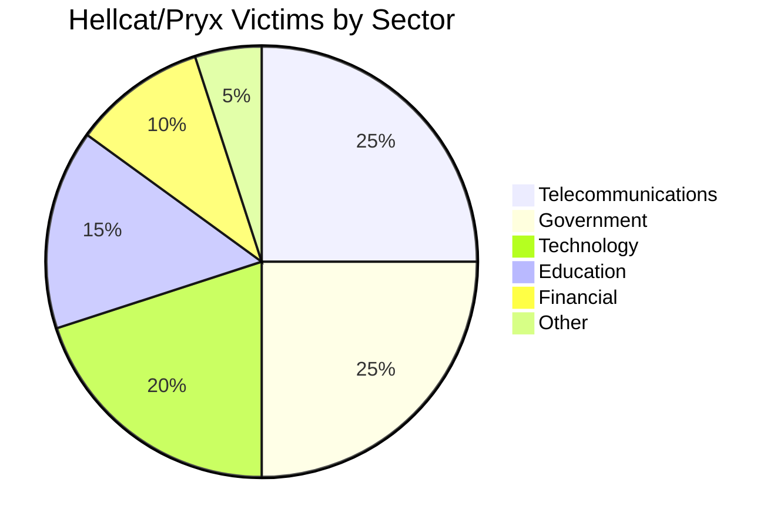
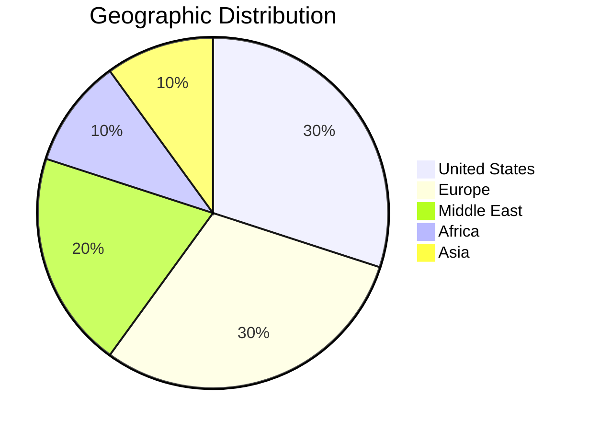
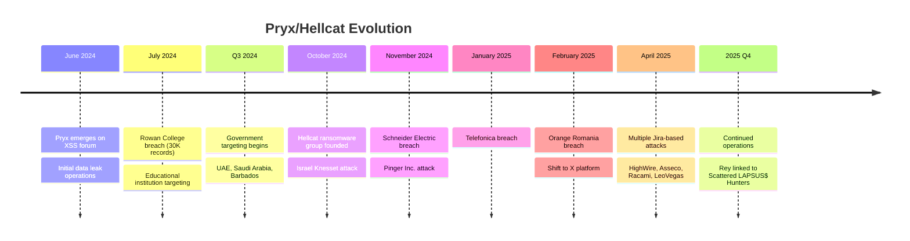

# Pryx Threat Actor Profile

**Report ID:** CTID-PRYX-2025
**Date:** December 28, 2025
**TLP:** TLP:AMBER
**Criticality:** HIGH
**Confidence:** High

---

## Executive Summary

[Pryx](Threat%20Actors/Pryx.md) is an emerging cybercriminal threat actor who has rapidly established prominence within the cybercrime ecosystem since June 2024. Operating as the founding member and administrator of the [Hellcat](Threat%20Actors/Hellcat.md) ransomware group, Pryx has demonstrated sophisticated technical capabilities, particularly through the development of an innovative server-side stealer that leverages Tor hidden services to minimize detection. The actor has been linked to high-profile breaches affecting major corporations including Schneider Electric, Telefónica, and Orange Romania, as well as government entities in Israel, UAE, Saudi Arabia, and Barbados.

Pryx represents a significant threat to organizations globally, with particular focus on government entities and organizations in the United States and Israel. The actor's combination of malware development expertise, access brokering capabilities, and ransomware operations—coupled with associations with prominent threat actors like [IntelBroker](Threat%20Actors/IntelBroker.md)—positions Pryx as a high-priority threat requiring sustained monitoring and defensive countermeasures.

---

## Key Points

- **Emerging Threat Actor**: Active since June 2024, Pryx has rapidly evolved from solo data leak operations to leading the Hellcat ransomware group
- **Technical Innovation**: Developed a novel server-side stealer using Tor onion services that significantly reduces detection risk by minimizing outbound traffic
- **High-Profile Targets**: Responsible for breaches at Schneider Electric (40GB+ data), Telefónica (236,000+ records), Orange Romania, and Israel's Knesset
- **Dual Motivation**: Operations driven by both financial gain and political motivations, with particular anti-Israel sentiment
- **Jira Exploitation**: Hellcat consistently exploits Atlassian Jira credentials harvested from infostealer logs to compromise enterprise environments
- **Code Sharing**: Hellcat ransomware payloads share nearly identical code with Morpheus ransomware, suggesting shared tooling or builder applications
- **Young Actor**: Claims to be 17 years old; suspected to be UAE-based individual originally from another Arab country
- **Affiliate Network**: Operates within a nine-member group including prominent figures like IntelBroker, Rey, and Grep

---

## Assessment

We assess with **high confidence** that Pryx is a technically sophisticated threat actor who has rapidly ascended within the cybercriminal ecosystem through a combination of innovative malware development, strategic partnerships, and aggressive targeting of high-value organizations. The actor's progression from educational institution data leaks to coordinated ransomware operations against critical infrastructure and government entities demonstrates both growing capabilities and ambition.

Pryx's development of a server-side stealer architecture represents a notable evolution in infostealer tradecraft. By establishing Tor hidden services on victim machines rather than exfiltrating data to remote servers, this approach significantly reduces detectable network traffic and evades traditional endpoint detection mechanisms. The victim's device functions as a passive file host, with attackers retrieving data through discrete GET requests—a methodology that circumvents conventional behavioral detection patterns.

The Hellcat ransomware operation, established in October 2024, employs double-extortion tactics and has demonstrated operational continuity despite internal conflicts, including a doxing incident affecting Pryx. The group's consistent exploitation of Jira credentials harvested through infostealer malware represents a repeatable attack pattern that has yielded access to multiple high-profile targets. Organizations with Atlassian Jira deployments face elevated risk from this threat actor.

Notably, SentinelOne analysis has revealed that Hellcat and Morpheus ransomware payloads are nearly identical, differing only in victim-specific data and contact information. This overlap suggests either collaboration between groups, shared affiliate networks, or common builder applications. The groups' ransom notes also mirror those of Underground Team from 2023, indicating potential code or template reuse within the ransomware ecosystem.

Pryx maintains operational security through encrypted communications (Tox, Session, XMPP), anonymous VPS infrastructure, MullvadVPN usage, and air-gapped systems. However, KELA researchers successfully linked the actor to a UAE-based individual through infostealer log analysis and archived web content—demonstrating that even sophisticated actors leave exploitable digital footprints.

---

## Threat Actor Summary

| Attribute | Details |
|-----------|---------|
| **Primary Alias** | Pryx |
| **Additional Aliases** | HolyPryx, Sp1d3r, Adem (suspected real name) |
| **Suspected Origin** | United Arab Emirates (originally from another Arab country) |
| **Language** | Arabic, English |
| **First Observed** | June 2024 |
| **Status** | Active |
| **Type** | Cybercriminal / Ransomware Operator |
| **Sponsorship** | None (eCrime) |
| **Motivation** | Financial, Political (anti-Israel) |
| **Group Affiliation** | Hellcat (founding member/admin) |
| **Associated Actors** | IntelBroker, Rey, Grep, AnonBF, Weed/WeedSec |
| **Associated Alliances** | Five Families Hacking Alliance |
| **Forum Presence** | XSS, BreachForums, Dread, Telegram, X (Twitter) |
| **Additional Operations** | DangerZone cybercrime forum (moderator) |

---

## TTPs Narrative

Pryx employs a multi-faceted operational approach combining initial access brokering, custom malware deployment, and ransomware operations.

### Initial Access

Pryx and Hellcat operators gain initial access through multiple vectors:

1. **Credential Harvesting**: The group consistently leverages credentials stolen through infostealer malware, particularly targeting Atlassian Jira instances. This approach has proven highly effective, with at least 10 confirmed breaches attributed to Jira credential exploitation over a six-month period.

2. **Spearphishing**: Targeted phishing campaigns deliver malicious attachments that initiate multi-stage PowerShell infection chains.

3. **Vulnerability Exploitation**: The group exploits public-facing applications, including documented use of Palo Alto PAN-OS vulnerabilities (CVE-2024-0012, CVE-2024-9474) and has demonstrated expertise in chaining vulnerabilities such as CVE-2024-3400.

4. **VPN Brute-Forcing**: Credential brute-forcing against VPN endpoints provides additional access opportunities.

### Execution and Persistence

Upon gaining access, Hellcat operators deploy sophisticated PowerShell infection chains:

1. **Stage 1 (S1.ps1)**: Establishes persistence via Windows Registry Run key (`HKCU\Software\Microsoft\Windows\CurrentVersion\Run` with value "maintenance") and downloads secondary payloads
2. **Stage 2 (Payload.ps1/Isma.ps1)**: Downloads additional scripts and performs AMSI bypass to evade Windows Defender
3. **Stage 3 (Shellcode.ps1)**: Implements reflective code loading to execute payloads in memory
4. **Stage 4 (Stager.woff)**: Deploys [SliverC2](Malware/SliverC2.md) shellcode for command-and-control operations

### Defense Evasion

The group employs multiple evasion techniques:

- AMSI bypass for PowerShell execution
- Reflective code loading (memory-only execution)
- Living-off-the-Land tools (Netcat, Netscan, BurpSuite)
- Self-deletion via batch files (`_-_.bat`)
- PowerShell script obfuscation through variable manipulation

### Exfiltration

Data exfiltration occurs through:

- SFTP protocol transfers
- Custom domain `waifu[.]cat`
- Pryx's server-side stealer (for individual operations)

### Impact

Hellcat employs double-extortion tactics: data theft followed by encryption. The group is known for psychological pressure tactics, including culturally-relevant demands (such as the "baguette" ransom request to French company Schneider Electric) designed to attract media attention and pressure victims.

---

## Infrastructure

### Server-Side Stealer Architecture

Pryx's most significant technical contribution is an innovative server-side stealer that inverts traditional infostealer architecture:

- Establishes Tor onion hidden service on victim device
- Sends only small JSON payload containing onion address and username
- Attacker-side scripts harvest data via GET requests to victim's hidden service
- Victim device functions as passive file host
- Significantly reduces detectable outbound traffic
- Both attacker and victim IPs remain hidden through Tor anonymization

### Known Infrastructure

| Type | Indicator | Context |
|------|-----------|---------|
| TOR Site | `c2mdhim6btaiyae3xqthnxsz64brvdxsnbty4tvos65zb565y4v55iid[.]onion` | Data leak site |
| Domain | `pryx[.]pw` (formerly `pryx[.]cc`) | Personal blog |
| Domain | `pato[.]pw` (formerly `pato[.]cc`) | Technical content hosting |
| Domain | `waifu[.]cat` | Data exfiltration |
| Domain | `dangerzone[.]cx` | Cybercrime forum |
| Domain | `meowballs[.]xyz` | Associated infrastructure |

### C2 Infrastructure

- SliverC2 framework for command-and-control
- Open directory identified at `45[.]200[.]148[.]157`
- C2 communications observed on port 8878

### Operational Security

- Encrypted messaging: Tox, Session, XMPP
- VPN: MullvadVPN
- Air-gapped systems for sensitive operations
- Anonymous VPS hosting

---

## Victims

### Victimology Pattern

Pryx and Hellcat target organizations across multiple sectors with particular emphasis on:

1. **Government Entities**: Primary target per Pryx's stated preference
2. **Critical Infrastructure**: Energy management, telecommunications
3. **Educational Institutions**: Universities, colleges
4. **Technology Companies**: Software, telecommunications

### Geographic Focus

- **Primary**: United States, Israel (politically motivated)
- **Secondary**: Europe (France, Romania, Spain), Middle East (UAE, Saudi Arabia), Asia, Africa

### Confirmed Victims

| Victim | Sector | Country | Date | Data Impact |
|--------|--------|---------|------|-------------|
| Israel Knesset | Government | Israel | October 2024 | 64GB sensitive data |
| Schneider Electric | Energy/Manufacturing | France | November 2024 | 40GB+ data, 400K user records |
| Pinger Inc. | Telecommunications | USA | November 2024 | 105GB exfiltrated, 11TB encrypted |
| Telefónica | Telecommunications | Spain | January 2025 | 236,000+ customer records |
| Orange Romania | Telecommunications | Romania | February 2025 | 380,000 email addresses, employee records |
| Rowan College at Burlington County | Education | USA | July 2024 | 30,000 university applications |
| Jordan Ministry of Education | Government | Jordan | 2024 | ID cards, personal documents |
| Tanzania College of Business Education | Education | Tanzania | 2024 | 500,000+ records |
| HighWire Press | Publishing | USA | April 2025 | Via Jira credentials |
| Asseco | Technology | Poland | April 2025 | Via Jira credentials |
| Racami | Technology | USA | April 2025 | Via Jira credentials |
| LeoVegas Group | Gaming | Sweden | April 2025 | Via Jira credentials |
| Potomac Financial Services | Financial | USA | April 2025 | 381GB data |

### Targeting Visualization





---

## Attribution

### Confidence Level: High

We assess with **high confidence** that Pryx is a UAE-based individual based on the following evidence:

1. **Infostealer Log Analysis**: KELA identified an infostealer bot originating from the UAE in their data lake that linked to Pryx's operational accounts

2. **Archived Web Content**: An archived version of a guide on `pato[.]pw` from June 30, 2024, listed an author named "Adem"

3. **GitHub Repository Correlation**: File hash analysis connected GitHub repositories to Telegram-shared materials associated with Pryx

4. **Forum Activity Patterns**: XSS forum registration and activity patterns consistent with UAE timezone

5. **Weed/WeedSec Connection**: Infostealer data linked Pryx to the threat actor known as Weed/WeedSec

### Demographics

- **Claimed Age**: 17 years old (as of late 2024)
- **Location**: United Arab Emirates
- **Origin**: Different Arab country (specific country undisclosed)
- **Language Skills**: Arabic (native), English (proficient)

### Association Evidence

Pryx's connections to the broader cybercrime ecosystem include:

- **IntelBroker**: BreachForums owner and Hellcat member
- **Rey**: Co-operator of Hellcat, recently linked to Scattered LAPSUS$ Hunters
- **Five Families Alliance**: Loose affiliation with multiple BreachForums factions
- **DangerZone Forum**: Moderator role, interface modeled after defunct BlackForums

---

## Key Intelligence Gaps

1. **Full Identity**: While linked to "Adem" in UAE, complete identification remains incomplete
2. **Server-Side Stealer Samples**: No malware samples publicly available for analysis
3. **Ransomware Builder Source**: Whether Hellcat developed or acquired their payload builder
4. **Morpheus Relationship**: Nature of connection between Hellcat and Morpheus operators
5. **Financial Operations**: Cryptocurrency wallets and money laundering infrastructure
6. **Additional Infrastructure**: Full scope of C2 and hosting infrastructure
7. **Five Families Coordination**: Extent of operational collaboration with alliance members

---

## MITRE ATT&CK Mapping

<details>
<summary>MITRE ATT&CK Techniques (15 techniques)</summary>

| Tactic | Technique ID | Technique Name | Procedure |
|--------|--------------|----------------|-----------|
| Initial Access | T1566.001 | Phishing: Spearphishing Attachment | Delivers malicious attachments initiating PowerShell infection chains |
| Initial Access | T1190 | Exploit Public-Facing Application | Exploits Atlassian Jira, Palo Alto PAN-OS (CVE-2024-0012, CVE-2024-9474) |
| Initial Access | T1078 | Valid Accounts | Uses stolen Jira credentials from infostealer logs |
| Execution | T1059.001 | Command and Scripting Interpreter: PowerShell | Multi-stage PowerShell infection chains (S1.ps1, Payload.ps1, Isma.ps1) |
| Persistence | T1547.001 | Boot or Logon Autostart Execution: Registry Run Keys | Creates "maintenance" Run key for persistence |
| Privilege Escalation | T1078 | Valid Accounts | Leverages harvested credentials for privilege escalation |
| Defense Evasion | T1562.001 | Impair Defenses: Disable or Modify Tools | AMSI bypass via Isma.ps1 |
| Defense Evasion | T1620 | Reflective Code Loading | Memory-only payload execution via Shellcode.ps1 |
| Defense Evasion | T1218 | System Binary Proxy Execution | Uses signed binaries like Netscan for malicious purposes |
| Discovery | T1046 | Network Service Discovery | Uses Netscan for network reconnaissance |
| Lateral Movement | T1021 | Remote Services | Uses Netcat for lateral movement |
| Collection | T1119 | Automated Collection | Server-side stealer automates credential and file harvesting |
| Command and Control | T1090 | Proxy | Uses Tor for C2 anonymization |
| Exfiltration | T1041 | Exfiltration Over C2 Channel | SFTP and custom domains for data exfiltration |
| Impact | T1486 | Data Encrypted for Impact | Hellcat ransomware encryption of victim files |

</details>

---

## Indicators of Compromise

### Network Indicators

<details>
<summary>Network IOCs (9 indicators)</summary>

| Type | Indicator | Context | First Seen |
|------|-----------|---------|------------|
| TOR Address | `c2mdhim6btaiyae3xqthnxsz64brvdxsnbty4tvos65zb565y4v55iid[.]onion` | Hellcat data leak site | October 2024 |
| Domain | `pryx[.]pw` | Personal blog | June 2024 |
| Domain | `pato[.]pw` | Technical content | June 2024 |
| Domain | `waifu[.]cat` | Exfiltration endpoint | 2024 |
| Domain | `dangerzone[.]cx` | Cybercrime forum | November 2024 |
| IP Address | `45[.]200[.]148[.]157` | C2/Open directory | 2024 |
| IP Address | `185[.]247[.]224[.]8` | Associated infrastructure | 2024 |
| IP Address | `185[.]10[.]68[.]159` | Associated infrastructure | 2024 |
| IP Address | `104[.]26[.]2[.]198` | Associated infrastructure | 2024 |

</details>

### File Indicators

<details>
<summary>File IOCs (4 indicators)</summary>

| Type | Indicator | Context |
|------|-----------|---------|
| SHA256 | `5b492a70c2bbded7286528316d402c89ae5514162d2988b17d6434ead5c8c274` | Hellcat ransomware payload |
| SHA256 | `5744fb1ab1543cb809300c1fc397cd40436407ac6b2fc22407d859697c246f0` | Hellcat ransomware payload |
| Filename | `_README_.txt` | Ransom note filename |
| Registry Key | `HKCU\Software\Microsoft\Windows\CurrentVersion\Run\maintenance` | Persistence mechanism |

</details>

### Communication Identifiers

| Platform | Identifier |
|----------|------------|
| Tox | `141C8F13F4B7A4C2EED05A29186AE10F8E849AE4AC2C3E7B167FD27B316E026A42B75D5AE83C` |
| Signal | `@prx.01` |
| Wire | `@pryx` |
| X (Twitter) | `@holypryx` |

---

## CVEs Exploited

| CVE | Product | CVSS | Exploitation Context |
|-----|---------|------|---------------------|
| CVE-2024-0012 | Palo Alto PAN-OS | 9.8 (Critical) | Authentication bypass for initial access |
| CVE-2024-9474 | Palo Alto PAN-OS | 7.2 (High) | Privilege escalation, chained with CVE-2024-0012 |
| CVE-2024-3400 | Palo Alto PAN-OS | 10.0 (Critical) | Command injection demonstrated in vulnerability chaining |
| CVE-2024-34102 | Multiple products | Variable | Reported exploitation capability |

---

## Detection Opportunities

### Endpoint Detection

- Monitor for PowerShell execution with encoded commands or unusual parent processes
- Detect AMSI bypass attempts through common techniques
- Alert on reflective code loading patterns
- Monitor Registry Run key modifications, specifically "maintenance" values
- Track Tor service installation or hidden service creation

### Network Detection

- Monitor for Tor traffic from unexpected endpoints
- Detect connections to known Hellcat infrastructure
- Alert on SFTP exfiltration to unusual destinations
- Monitor for Jira API access patterns consistent with credential abuse

### Log Sources

- Windows Security Event Log (4688, 4657)
- PowerShell Script Block Logging
- Sysmon (Event IDs 1, 3, 7, 11, 13)
- Firewall logs for Tor traffic
- Jira access logs

### Hunting Queries

**PowerShell Persistence Detection (Splunk)**:
```spl
index=windows EventCode=4688
| where CommandLine LIKE "%HKCU%Run%maintenance%" OR CommandLine LIKE "%S1.ps1%"
| stats count by Computer, User, CommandLine
```

**Tor Hidden Service Detection (Sigma)**:
```yaml
title: Potential Tor Hidden Service Installation
status: experimental
logsource:
    product: windows
    category: process_creation
detection:
    selection:
        CommandLine|contains:
            - 'tor.exe'
            - 'HiddenServiceDir'
            - '.onion'
    condition: selection
```

---

## Probability Matrix

| Term | Probability Range |
|------|------------------|
| Almost Certainly | 95-99% |
| Very Likely | 80-95% |
| Likely | 55-80% |
| Roughly Even Chance | 45-55% |
| Unlikely | 20-45% |
| Very Unlikely | 5-20% |

---

## Intelligence Requirements

1. Obtain samples of Pryx's server-side stealer for technical analysis
2. Map full extent of Hellcat C2 infrastructure
3. Determine relationship between Hellcat and Morpheus ransomware operations
4. Identify cryptocurrency wallets used for ransom payments
5. Monitor for new Jira-based intrusions matching Hellcat TTPs
6. Track Pryx activity following doxing incident for operational changes

---

## Feedback Section

This report was prepared by the Threat Intelligence team. For questions, corrections, or additional intelligence:

- **Classification Review**: Contact security team if TLP adjustment needed
- **New Intelligence**: Submit via threat intel ticketing system
- **Operational Support**: Contact SOC for detection rule implementation

---

## Data Sources

- KELA Cyber Threat Intelligence
- SentinelOne Research
- Picus Security Analysis
- Bridewell Threat Research
- InfoStealers Research
- Morado Security
- SOCPrime Detection Content
- GuidePoint Security GRIT Reports
- Open Source Intelligence (OSINT)

---

## Threat Actor Evolution Timeline



---

## References

- Bridewell. (2024). Who are Hellcat Ransomware Group? https://www.bridewell.com/insights/blogs/detail/who-are-hellcat-ransomware-group
- CyberScoop. (2024). Schneider Electric reports cyberattack, its third incident in 18 months. https://cyberscoop.com/schneider-electric-energy-ransomware-hellcat/
- InfoStealers. (2024). Server-Side Infostealers: How Initial Access Broker Pryx is Revolutionizing Infostealers. https://www.infostealers.com/article/server-side-infostealers-how-initial-access-broker-pryx-is-revolutionizing-infostealers/
- InfoStealers. (2025). HELLCAT Ransomware Group Strikes Again: Four New Victims Breached via Jira Credentials from Infostealer Logs. https://www.infostealers.com/article/hellcat-ransomware-group-strikes-again-four-new-victims-breached-via-jira-credentials-from-infostealer-logs/
- KELA Cyber. (2025). Hellcat Hacking Group Unmasked: Investigating Rey and Pryx. https://www.kelacyber.com/blog/hellcat-hacking-group-unmasked-rey-and-pryx/
- Morado Security. (2024). Threat Actor Spotlight: Pryx. https://www.morado.io/blog-posts/threat-actor-spotlight-pryx
- Picus Security. (2025). HellCat Ransomware: Exposing the TTPs of a Rising Ransomware Threat in 2025. https://www.picussecurity.com/resource/blog/hellcat-ransomware
- SentinelOne. (2025). HellCat and Morpheus | Two Brands, One Payload as Ransomware Affiliates Drop Identical Code. https://www.sentinelone.com/blog/hellcat-and-morpheus-two-brands-one-payload-as-ransomware-affiliates-drop-identical-code/
- SOCPrime. (2024). Detect Hellcat Ransomware Attacks. https://socprime.com/blog/hellcat-ransomware-detection/
- WatchGuard Technologies. (2024). Pryx Ransomware. https://www.watchguard.com/wgrd-security-hub/ransomware-tracker/pryx

---

## Related Intelligence


