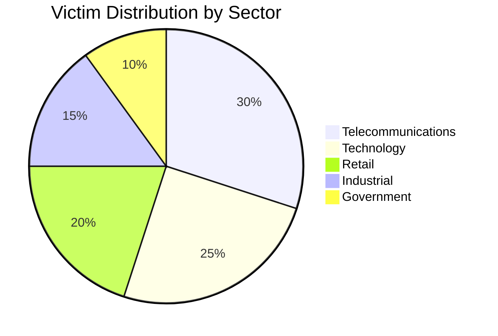

# Rey (Saif AL-Din Khader) - Threat Actor Profile

**Report ID:** CTID-004-2025
**Date:** December 27, 2025
**TLP:** TLP:AMBER
**Criticality:** HIGH

---

## Executive Summary

[Rey](Threat%20Actors/Rey.md), whose real-world identity has been unmasked as **Saif AL-Din Khader**, is a 16-year-old Jordanian cybercriminal who serves as the technical operator and public face of [Scattered LAPSUS$ Hunters](Threat%20Actors/Scattered%20LAPSUS%24%20Hunters.md) (SLSH)—a cybercriminal supergroup comprising elements of [Scattered Spider](Threat%20Actors/Scattered%20Spider.md), [LAPSUS$](Threat%20Actors/LAPSUS%24.md), and [ShinyHunters](Threat%20Actors/ShinyHunters.md). Despite his young age, Rey has been directly involved in high-profile data breaches affecting major corporations including Schneider Electric, Telefonica, Orange Romania, and numerous Salesforce customers.

Rey's operational role spans multiple criminal functions: administrator of the Hellcat ransomware data leak site, one of three administrators of SLSH's Telegram channel, former administrator of BreachForums, and developer of the [ShinySp1d3r](Malware/ShinySp1d3r.md) ransomware-as-a-service platform. His activities represent a significant evolution in the youth-dominated "Com" cybercriminal ecosystem, where teenage threat actors leverage sophisticated social engineering to compromise enterprise targets.

Organizations in the technology, telecommunications, retail, and SaaS sectors face elevated risk from SLSH operations. Rey's claimed cooperation with law enforcement since June 2025 introduces uncertainty regarding the group's future operational tempo, though SLSH announced continued operations in November 2025 despite member arrests.

---

## Key Points

- **Identity Confirmed**: KELA Cyber and Krebs on Security independently verified Rey as Saif AL-Din Khader, a 16-year-old from Amman, Jordan, whose father is a Royal Jordanian Airlines pilot
- **Multi-Group Affiliation**: Rey operates across SLSH, Hellcat ransomware, and formerly BreachForums, demonstrating the interconnected nature of the Com cybercriminal community
- **ShinySp1d3r RaaS**: Rey released SLSH's proprietary ransomware-as-a-service platform, a modified version of Hellcat enhanced with AI tools, marking SLSH's transition to full RaaS operator
- **Jira Exploitation Specialty**: Rey's signature technique involves exploiting Jira credentials to access sensitive corporate data, used in attacks against Schneider Electric, Telefonica, and Orange Romania
- **OPSEC Failures**: Multiple operational security mistakes—including infostealer infections and exposed credentials—enabled identity attribution
- **Law Enforcement Contact**: Rey claims cooperation with European law enforcement since June 2025, though verification remains limited

---

## Assessment

We assess with **high confidence** that Rey (Saif AL-Din Khader) is a significant operational figure within the Scattered LAPSUS$ Hunters ecosystem based on corroborating evidence from Intel 471, KELA Cyber, Flashpoint, and Krebs on Security. His identity attribution stems from critical operational security failures including infostealer malware infections that exposed family credentials and his Amman, Jordan location.

Rey's trajectory from low-level BreachForums activity in early 2024 to SLSH administrator demonstrates rapid advancement within Com circles. His early claims under the "Hikki-Chan" persona included several repackaged breaches (VK, Kavim) that damaged his credibility, prompting a rebrand to "Rey" in late 2024. Despite credibility issues, he accumulated over 200 BreachForums posts and eventually assumed administrator roles for both BreachForums and the Hellcat ransomware leak site.

The emergence of ShinySp1d3r ransomware in November 2025 represents a strategic shift for SLSH. Previously, the group relied on third-party ransomware from ALPHV/BlackCat, Qilin, RansomHub, and DragonForce. By developing proprietary ransomware, SLSH now controls the entire attack chain and can recruit affiliates independently. Rey described ShinySp1d3r as "a rehash of Hellcat ransomware, except modified with AI tools," acknowledging he provided Hellcat's source code as the foundation.

Rey's claimed law enforcement cooperation since June 2025 introduces significant uncertainty. While he provided a screenshot showing Europol contact in late October 2025, he could not name specific officials and expressed concern that media attention would "bring so much unwanted heat." His stated motivation—wanting to "move on from all this stuff even if it's going to be prison time"—suggests genuine desire to exit, though SLSH's November 2025 announcement of continued operations complicates this narrative.

**Intelligence Gap**: The extent and nature of Rey's law enforcement cooperation remains unverified. Whether his information has led to arrests or operational disruptions within SLSH is unknown.

---

## Threat Actor Summary

| Attribute | Details |
|-----------|---------|
| **Primary Alias** | Rey |
| **Real Name** | Saif AL-Din Khader |
| **Age** | 16 years old (born December 2009) |
| **Nationality** | Jordanian |
| **Location** | Amman, Jordan |
| **Family** | Father: Zaid Khader (Royal Jordanian Airlines pilot); Irish maternal heritage (surname: Ginty) |
| **Other Aliases** | Hikki-Chan, @wristmug, o5tdev, @05tdev, ReyXBF, ggyaf |
| **Affiliations** | Scattered LAPSUS$ Hunters (SLSH), Hellcat, ShinyHunters, The Com |
| **Motivation** | Financial gain, notoriety |
| **First Observed** | February 2024 (BreachForums as Hikki-Chan) |
| **Status** | Active (claimed LE cooperation since June 2025) |
| **Sponsorship** | None (cybercriminal) |

### Alias Timeline

| Period | Alias | Platform | Activity |
|--------|-------|----------|----------|
| Pre-2024 | ggyaf | Hacking forums | Website defacement |
| Early 2024 | o5tdev | RaidForums, BreachForums | Data leaks |
| Feb 2024 | Hikki-Chan | BreachForums | CDC data breach claim |
| Late 2024 | Rey | BreachForums, Telegram | Rebranded after credibility issues |
| 2024-2025 | Rey | SLSH Telegram | Technical operator, admin |

---

## TTPs Narrative

Rey's operational methodology reflects the broader Com community's emphasis on social engineering over technical exploitation. His approach follows the "log in, not hack in" philosophy characteristic of Scattered Spider and SLSH operations.

### Primary Attack Vector: Jira Credential Exploitation

Rey's signature technique involves targeting Jira servers to access sensitive corporate data. In both the Schneider Electric and Telefonica breaches, attackers exploited Jira credentials to exfiltrate 40GB and 2.5GB of data respectively. The Orange Romania breach followed a similar pattern, with Rey claiming month-long access before a three-hour data exfiltration operation.

### Social Engineering Operations

As part of SLSH, Rey participates in sophisticated vishing campaigns. Native English speakers impersonate IT support staff, leveraging pre-acquired PII to navigate security verification questions. Targets are manipulated into performing password resets, authorizing malicious OAuth applications, or approving MFA prompts.

### MFA Bypass Techniques

SLSH weaponizes MFA flows rather than brute-forcing second factors. Attackers generate or coerce MFA prompts and trick targets into approving them. In Salesforce incidents, adversaries combined vishing with prompts to authorize connected apps or complete OAuth consent screens.

### Ransomware Operations

Rey previously administered the Hellcat ransomware data leak site before developing ShinySp1d3r. The ransomware currently targets Windows systems, with Linux and ESXi versions in development. Rey acknowledged providing Hellcat's source code as ShinySp1d3r's foundation, enhanced with AI-assisted modifications.

### Extortion Model

SLSH operates an Extortion-as-a-Service (EaaS) model, publicly mass extorting victims through Telegram channels and threatening to leak stolen data. The group has issued threats against New York City and New York State infrastructure as intimidation tactics.

---

## Infrastructure

### Communication Platforms

| Platform | Handle/Channel | Purpose |
|----------|----------------|---------|
| Telegram | @wristmug, @05tdev | Primary communication |
| Telegram | SLSH Channel | Data leak announcements, extortion |
| Twitter/X | @ReyXBF | Public statements, leak promotion |
| BreachForums | Rey, Hikki-Chan, o5tdev | Data sales, community engagement |

### Technical Infrastructure

- **Ransomware**: ShinySp1d3r (modified Hellcat with AI enhancements)
- **Credential Harvesting**: Leverages Evilginx for MFA bypass via phishing
- **Obfuscation**: Mullvad VPN for data exfiltration operations
- **Collaboration Tools**: Shared infrastructure with SLSH members across The Com

### Operational Security Failures

Rey's identity attribution resulted from multiple OPSEC failures:

1. **Infostealer Infections**: Computer infected with Redline (February 2024) and Vidar (March 2024), exposing family credentials and Amman address
2. **Exposed Credentials**: Posted screenshot to Telegram showing sextortion email with visible password and @proton.me domain
3. **Email Exposure**: cybero5tdev@proton.me indexed in breach databases
4. **Personal Disclosures**: Shared details about father's profession and Irish heritage in Telegram channels
5. **Surname Leak**: Posted graphics referencing "Ginty" surname in cybercrime channels

---

## Victims

### Confirmed/Claimed Victims

| Victim | Sector | Date | Data Type | Volume |
|--------|--------|------|-----------|--------|
| U.S. CDC | Government | Feb 2024 | Alleged employee data | Unknown |
| Schneider Electric | Industrial | 2024 | Jira data | 40GB |
| Telefonica | Telecommunications | 2024 | Internal documents | 2.5GB |
| Orange Romania | Telecommunications | Feb 2025 | Emails, source code, contracts | 380K emails |
| Jaguar | Automotive | 2025 | Corporate data | Unknown |
| Ascom | Technology | 2025 | Corporate data | Unknown |

### Disputed Claims

| Victim | Date | Status |
|--------|------|--------|
| VK | 2024 | Exposed as repackaged older breach |
| Kavim | 2024 | Exposed as repackaged older breach |

### SLSH Collective Victims (Rey-Affiliated)

Through SLSH operations, Rey is associated with attacks affecting:

- **Salesforce Customers**: 760 tenants compromised, 1.5 billion records exfiltrated
- **UK Retailers**: Marks & Spencer, Co-op (April 2025)
- **Enterprise Targets**: Toyota, FedEx, Disney/Hulu, UPS, and others



---

## Attribution

### Identity Verification

We assess with **high confidence** that Rey is Saif AL-Din Khader based on:

| Evidence Type | Source | Confidence |
|---------------|--------|------------|
| Infostealer data linking cybero5tdev@proton.me to Khader family in Amman | Spycloud | High |
| OSINT investigation identifying o5tdev/Hikki-Chan as Saif Khader | KELA Cyber (March 2025) | High |
| Credential reuse patterns across platforms | Intel 471 | High |
| Direct confirmation in interview | Krebs on Security (Nov 2025) | High |
| Family computer metadata showing Amman location | Spycloud | High |

### Attribution Timeline

| Date | Event | Source |
|------|-------|--------|
| March 2025 | KELA publicly identifies Rey as Saif Khader, shares with LE | KELA Cyber |
| November 2025 | Krebs contacts father, Rey confirms identity in interview | Krebs on Security |
| November 2025 | Rey claims LE cooperation since June 2025 | Self-reported |

---

## Key Intelligence Gaps

1. **Law Enforcement Status**: Extent and outcomes of Rey's claimed cooperation with European law enforcement remain unverified
2. **SLSH Role Post-Cooperation**: Whether Rey maintains operational involvement despite LE contact
3. **ShinySp1d3r Deployment**: Limited confirmed real-world ransomware deployments; primarily visible in SLSH communications
4. **Full Victim List**: Unknown number of unreported or unattributed breaches
5. **Financial Infrastructure**: Cryptocurrency wallets and monetization methods not documented
6. **Com Network Mapping**: Full relationships with other SLSH members and Com affiliates

---

## MITRE ATT&CK Mapping

<details>
<summary>MITRE ATT&CK Techniques (12 mapped)</summary>

| Tactic | Technique | ID | Procedure |
|--------|-----------|----|-----------|
| Reconnaissance | Gather Victim Identity Information | T1589 | Collects employee PII for vishing operations |
| Initial Access | Phishing: Spearphishing Voice | T1566.004 | Native English speakers impersonate IT support |
| Initial Access | Valid Accounts | T1078 | Uses stolen Jira and SSO credentials |
| Initial Access | Trusted Relationship | T1199 | Exploits third-party integrations (Salesforce connected apps) |
| Credential Access | Steal Application Access Token | T1528 | Harvests OAuth tokens via malicious connected apps |
| Credential Access | Unsecured Credentials | T1552 | Targets Jira credential stores |
| Collection | Data from Information Repositories | T1213 | Exfiltrates data from Jira, Salesforce |
| Exfiltration | Exfiltration Over Web Service | T1567 | Data exfiltration via legitimate cloud services |
| Impact | Data Encrypted for Impact | T1486 | ShinySp1d3r/Hellcat ransomware deployment |
| Impact | Financial Theft | T1657 | Extortion payments demanded |
| Command and Control | Application Layer Protocol | T1071 | C2 via Telegram, legitimate services |
| Defense Evasion | Masquerading | T1036 | Malicious OAuth apps disguised as legitimate tools |

</details>

---

## IOCs

### Domains/Handles

| Type | Indicator | Context |
|------|-----------|---------|
| Email | `cybero5tdev@proton[.]me` | Primary email associated with Rey |
| Telegram | `@wristmug` | Telegram handle (historical) |
| Telegram | `@05tdev` | Telegram handle (historical) |
| Twitter | `@ReyXBF` | Twitter/X account |

### Associated Infrastructure

| Type | Indicator | Context |
|------|-----------|---------|
| Ransomware | ShinySp1d3r | SLSH RaaS platform |
| Ransomware | Hellcat | Previous ransomware affiliation |
| Tool | Evilginx | MFA bypass phishing toolkit |
| VPN | Mullvad VPN | Exfiltration obfuscation |

**Note**: Due to Rey's reliance on social engineering and legitimate services rather than malware-based operations, traditional hash-based IOCs are limited.

---

## Detection & Hunting Guidance

### Priority Log Sources

- Identity Provider logs (Okta, Azure AD, Ping)
- Salesforce Event Monitoring
- Help desk ticketing systems
- VPN and remote access logs
- OAuth application authorization logs

### Hunt Queries

**Suspicious OAuth App Authorization (Salesforce)**
```sql
SELECT user_name, client_app_name, event_type, timestamp
FROM event_log
WHERE event_type = 'ConnectedAppOAuthAuthorization'
AND client_app_name NOT IN (approved_apps_list)
AND timestamp > DATE_SUB(NOW(), INTERVAL 7 DAY)
```

**MFA Registration Anomalies (Azure AD)**
```kql
AuditLogs
| where OperationName has "User registered security info"
| where TimeGenerated > ago(24h)
| extend UserPrincipalName = tostring(TargetResources[0].userPrincipalName)
| summarize RegistrationCount = count() by UserPrincipalName, bin(TimeGenerated, 1h)
| where RegistrationCount > 1
```

**Help Desk Impersonation Indicators**
```
Monitor for:
- Password reset requests following recent employee directory queries
- MFA bypass requests from non-corporate phone numbers
- Unusual timing of IT support calls (outside business hours)
- Requests to add new OAuth applications
```

---

## Recommendations

### Immediate Actions

1. **Phishing-Resistant MFA**: Implement FIDO2/WebAuthn; disable SMS, voice, and basic push authentication
2. **OAuth App Review**: Audit and restrict connected applications in Salesforce, Google Workspace, Microsoft 365
3. **Help Desk Hardening**: Implement callback verification procedures; require manager approval for MFA resets
4. **Jira Security**: Review Jira access controls, implement privileged access monitoring

### Strategic Mitigations

1. **Identity Threat Detection**: Deploy solutions monitoring for OAuth token theft and session hijacking
2. **Vishing Awareness**: Train employees on voice phishing tactics; establish verification protocols
3. **Third-Party Risk**: Assess vendors with Salesforce/cloud integrations for security controls
4. **Insider Threat Monitoring**: Enhanced monitoring for employees with privileged access

---

## Probability Matrix

| Term | Probability | Definition |
|------|-------------|------------|
| Almost Certainly | 95-99% | Very high confidence based on multiple corroborating sources |
| Very Likely | 80-95% | High confidence with strong evidence |
| Likely | 55-80% | Moderate-high confidence |
| Roughly Even Chance | 45-55% | Uncertain, evidence is mixed |
| Unlikely | 20-45% | Low probability |
| Very Unlikely | 5-20% | Very low probability |

---

## Intelligence Requirements

### Priority Intelligence Requirements (PIRs)

1. What is the current operational status of Rey's law enforcement cooperation?
2. Has ShinySp1d3r ransomware been deployed in confirmed attacks?
3. What is Rey's current role within SLSH following identity exposure?
4. Are other SLSH members subject to law enforcement action based on Rey's cooperation?

### Specific Intelligence Requirements (SIRs)

1. ShinySp1d3r technical analysis and detection signatures
2. Updated SLSH membership and role assignments
3. Financial infrastructure used by Rey and SLSH
4. New victim disclosures from SLSH operations

---

## Feedback Section

This intelligence product was produced to support defensive operations and strategic planning. Feedback on accuracy, completeness, and operational utility should be directed to the Threat Intelligence team.

**Questions for Consumers**:
- Did this report provide actionable intelligence for your organization?
- Are there specific aspects requiring additional depth?
- What additional collection would support your security operations?

---

## Data Sources

| Source | Type | Reliability |
|--------|------|-------------|
| Krebs on Security | OSINT, Primary Research | High |
| KELA Cyber | Threat Intelligence Vendor | High |
| Intel 471 | Threat Intelligence Vendor | High |
| Unit 42 (Palo Alto Networks) | Threat Intelligence Vendor | High |
| ZeroFox | Threat Intelligence Vendor | High |
| Flashpoint | Threat Intelligence Vendor | High |
| BleepingComputer | Cybersecurity News | Medium |
| MITRE ATT&CK | Framework | High |

---

## References

KELA Cyber. (2025, November). *UPDATE: Hellcat Hacking Group Unmasked: Investigating Rey and Pryx*. https://www.kelacyber.com/blog/hellcat-hacking-group-unmasked-rey-and-pryx/

Krebs, B. (2025, November). *Meet Rey, the Admin of 'Scattered Lapsus$ Hunters'*. Krebs on Security. https://krebsonsecurity.com/2025/11/meet-rey-the-admin-of-scattered-lapsus-hunters/

MITRE ATT&CK. (2025). *Scattered Spider, G1015*. https://attack.mitre.org/groups/G1015/

Obsidian Security. (2025). *ShinyHunters and Scattered Spider: A Merger of Chaos in the 2025 Salesforce Attacks*. https://www.obsidiansecurity.com/blog/shinyhunters-and-scattered-spider-a-merger-of-chaos-in-the-2025-salesforce-attacks

Picus Security. (2025). *Scattered LAPSUS$ Hunters: 2025's Most Dangerous Cybercrime Supergroup*. https://www.picussecurity.com/resource/blog/scattered-lapsus-hunters-2025s-most-dangerous-cybercrime-supergroup

Resecurity. (2025). *Trinity of Chaos: The LAPSUS$, ShinyHunters, and Scattered Spider Alliance Embarks on Global Cybercrime Spree*. https://www.resecurity.com/blog/article/trinity-of-chaos-the-lapsus-shinyhunters-and-scattered-spider-alliance-embarks-on-global-cybercrime-spree

Unit 42. (2025). *The Golden Scale: Bling Libra and the Evolving Extortion Economy*. https://unit42.paloaltonetworks.com/scattered-lapsus-hunters/

ZeroFox. (2025). *Flash Report: Powerful New RaaS from Scattered Lapsus$ Hunters*. https://www.zerofox.com/intelligence/flash-report-powerful-new-raas-from-scattered-lapsus-hunters/

---

## Related Intelligence


---

*Report generated by Claude Code Threat Intelligence*
*Classification: TLP:AMBER*