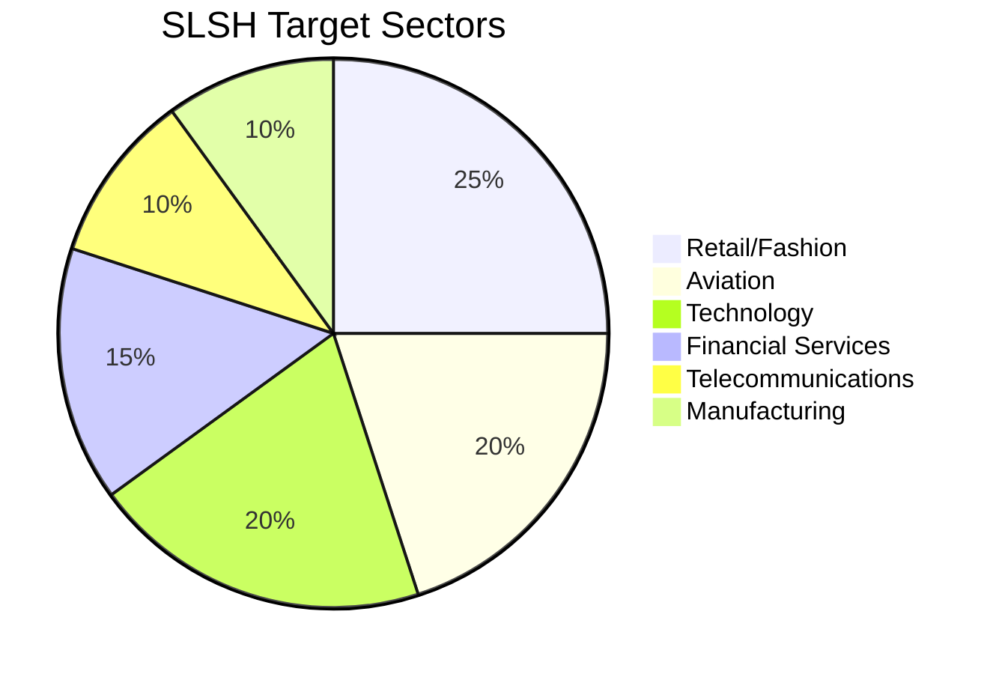
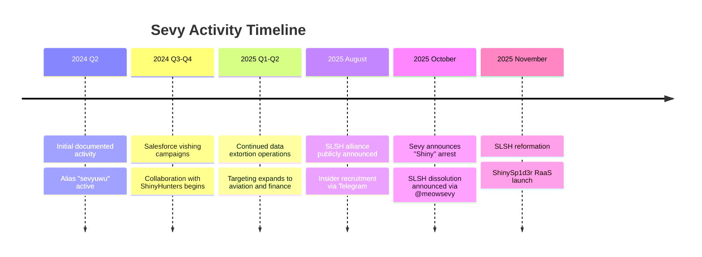

# Sevy - SLSH Threat Actor Profile

**Report ID:** CTID-SEVY-2025
**Date:** December 28, 2025
**TLP:** TLP:AMBER
**Criticality:** HIGH
**Confidence:** MODERATE

---

## Executive Summary

Sevy (aliases: sevyuwu, @meowsevy) is a social engineering specialist operating within the [Scattered Spider](Threat%20Actors/Scattered%20Spider.md) ecosystem and the broader [SLSH](Threat%20Actors/SLSH.md) (Scattered LAPSUS$ Hunters) cybercriminal alliance. Active since at least May 2024, Sevy specializes in voice phishing (vishing) operations targeting enterprise IT helpdesks, enabling unauthorized access to corporate environments through sophisticated social engineering rather than technical exploitation.

Sevy's operational significance stems from collaboration with [ShinyHunters](Threat%20Actors/ShinyHunters.md) to conduct large-scale data extortion campaigns against retail, telecommunications, manufacturing, and aviation sectors. The threat actor functions both as an operational vishing specialist and as a communications amplifier for SLSH, serving as a public-facing persona who announced major group developments including arrests and operational status changes throughout October-November 2025.

We assess with **moderate confidence** that Sevy represents a distinct individual within the SLSH collective rather than a shared alias, based on consistent linguistic patterns and documented alias rotation over an 18-month period. The threat actor's vishing expertise contributed to breaches affecting major enterprises including Google, Cisco, Adidas, LVMH, Qantas, and FedEx as part of coordinated campaigns that reportedly compromised over 1.5 billion Salesforce records.

---

## Key Points

- **Primary Role:** Voice phishing (vishing) operator specializing in social engineering attacks against enterprise IT helpdesks to obtain credential resets and MFA bypass
- **Group Affiliation:** Core operational member of Scattered Spider and SLSH (Scattered [LAPSUS$](Threat%20Actors/LAPSUS%24.md) Hunters), with documented collaboration with ShinyHunters
- **Active Period:** May 2024 – November 2025 (documented), with activity pattern suggesting continued operations
- **Targeting:** Enterprise organizations in retail, telecommunications, manufacturing, and aviation sectors, primarily targeting Salesforce customers and OAuth integrations
- **Significance:** Announced SLSH dissolution following key arrests (October 2025), though group subsequently reformed, indicating Sevy serves as primary communications channel for the collective

---

## Assessment

### Operational Capabilities

Sevy demonstrates advanced social engineering capabilities, specifically optimized for voice-based attacks against corporate IT support functions. EclecticIQ analysts assess with high confidence that Sevy conducted voice call phishing campaigns against enterprise organizations as a core operational specialty. Unlike technically-focused threat actors, Sevy's value to the SLSH ecosystem lies in the ability to manipulate human targets through convincing impersonation of legitimate employees during phone calls to corporate helpdesks.

The threat actor's vishing operations follow a well-documented methodology: reconnaissance using business-to-business websites to gather employee information, followed by coordinated phone campaigns where Sevy and similar operators impersonate locked-out employees to extract password resets. Once initial access is obtained, follow-up calls target MFA bypass through techniques including push notification fatigue and session manipulation.

### Ecosystem Position

Within the SLSH structure, Sevy occupies a dual role. Trustwave SpiderLabs identified Sevy (alongside sevyuwu) as an "auxiliary identity" that functions to "amplify narratives and sustain channel engagement." This communications function complements operational vishing work, with Sevy serving as a public-facing representative who announces group activities, responds to law enforcement actions, and manages the collective's external narrative.

Research indicates that despite approximately thirty observable handles across SLSH-associated channels, linguistic patterns, emoji usage, and posting cadence suggest fewer than five individuals drive the core operation. This raises the possibility that Sevy may represent one of several personas controlled by a limited number of actual operators, though available evidence is insufficient to confirm this assessment.

### Collaboration Network

Sevy operates within a broader collaborative network connecting Scattered Spider's initial access capabilities with ShinyHunters' data extortion infrastructure. EclecticIQ analysts assessed with high confidence that Sevy and Rey (another key SLSH figure) collaborated directly with the ShinyHunters team to breach companies across multiple sectors. This cross-membership model—where individual operators contribute specialized skills while maintaining ties to multiple groups—exemplifies the "as-a-Service" economy that characterizes modern cybercrime.

The collaboration extends to infrastructure sharing: ShinyHunters affiliates used VoIP services including Twilio, Google Voice, and 3CX for vishing operations, with some campaigns leveraging AI-powered voice platforms (Vapi, Bland) to automate social engineering at scale. Sevy's documented specialization in voice attacks suggests direct involvement in deploying these capabilities against target organizations.

---

## Threat Actor Summary

| Attribute | Details |
|-----------|---------|
| **Primary Alias** | Sevy |
| **Known Aliases** | sevyuwu, @meowsevy (X/Twitter) |
| **Origin/Location** | Likely United States or United Kingdom (The Com association) |
| **Sponsorship** | None (Financially motivated cybercriminal) |
| **Motivation** | Financial gain through data extortion |
| **First Observed** | May 2024 |
| **Last Observed** | November 2025 |
| **Status** | Likely Active |
| **Affiliation** | Scattered Spider, SLSH, The Com |
| **Collaboration** | ShinyHunters, LAPSUS$ remnants |

---

## TTPs Narrative

### Initial Access via Voice Phishing

Sevy's primary operational contribution centers on gaining initial access through sophisticated vishing campaigns. The attack methodology begins with pre-operational reconnaissance: gathering employee names, organizational structures, and IT support procedures from business directories, LinkedIn, and other open sources. Armed with this intelligence, Sevy places calls to corporate IT helpdesks while impersonating legitimate employees.

The social engineering follows a consistent pattern: the caller claims to be locked out of their account, often citing urgent business needs. Native English-speaking operators like Sevy demonstrate exceptional impersonation skills during these calls, successfully navigating security verification questions using pre-acquired personally identifiable information (PII). The calls are designed to extract password resets, ultimately providing attackers with valid credentials to enterprise systems.

### MFA Bypass Techniques

Following successful credential harvesting, Sevy and associated operators employ multiple techniques to bypass multi-factor authentication. The most common approach involves "push notification fatigue"—bombarding target users with mobile push notifications until they approve a request either accidentally or to stop the notification barrage. Alternative techniques include SIM swapping (convincing mobile operators to transfer victim phone numbers to attacker-controlled SIM cards) and session cookie theft using infostealer malware.

A particularly effective variation involves OAuth token capture. In Salesforce-targeting campaigns, attackers guided victims during vishing calls to navigate to legitimate Salesforce app connection pages where they would enter 8-digit authorization codes. These codes authorized malicious connected applications—often rebranded versions of legitimate tools like "Salesforce Data Loader" presented as "My Ticket Portal"—that captured OAuth tokens. These tokens bypassed MFA entirely, providing persistent API-level access for bulk data extraction.

### Data Exfiltration and Extortion

Once access is established, compromised Salesforce CRM dashboards enable bulk data exfiltration and lateral movement into additional platforms including Okta, Microsoft 365, and Amazon S3. SLSH campaigns reportedly extracted over 1.5 billion Salesforce records from 760 companies by compromising OAuth tokens associated with Salesloft and Drift integrations.

The extortion model follows Extortion-as-a-Service (EaaS) patterns: stolen data is leveraged for ransom demands, with victims threatened by public disclosure on SLSH's data leak site. Sevy's communications role includes amplifying pressure through public announcements and managing victim engagement during negotiation processes.

---

## Infrastructure

### Communication Platforms

| Platform | Identifier | Purpose |
|----------|------------|---------|
| X (Twitter) | @meowsevy | Public communications, announcements |
| Telegram | @sevyuwu | Operational coordination, group channels |
| Telegram | SLSH channels (multiple iterations) | Campaign coordination, victim posting |

### Vishing Infrastructure

Sevy and SLSH affiliates utilize commercial VoIP services for vishing operations:

- **Twilio** - VoIP calling services for vishing campaigns
- **Google Voice** - Voice communication platform
- **3CX** - Enterprise VoIP platform abuse
- **Vapi** - AI-powered voice call automation
- **Bland** - AI-driven social engineering call automation

### Data Leak Infrastructure

SLSH operates a Tor-based extortionware portal for victim listing and data publication. On October 3, 2025, the group launched their data leak site on a domain previously associated with BreachForums. The portal lists victims with data volumes and payment deadlines to pressure ransom payment.

---

## Victims

### Sector Distribution

### Confirmed Victim Organizations

Organizations confirmed or reported as SLSH/ShinyHunters campaign victims include:

| Sector | Organizations |
|--------|---------------|
| Technology | Google, Cisco |
| Retail/Fashion | Adidas, LVMH (Dior, Louis Vuitton, Tiffany & Co), Pandora, Chanel, Gap, IKEA, Cartier |
| Aviation | Qantas, Air France-KLM |
| Logistics | FedEx, UPS |
| Financial | Allianz, TransUnion |
| Hospitality | Marriott, Disney/Hulu, HBO Max |
| Automotive | Toyota, Jaguar Land Rover |
| Other | McDonald's, Walgreens, Instacart, Home Depot |

### Geographic Targeting

While SLSH operates globally, the majority of confirmed victims are headquartered in:
- United States (primary)
- Europe (significant)
- Australia (notable, including specific threats against Australian organizations)

---

## Attribution

### Identity Assessment

**Confidence Level:** MODERATE

Sevy is assessed to be a distinct individual operating within the Scattered Spider/SLSH collective based on:

1. **Alias Rotation Pattern:** Documented alias rotation over 18 months (May 2024 – November 2025) from "sevyuwu" to "Sevy" to "@meowsevy" suggests a consistent individual managing their online presence
2. **Functional Specialization:** Consistent attribution to voice phishing operations across multiple intelligence sources indicates specialized operational role
3. **Communications Consistency:** Public statements on X and Telegram show consistent linguistic patterns when announcing group activities

### Location Assessment

**Confidence Level:** LOW

Sevy is assessed to be located in the United States or United Kingdom based on:
- Association with "The Com," described as a "youth cybercrime network based in the United States and the United Kingdom"
- Scattered Spider operators are documented as native English speakers with no detectable accents
- Many Com-affiliated actors were recruited from online gaming platforms (Roblox, Minecraft) in their early teens, suggesting Western origin

### Network Position

Sevy functions within a collaborative network including:

| Actor | Relationship | Confidence |
|-------|-------------|------------|
| **Rey** | SLSH co-operator, collaboration on campaigns | HIGH |
| **Shiny/ShinyCorp** | ShinyHunters leader, recruited Sevy for campaigns | HIGH |
| **Yukari** | Cross-membership facilitating additional TTPs | MODERATE |
| **The Com** | Broader ecosystem membership | HIGH |

---

## Key Intelligence Gaps

1. **True Identity:** Sevy's real-world identity remains unknown. While Rey (another SLSH admin) has been identified by KrebsOnSecurity, comparable identification of Sevy has not been publicly reported.

2. **Operational Status:** Following Sevy's October 2025 announcement of SLSH dissolution and subsequent group reformation, Sevy's current operational status and level of involvement remains unclear.

3. **Technical Capabilities:** Intelligence focuses on Sevy's social engineering role; extent of technical capabilities (malware deployment, infrastructure management) is undocumented.

4. **Arrest Status:** While Sevy announced "Shiny" was arrested and SLSH was disbanding, no information indicates whether Sevy faces law enforcement action.

5. **AI Tool Usage:** Extent of Sevy's personal use of AI-powered vishing tools (Vapi, Bland) versus reliance on other operators is unclear.

---

## MITRE ATT&CK Mapping

MITRE ATT&CK Techniques (16 techniques)

| Tactic | Technique ID | Technique Name | Procedure |
|--------|-------------|----------------|-----------|
| Reconnaissance | T1589 | Gather Victim Identity Information | Collected employee PII from business directories and social media for vishing pretext |
| Reconnaissance | T1598 | Phishing for Information | Conducted pre-attack reconnaissance calls to gather IT procedures |
| Reconnaissance | T1598.004 | Spearphishing Voice | Placed targeted voice calls to specific employees and IT staff |
| Resource Development | T1583.001 | Acquire Infrastructure: Domains | Established VoIP infrastructure using Twilio, Google Voice, 3CX |
| Resource Development | T1585 | Establish Accounts | Created accounts on AI voice platforms (Vapi, Bland) |
| Initial Access | T1566.004 | Phishing: Spearphishing Voice | Impersonated employees during calls to IT helpdesks to obtain credential resets |
| Initial Access | T1078 | Valid Accounts | Used credentials obtained through vishing for initial access |
| Initial Access | T1199 | Trusted Relationship | Exploited OAuth trust relationships to access victim environments |
| Persistence | T1136 | Create Account | Established persistent access through new user accounts |
| Credential Access | T1621 | Multi-Factor Authentication Request Generation | Conducted MFA fatigue attacks via push notification bombardment |
| Credential Access | T1606 | Forge Web Credentials | Captured OAuth tokens through malicious connected applications |
| Credential Access | T1451 | SIM Card Swap | Conducted SIM swapping attacks to intercept MFA codes |
| Defense Evasion | T1656 | Impersonation | Impersonated legitimate IT staff and employees during vishing calls |
| Collection | T1530 | Data from Cloud Storage | Exfiltrated data from Salesforce, AWS S3, Microsoft 365 |
| Exfiltration | T1567.002 | Exfiltration Over Web Service: Cloud Storage | Used cloud services for data exfiltration |
| Impact | T1657 | Financial Theft | Conducted data extortion demanding seven-figure ransom payments |

---

## Timeline of Activity

### Key Events

| Date | Event | Source |
|------|-------|--------|
| August 8, 2025 | SLSH publicly announced on Telegram as alliance of Scattered Spider, LAPSUS$, ShinyHunters | Multiple |
| August 31, 2025 | SLSH posted insider recruitment message seeking Okta, Microsoft SSO, Citrix, Git access | Picus Security |
| October 3, 2025 | SLSH launched data leak site on former BreachForums domain | Unit 42 |
| October 19, 2025 | Sevy announced via @meowsevy that "Shiny" had been arrested | Flare |
| October 20, 2025 | SLSH announced operational cessation due to key member arrests | ThreatMon |
| November 21, 2025 | SLSH posted new Telegram channel announcing continued operations | Multiple |

---

## IOCs

### Network Indicators

| Type | Indicator | Context | First Seen |
|------|-----------|---------|------------|
| Twitter/X | @meowsevy | Sevy public communications account | 2025 |
| Telegram | @sevyuwu | Sevy operational account | 2024 |
| Domain | breachforums[.]st (historic) | SLSH data leak site (former BreachForums domain) | October 2025 |

*Note: Sevy operates primarily through social engineering and communications; technical IOCs are limited to shared SLSH infrastructure.*

---

## Probability Matrix

| Term | Probability Range |
|------|-------------------|
| Almost Certainly | 95-99% |
| Very Likely | 80-95% |
| Likely | 55-80% |
| Roughly Even Chance | 45-55% |
| Unlikely | 20-45% |
| Very Unlikely | 5-20% |
| Remote Possibility | <5% |

---

## Intelligence Requirements

### Priority Intelligence Requirements (PIRs)

1. What is Sevy's true identity and geographic location?
2. Is Sevy currently subject to law enforcement investigation or arrest?
3. What is Sevy's current operational status within SLSH following the October-November 2025 events?
4. What additional organizations has Sevy targeted that have not been publicly disclosed?

### Specific Information Requirements (SIRs)

1. Additional aliases or accounts used by Sevy
2. Financial infrastructure (cryptocurrency wallets, payment mechanisms)
3. Documented technical capabilities beyond social engineering
4. Relationships with other named Scattered Spider/SLSH members

---

## Feedback Section

This report represents threat intelligence analysis based on open-source information available as of December 28, 2025. Intelligence gaps exist regarding Sevy's true identity, current operational status, and complete scope of activities.

**Questions or additional intelligence contributions should be directed to the threat intelligence team.**

---

## Data Sources

| Source | Type | Confidence |
|--------|------|------------|
| EclecticIQ | Vendor Intelligence | HIGH |
| Trustwave SpiderLabs | Vendor Intelligence | HIGH |
| Unit 42 (Palo Alto Networks) | Vendor Intelligence | HIGH |
| Picus Security | Vendor Intelligence | HIGH |
| Flare | Threat Exposure Management | MODERATE |
| KrebsOnSecurity | Investigative Journalism | HIGH |
| ThreatMon | Threat Intelligence Platform | MODERATE |
| CISA AA23-320A | Government Advisory | HIGH |
| Resecurity | Threat Intelligence | MODERATE |

---

## Threat Actor Metadata

| Field | Value |
|-------|-------|
| **Actor Name** | Sevy |
| **Actor Type** | Individual Operator |
| **Threat Type** | Financially Motivated Cybercriminal |
| **Sophistication** | Intermediate |
| **Resource Level** | Moderate (collective resources) |
| **Primary Motivation** | Financial Gain |
| **Secondary Motivation** | Notoriety |
| **Target Categories** | Enterprise Organizations |
| **Associated Groups** | Scattered Spider, SLSH, ShinyHunters, LAPSUS$, The Com |
| **Tracking IDs** | UNC3944 (Mandiant), Octo Tempest (Microsoft), Storm-0875 (Microsoft) |

---

## References

EclecticIQ. (2025). *ShinyHunters Calling: Financially Motivated Data Extortion Group Targeting Enterprise Cloud Applications*. https://blog.eclecticiq.com/shinyhunters-calling-financially-motivated-data-extortion-group-targeting-enterprise-cloud-applications

Flare. (2025). *Chaotic Scattered Shiny Lapsus$ Spider: Information Warfare*. https://flare.io/learn/resources/chaotic-scattered-shiny-lapsus-spider/

Krebs, B. (2025, November). *Meet Rey, the Admin of 'Scattered Lapsus$ Hunters'*. KrebsOnSecurity. https://krebsonsecurity.com/2025/11/meet-rey-the-admin-of-scattered-lapsus-hunters/

Picus Security. (2025). *Scattered LAPSUS$ Hunters: 2025's Most Dangerous Cybercrime Supergroup*. https://www.picussecurity.com/resource/blog/scattered-lapsus-hunters-2025s-most-dangerous-cybercrime-supergroup

Resecurity. (2025). *Trinity of Chaos: The LAPSUS$, ShinyHunters, and Scattered Spider Alliance Embarks on Global Cybercrime Spree*. https://www.resecurity.com/blog/article/trinity-of-chaos-the-lapsus-shinyhunters-and-scattered-spider-alliance-embarks-on-global-cybercrime-spree

Trustwave SpiderLabs. (2025). *Scattered LAPSUS$ Hunters: Anatomy of a Federated Cybercriminal Brand*. https://levelblue.com/blogs/spiderlabs-blog/scattered-lapsuss-hunters-anatomy-of-a-federated-cybercriminal-brand/

Unit 42. (2025). *The Golden Scale: Bling Libra and the Evolving Extortion Economy*. https://unit42.paloaltonetworks.com/scattered-lapsus-hunters/

U.S. Cybersecurity and Infrastructure Security Agency. (2023). *Scattered Spider (AA23-320A)*. https://www.cisa.gov/news-events/cybersecurity-advisories/aa23-320a

---

## Related Intelligence

---

*Report generated by Claude Code Threat Intelligence*
