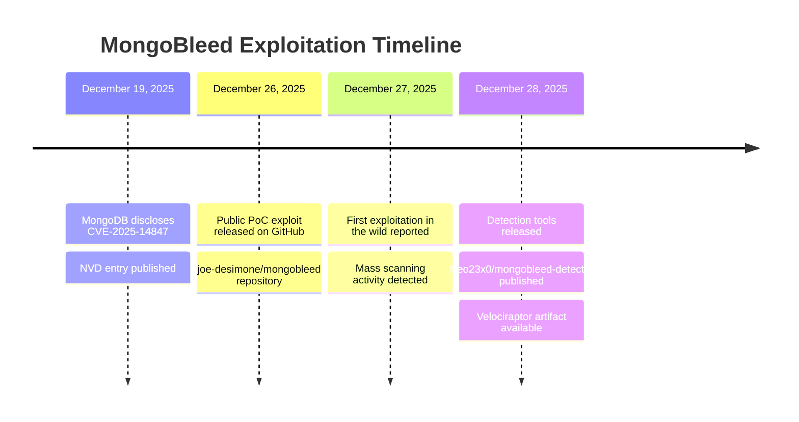
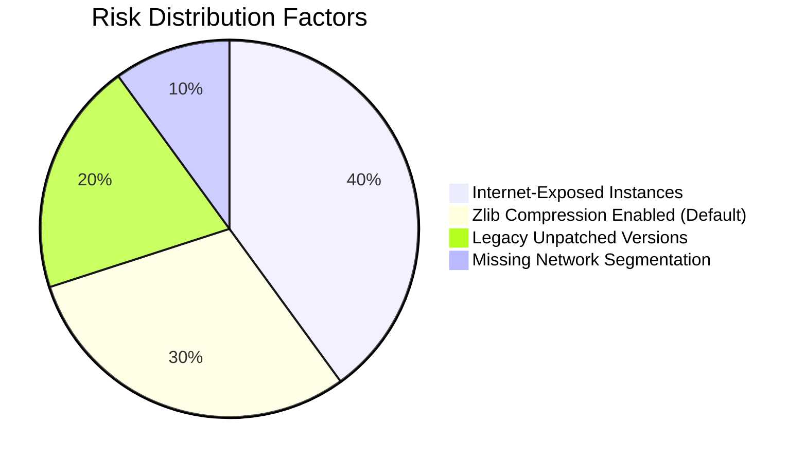

# MongoBleed: Critical MongoDB Memory Disclosure Vulnerability (CVE-2025-14847)

**Report ID:** VUL-2025-0034
**Date:** December 28, 2025
**TLP:** TLP:CLEAR
**Criticality:** CRITICAL

---

## Executive Summary

[CVE-2025-14847](Vulnerabilities/CVE-2025-14847.md) (MongoBleed) is a critical unauthenticated memory disclosure vulnerability affecting MongoDB Server's zlib compression implementation. The flaw allows remote attackers to extract fragments of uninitialized heap memory without authentication, potentially exposing cleartext credentials, session tokens, authentication keys, and customer PII.

Named after the infamous Heartbleed vulnerability due to its similar attack pattern, MongoBleed was publicly disclosed on December 19, 2025, with a working exploit released on December 26, 2025. Active exploitation in the wild was confirmed shortly thereafter. Based on Wiz telemetry, 42% of cloud environments contain at least one vulnerable MongoDB instance, and Censys has identified approximately 87,000 potentially vulnerable instances exposed to the internet.

Organizations running affected MongoDB versions should treat this as a critical priority for immediate patching or mitigation.

---

## Key Points

- **Unauthenticated Remote Exploitation**: No credentials required; exploitation occurs before authentication checks at the network transport layer
- **Pre-Authentication Attack Vector**: Vulnerability triggers during zlib message decompression, bypassing all authentication mechanisms
- **Widespread Exposure**: 87,000+ vulnerable instances identified globally; 42% of cloud environments affected
- **Active Exploitation Confirmed**: Working exploit publicly available since December 26, 2025; exploitation in the wild observed
- **Memory Contents at Risk**: Heap memory may contain database passwords (plaintext), AWS secret keys, session tokens, and sensitive application data
- **Detection Challenge**: Exploitation only detectable via MongoDB server logs (JSON format required), which are rarely shipped to SIEMs

---

## Technical Assessment

### Vulnerability Details

| Attribute | Value |
|-----------|-------|
| **CVE ID** | CVE-2025-14847 |
| **CVSS v4.0** | 8.7 (HIGH) |
| **CVSS v3.1** | 7.5 (HIGH) |
| **CWE** | CWE-130: Improper Handling of Length Parameter Inconsistency |
| **Attack Vector** | Network |
| **Attack Complexity** | Low |
| **Privileges Required** | None |
| **User Interaction** | None |
| **Impact** | Confidentiality: High |
| **Disclosure Date** | December 19, 2025 |
| **Exploit Release** | December 26, 2025 |

### Root Cause Analysis

The vulnerability resides in MongoDB Server's network message compression layer, specifically within `message_compressor_zlib.cpp`. The flawed code incorrectly handles decompressed message length calculations:

1. **Mismatched Length Fields**: The vulnerable code returns the allocated buffer size rather than the actual decompressed data length
2. **Heap Memory Exposure**: This mismatch causes MongoDB to return uninitialized heap memory beyond the intended payload
3. **Pre-Authentication Processing**: Compression/decompression occurs at the transport layer before authentication checks, enabling unauthenticated exploitation

When an attacker sends specially crafted compressed payloads with inflated length fields, MongoDB miscalculates the length of decompressed data and includes unintended memory contents in its response.

### Attack Methodology

The exploitation technique follows a predictable pattern:

1. **Mass Connection Establishment**: Attacker establishes thousands of rapid connections (100,000+ per minute observed)
2. **Malformed Packet Injection**: Each connection sends crafted zlib-compressed packets with manipulated length fields
3. **Memory Bleeding**: Server returns uninitialized heap memory fragments in responses
4. **Data Aggregation**: Attacker aggregates leaked memory to reconstruct sensitive information

The exploit specifically searches for:
- Database credentials (often stored in plaintext in heap)
- AWS secret access keys
- Session tokens and authentication cookies
- Customer PII from recent database operations

### Affected Versions

<details>
<summary>Complete Affected Version Matrix (All Versions)</summary>

| Version Branch | Vulnerable Range | Patched Version | Support Status |
|----------------|------------------|-----------------|----------------|
| 8.2.x | 8.2.0 - 8.2.2 | 8.2.3+ | Supported |
| 8.0.x | 8.0.0 - 8.0.16 | 8.0.17+ | Supported |
| 7.0.x | 7.0.0 - 7.0.27 | 7.0.28+ | Supported |
| 6.0.x | 6.0.0 - 6.0.26 | 6.0.27+ | Supported |
| 5.0.x | 5.0.0 - 5.0.31 | 5.0.32+ | Supported |
| 4.4.x | 4.4.0 - 4.4.29 | 4.4.30+ | Supported |
| 4.2.x | All versions | No patch | End of Life |
| 4.0.x | All versions | No patch | End of Life |
| 3.6.x | All versions | No patch | End of Life |

</details>

**Critical Note**: MongoDB versions 4.2.x, 4.0.x, and 3.6.x have reached end-of-life and will NOT receive patches. Organizations running these versions must upgrade to a supported release.

---

## Exploitation Timeline



---

## Attack Surface Assessment

### Global Exposure

| Metric | Value | Source |
|--------|-------|--------|
| Potentially Vulnerable Instances (Internet-Facing) | ~87,000 | Censys |
| Cloud Environments with Vulnerable Instance | 42% | Wiz Research |
| Total MongoDB Internet Footprint | 200,000+ | Censys |

### Risk Factors



---

## MITRE ATT&CK Mapping

| Tactic | Technique | ID | Procedure | D3FEND Countermeasure |
|--------|-----------|----|-----------|-----------------------|
| Initial Access | Exploit Public-Facing Application | T1190 | Attacker sends crafted zlib packets to internet-exposed MongoDB | Network Monitoring, Application Firewall |
| Collection | Data from Local System | T1005 | Heap memory contents extracted include sensitive data | Memory Encryption, Data Masking |
| Credential Access | Unsecured Credentials | T1552 | Plaintext credentials exposed via memory disclosure | Credential Encryption at Rest |
| Discovery | Network Sniffing | T1040 | Memory fragments may reveal network configuration | Network Segmentation |

---

## Detection & Hunting

### Primary Detection Signal

The MongoBleed exploit exhibits a distinctive behavioral pattern that enables reliable detection:

**Key Insight**: Legitimate MongoDB drivers **always** send client metadata (Event ID 51800) immediately after connecting. The exploit **never** sends metadata.

| Event ID | Event Type | Exploit Behavior | Legitimate Behavior |
|----------|------------|------------------|---------------------|
| 22943 | Connection Accepted | Present | Present |
| 51800 | Client Metadata | **ABSENT** | Present |
| 22944 | Connection Closed | Present | Present |

### Detection Thresholds

| Risk Level | Connection Count | Metadata Rate | Connection Velocity |
|------------|------------------|---------------|---------------------|
| **HIGH** | ≥100 | <10% | ≥500 conn/min |
| **MEDIUM** | ≥100 | <10% | <500 conn/min |
| **LOW** | ≥100 | ≥10% | Any |
| **INFO** | <100 | Any | Any |

### Behavioral Indicators

**Attack Traffic Characteristics:**
- Extreme connection velocity: 100,000+ connections per minute
- Zero percent metadata rate across all connections
- Example: "499 connections, 0 metadata events, 0.3 seconds, 111,716 connections/min"

**Legitimate Traffic Baseline:**
- Connection velocity: 0.2-3.2 connections/minute
- Metadata rate: 99-100%
- Daily connections: 300-4,500

### Detection Tools

#### 1. MongoBleed Detector (Florian Roth)

**Repository**: `https://github.com/Neo23x0/mongobleed-detector`

```bash
# Basic scan
./mongobleed-detector.sh

# Custom log path
./mongobleed-detector.sh -p /path/to/logs/*.json

# Forensic mode (multiple hosts)
./mongobleed-detector.sh --forensic-dir /evidence/

# Remote SSH scanning
./mongobleed-remote.py --hosts-file hosts.txt --user admin
```

**Parameters:**
- `-t, --time`: Lookback window in minutes (default: 4320 / 3 days)
- `-c, --conn-threshold`: Connection count trigger (default: 100)
- `-b, --burst-threshold`: Connections per minute for HIGH risk (default: 400)
- `-m, --metadata-rate`: Metadata presence threshold (default: 0.10 / 10%)

#### 2. Velociraptor Artifact

**Artifact**: `Linux.Detection.CVE202514847.MongoBleed`

Available via Velociraptor Artifact Exchange for enterprise deployment.

**Log Sources Required:**
- MongoDB JSON logs (required format; 4.4+ defaults to JSON)
- Standard paths: `/var/log/mongodb/*.log*`
- Docker container logs supported

### Detection Challenges

- MongoDB server logs rarely shipped to SIEM platforms
- Requires JSON-formatted logging (not all deployments configured)
- Complex correlation logic required (connection events vs metadata events)
- Evidence depends on log retention policies

---

## Mitigation & Remediation

### Immediate Actions

#### 1. Patch (Preferred)

Upgrade to patched versions immediately:

| Current Version | Upgrade To |
|-----------------|------------|
| 8.2.x | 8.2.3+ |
| 8.0.x | 8.0.17+ |
| 7.0.x | 7.0.28+ |
| 6.0.x | 6.0.27+ |
| 5.0.x | 5.0.32+ |
| 4.4.x | 4.4.30+ |
| 4.2.x/4.0.x/3.6.x | Upgrade to supported version |

#### 2. Disable Zlib Compression (Temporary Mitigation)

If immediate patching is not possible, disable zlib compression:

**Configuration File Method:**
```yaml
net:
  compression:
    compressors: snappy,zstd
```

**Command Line Method:**
```bash
mongod --networkMessageCompressors snappy,zstd
```

**Note**: This removes zlib from available compressors while maintaining snappy and zstd for performance.

#### 3. Network Controls

- Restrict MongoDB access to trusted IP addresses only
- Implement network segmentation for database tier
- Use VPN or private connectivity for remote database access
- Block direct internet exposure of MongoDB instances

### Detection Deployment

1. Enable JSON-formatted logging in MongoDB (4.4+ default)
2. Ship MongoDB logs to SIEM/log aggregation platform
3. Deploy mongobleed-detector or Velociraptor artifact
4. Monitor for HIGH/MEDIUM risk alerts
5. Establish baseline connection patterns for anomaly detection

---

## Proof of Concept

A public PoC exploit is available at: `https://github.com/joe-desimone/mongobleed`

The exploit operates by:
1. Establishing TCP connection to MongoDB server
2. Sending crafted BSON documents with inflated length fields
3. Triggering zlib decompression with mismatched lengths
4. Extracting uninitialized memory from server responses
5. Parsing extracted memory for credentials and secrets

**Warning**: This tool should only be used for authorized testing and validation purposes.

---

## Intelligence Gaps

- **Threat Actor Attribution**: No specific threat actors have been publicly attributed to exploitation campaigns (vulnerability is <2 weeks old)
- **Targeted Sectors**: No sector-specific targeting patterns identified yet
- **Secondary Exploitation**: Unknown whether extracted credentials are being used for follow-on attacks
- **Ransomware Nexus**: Potential connection to ransomware operations not yet confirmed
- **Nation-State Interest**: Unknown if APT groups are leveraging this vulnerability

---

## Related Incidents

Reports suggest multiple organizations may have been impacted, including potential targeting of gaming companies. However, specific attribution and incident details remain unconfirmed at this time.

---

## References

1. National Vulnerability Database. (2025, December 19). CVE-2025-14847. Retrieved from https://nvd.nist.gov/vuln/detail/CVE-2025-14847

2. Wiz Research. (2025, December 28). MongoBleed (CVE-2025-14847) exploited in the wild. Retrieved from https://www.wiz.io/blog/mongobleed-cve-2025-14847-exploited-in-the-wild-mongodb

3. Capuano, E. (2025, December 28). Hunting MongoBleed (CVE-2025-14847). Retrieved from https://blog.ecapuano.com/p/hunting-mongobleed-cve-2025-14847

4. Aikido Security. (2025, December). MongoBleed: MongoDB Zlib Vulnerability (CVE-2025-14847). Retrieved from https://www.aikido.dev/blog/mongobleed-mongodb-zlib-vulnerability-cve-2025-14847

5. Roth, F. (2025, December 28). mongobleed-detector. GitHub. Retrieved from https://github.com/Neo23x0/mongobleed-detector

6. DeSimone, J. (2025, December 26). mongobleed. GitHub. Retrieved from https://github.com/joe-desimone/mongobleed

7. Orca Security. (2025, December). CVE-2025-14847: MongoDB Memory Leak Alert. Retrieved from https://orca.security/resources/blog/cve-2025-14847-mongodb-heap-memory-leak/

8. runZero. (2025, December). MongoDB Server vulnerability: CVE-2025-14847. Retrieved from https://www.runzero.com/blog/mongodb/

9. Security Affairs. (2025, December). High-severity MongoDB flaw CVE-2025-14847 could lead to server takeover. Retrieved from https://securityaffairs.com/186107/security/high-severity-mongodb-flaw-cve-2025-14847-could-lead-to-server-takeover.html

10. Velociraptor. (2025). Linux.Detection.CVE202514847.MongoBleed. Artifact Exchange. Retrieved from https://docs.velociraptor.app/exchange/artifacts/pages/linux.detection.cve202514847.mongobleed/

---

## Data Sources

| Source | Type | Confidence |
|--------|------|------------|
| MongoDB Security Advisory | Primary Vendor | High |
| NVD/CVE | Authoritative Database | High |
| Wiz Research | Cloud Security Vendor | High |
| Eric Capuano | Security Researcher | High |
| Florian Roth | Security Researcher | High |
| Censys | Internet Scanning Platform | Medium |
| Aikido Security | Application Security Vendor | Medium |

---

## Probability Matrix

| Term | Probability Range |
|------|-------------------|
| Almost Certainly | 95-99% |
| Very Likely | 80-95% |
| Likely | 55-80% |
| Roughly Even Chance | 45-55% |
| Unlikely | 20-45% |
| Very Unlikely | 5-20% |

---

## Related Intelligence


---

*Report generated by Claude Code Threat Intelligence Research*
*Last Updated: December 28, 2025*
