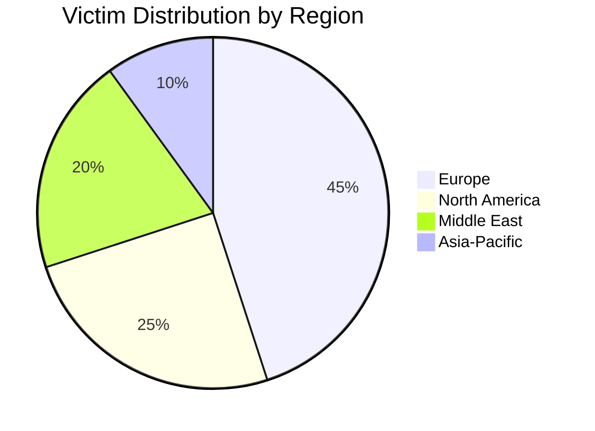
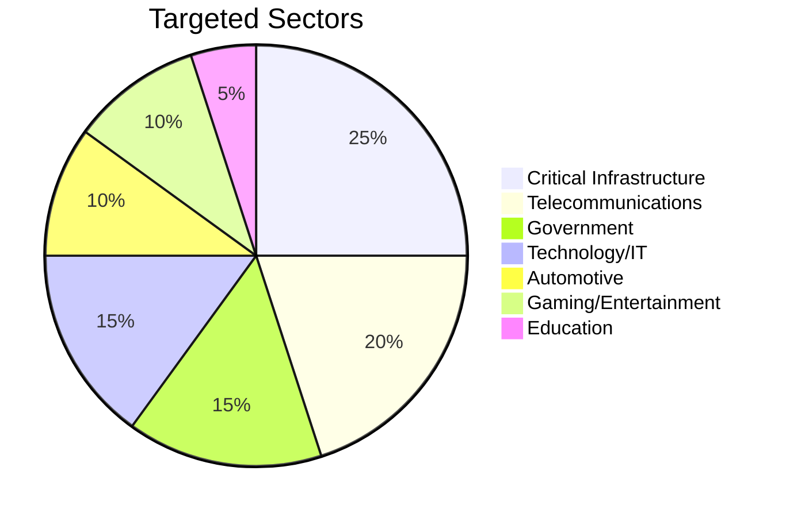
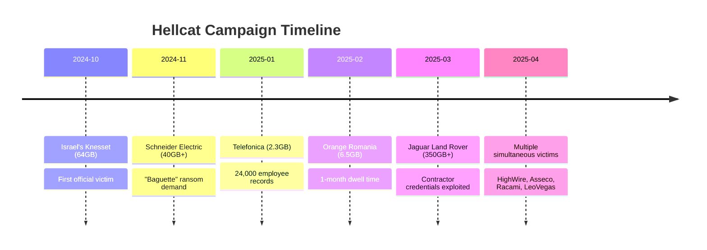

# Hellcat Ransomware Group - Threat Actor Profile

**Report ID:** CTID-002-2025  
**Classification:** TLP:AMBER  
**Date:** December 27, 2025  
**Criticality:** HIGH  
**Confidence:** HIGH

---

## Executive Summary

[[Threat Actors/Hellcat]] is an emerging Ransomware-as-a-Service (RaaS) threat group that surfaced in Q4 2024 and has rapidly established itself as a significant threat to global enterprises and government entities. The group combines ideological motivations—specifically targeting U.S. and Israeli organizations for "religious motives"—with financially-driven extortion operations. We assess with high confidence that Hellcat operators are high-ranking members of the BreachForums cybercriminal community, including identified individuals Pryx ("Adem" based in UAE) and Rey (Saif Khader from Amman, Jordan).

Hellcat's signature attack vector involves the exploitation of Atlassian Jira credentials harvested via infostealer malware (StealC, Raccoon, Redline, [[Malware/LummaStealer]]). This technique has enabled breaches of high-profile targets including Schneider Electric, Telefonica, Jaguar Land Rover, and Orange Romania. The group employs sophisticated multi-stage PowerShell infection chains deploying [[Malware/SliverC2]] for persistent access before ransomware deployment.

SentinelOne analysis revealed that Hellcat ransomware shares "nearly identical code" with [[Threat Actors/Morpheus]] ransomware, indicating a shared codebase or builder application. This connection, combined with the group's integration into the BreachForums ecosystem, positions Hellcat as part of an interconnected web of cybercriminal operations with significant resources and reach.

---

## Key Points

- **Identity:** Hellcat (formerly ICA Group) emerged October 2024; operators include Pryx, Rey, Grep, and IntelBroker—all high-ranking BreachForums members
- **Primary Attack Vector:** Exploitation of Jira credentials harvested via infostealer malware, enabling enterprise-wide compromise
- **Notable Victims:** Schneider Electric (40GB), Telefonica (2.3GB), Jaguar Land Rover (350GB+), Orange Romania (6.5GB), Israel's Knesset (64GB)
- **Technical Arsenal:** Multi-stage PowerShell chains, SliverC2/Cobalt Strike for C2, custom ransomware (AES-CBC + RSA encryption)
- **Code Relationship:** Nearly identical codebase shared with Morpheus ransomware; possible shared builder or affiliate overlap
- **Dual Motivation:** Ideological targeting of U.S./Israeli entities combined with financial extortion

---

## Assessment

### Operational Capabilities

Hellcat demonstrates sophisticated operational capabilities characteristic of an established RaaS operation despite its recent emergence. The group's consistent exploitation of Jira credentials harvested from infostealer logs indicates access to underground credential marketplaces and potentially direct relationships with infostealer operators. This supply chain approach allows Hellcat to bypass traditional perimeter defenses by using legitimate credentials that may have been compromised months or years prior—as evidenced by the Jaguar Land Rover breach where 2021-vintage credentials remained valid in 2025.

The group's technical tradecraft is notable for its use of multi-stage PowerShell infection chains with progressive defense evasion capabilities. Initial scripts establish persistence via registry modifications, subsequent stages implement AMSI bypasses, and final payloads deploy SliverC2 shellcode via reflective code loading. This modular approach allows operators to adapt their tooling while maintaining operational security.

### Group Structure and Attribution

Intelligence from KELA's March 2025 exposure reveals Hellcat operates with a core leadership of two to three individuals supported by an unknown number of affiliates. The leadership includes:

- **Pryx (HolyPryx):** Founding leader, identified as "Adem" residing in UAE with origins in an Arab country. Developed custom server-side stealer using Tor-based services.
- **Rey (Hikki-Chan):** Administrator, identified as Saif Khader from Amman, Jordan. Publicly acknowledged Palestinian identity and anti-Israel ideology.
- **Grep:** Operator attributed to Dell and CapGemini breaches.

The arrest of associated member IntelBroker (BreachForums owner) in February 2025 and four ShinyHunters members in June 2025 demonstrates law enforcement attention on the broader ecosystem. However, Hellcat operations have continued, indicating operational resilience and compartmentalization.

### Evolutionary Trajectory

Hellcat's victim count has accelerated throughout 2025, with the group claiming four simultaneous new victims in April 2025 (HighWire Press, Asseco, Racami, LeoVegas). This escalation pattern, combined with the group's RaaS model and shared codebase with Morpheus, suggests expansion of affiliate operations. We assess with moderate confidence that Hellcat will continue to grow its victim count and may expand targeting to additional sectors and geographies.

---

## Threat Actor Summary

| Attribute | Details |
|-----------|---------|
| **Primary Name** | Hellcat |
| **Aliases** | HellCat, HELLCAT, ICA Group (former) |
| **Type** | eCrime / Ransomware-as-a-Service |
| **Origin** | Jordan, UAE (operators) |
| **Sponsorship** | None (financially motivated) |
| **Motivation** | Financial gain; Ideological (anti-US/Israel) |
| **First Observed** | October 2024 |
| **Status** | Active |
| **Associated Groups** | Morpheus, BreachForums, ShinyHunters |

---

## TTPs Narrative

### Initial Access

Hellcat's signature initial access technique centers on the exploitation of Atlassian Jira credentials. The group acquires these credentials from infostealer logs—specifically from malware families including StealC, Raccoon Stealer, Redline Stealer, and Lumma Stealer. This technique is highly effective because:

1. Jira credentials often provide access to internal project management systems containing sensitive data
2. Organizations frequently fail to rotate credentials following infostealer infections
3. Jira instances may have elevated access to other enterprise systems via integrations

Secondary initial access vectors include spearphishing campaigns with malicious attachments and exploitation of public-facing applications, notably Palo Alto Networks PAN-OS vulnerabilities (CVE-2024-0012, CVE-2024-9474).

### Execution and Persistence

Upon gaining initial access, Hellcat deploys a multi-stage PowerShell infection chain:

1. **S1.ps1** - Establishes registry persistence in `HKCU\Software\Microsoft\Windows\CurrentVersion\Run`, downloads secondary payloads
2. **Payload.ps1** - Fetches additional scripts from C2 infrastructure
3. **Isma.ps1** - Implements AMSI bypass to evade endpoint detection
4. **Shellcode.ps1** - Performs reflective code loading for in-memory execution
5. **Stager.woff** - SliverC2 shellcode variant for C2 establishment

### Command and Control

Primary C2 is established via SliverC2, an open-source red team framework. Cobalt Strike serves as secondary C2 for some operations. The group also establishes SSH backdoors using custom user accounts (username: "Notty") for persistent access.

### Data Exfiltration and Impact

Data exfiltration occurs via SFTP to attacker-controlled infrastructure, with the `waifu[.]cat` domain serving as a custom exfiltration platform. Following exfiltration, custom ransomware is deployed using AES-CBC encryption with RSA-protected keys. The ransomware creates a ransom note (`_README_.txt`) in `C:\Users\Public` and executes self-deletion via batch script (`_-_.bat`).

---

## Infrastructure

### Command and Control Domains

| Domain | Purpose |
|--------|---------|
| `pryx[.]pw` | Primary C2 |
| `waifu[.]cat` | Data exfiltration |
| `hellcat[.]locker` | Ransomware operations |
| `meowballs[.]xyz` | Associated infrastructure |
| `Dangerzone[.]cx` | Cybercrime forum |

### Tor Hidden Services

- `hellcakbszllztlyqbjzwcbdhfrodx55wq77kmftp4bhnhsnn5r3odad[.]onion` (Data Leak Site)
- `dangerzkwrpcvmyjl7tuopg2tus2srx4nfwhgm6yvtgqc3g54dvp4sad[.]onion` (Forum)

### Operational Security

The group employs multiple OPSEC measures including TOX and Session encrypted messaging, encrypted storage, air-gapped systems for sensitive operations, anonymous VPS procurement, and MullvadVPN for anonymization.

---

## Victims

### Geographic Distribution



### Sector Targeting



### Notable Victims Timeline



---

## Attribution

### Assessment

We assess with **high confidence** that Hellcat is a financially motivated eCrime group with an ideological component, operated by individuals based in Jordan and the UAE with ties to the broader BreachForums cybercriminal community.

### Supporting Evidence

| Evidence Type | Details | Confidence |
|---------------|---------|------------|
| Identity Exposure | KELA unmasked Rey as Saif Khader (Amman, Jordan) | High |
| Self-Disclosure | Pryx identified self as "Adem" in UAE | Moderate |
| Operational Patterns | Consistent Jira credential exploitation methodology | High |
| Code Analysis | SentinelOne confirmed shared codebase with Morpheus | High |
| Forum Activity | Operators are high-ranking BreachForums members | High |

### Alternative Hypotheses

No significant alternative hypotheses exist. The combination of self-disclosure, third-party investigation, and operational analysis provides strong attribution confidence.

---

## Key Intelligence Gaps

1. **Complete Victim Count:** Only 20+ victims publicly confirmed; actual count likely higher
2. **Affiliate Structure:** Limited visibility into RaaS affiliate recruitment and operations
3. **Builder Analysis:** No public analysis of shared ransomware builder application
4. **Rey's Status:** Unknown if still active following March 2025 identity exposure
5. **Financial Success:** No confirmed ransom payments or amounts
6. **Infrastructure Evolution:** Limited tracking of infrastructure changes post-exposure

---

<details>
<summary>MITRE ATT&CK Mapping (18 techniques)</summary>

| Tactic | Technique ID | Technique Name | Procedure |
|--------|--------------|----------------|-----------|
| Initial Access | T1566.001 | Phishing: Spearphishing Attachment | Malicious email attachments for credential theft |
| Initial Access | T1190 | Exploit Public-Facing Application | Jira exploitation; Palo Alto PAN-OS vulnerabilities |
| Initial Access | T1078 | Valid Accounts | Infostealer-harvested Jira/VPN credentials |
| Execution | T1059.001 | PowerShell | Multi-stage PowerShell infection chain |
| Persistence | T1547.001 | Registry Run Keys | `HKCU\...\CurrentVersion\Run` modifications |
| Defense Evasion | T1562.001 | Impair Defenses | AMSI bypass techniques |
| Defense Evasion | T1620 | Reflective Code Loading | In-memory payload execution |
| Defense Evasion | T1036 | Masquerading | Scripts disguised as executables |
| Defense Evasion | T1027 | Obfuscated Files | PowerShell script obfuscation |
| Credential Access | T1555.003 | Credentials from Browsers | Jira credentials from web browsers |
| Discovery | T1046 | Network Service Discovery | Netscan for network enumeration |
| Discovery | T1083 | File and Directory Discovery | Target data identification |
| Lateral Movement | T1021 | Remote Services | Netcat, SSH exploitation |
| Command and Control | T1071 | Application Layer Protocol | SliverC2, Cobalt Strike communications |
| Command and Control | T1219 | Remote Access Software | SliverC2 deployment via shellcode |
| Exfiltration | T1020 | Automated Exfiltration | SFTP to attacker infrastructure |
| Exfiltration | T1567 | Exfiltration Over Web Service | waifu[.]cat platform |
| Impact | T1486 | Data Encrypted for Impact | Custom AES-CBC + RSA ransomware |
| Impact | T1490 | Inhibit System Recovery | Self-deletion via batch script |

</details>

---

<details>
<summary>Indicators of Compromise (27 indicators)</summary>

### File Hashes (SHA256)

| Hash | Description |
|------|-------------|
| `5b492a70c2bbded7286528316d402c89ae5514162d2988b17d6434ead5c8c274` | Hellcat payload |
| `5744fb1ab1543cb809300c1fc397cd40436407ac6b2fc22407d859697c246f0` | Associated payload |
| `f4f4e853ffa13a8282bb85e756d35f7ad5bf0e294dc9261cad2c46bd087dea2e` | Associated payload |
| `03c3df737197126a3a8fdc5febfca0d7eb3c754bbc6fed2495a0f03efb113882` | Associated payload |
| `07297eb13714414fea3f60eba1ee53e59249d57a16d014fd066f604efa3f35b3` | Associated payload |

### File Hashes (SHA1)

| Hash | Description |
|------|-------------|
| `b834d9dbe2aed69e0b1545890f0be6f89b2a53c7` | HellCat payload |
| `f86324f889d078c00c2d071d6035072a0abb1f73` | Morpheus payload |
| `f62d2038d00cb44c7cbd979355a9d060c10c9051` | er.bat launcher |

### Network Indicators - Domains

| Indicator | Context |
|-----------|---------|
| `pryx[.]pw` | Primary C2 |
| `mail.pryx[.]pw` | Email infrastructure |
| `waifu[.]cat` | Data exfiltration |
| `dev.waifu[.]cat` | Development infrastructure |
| `api.waifu[.]cat` | API endpoint |
| `files.waifu[.]cat` | File hosting |
| `meowballs[.]xyz` | Associated infrastructure |
| `hellcat[.]locker` | Ransomware operations |
| `Dangerzone[.]cx` | Cybercrime forum |
| `Dzone[.]st` | Forum mirror |

### Network Indicators - IP Addresses

| Indicator | Context |
|-----------|---------|
| `45[.]200[.]148[.]157` | C2 infrastructure |
| `185[.]247[.]224[.]8` | C2 infrastructure |
| `185[.]10[.]68[.]159` | C2 infrastructure |
| `104[.]26[.]2[.]198` | Associated infrastructure |
| `172[.]67[.]71[.]216` | Associated infrastructure |
| `104[.]26[.]3[.]198` | Associated infrastructure |
| `172[.]67[.]157[.]17` | Associated infrastructure |
| `104[.]21[.]34[.]79` | Associated infrastructure |
| `154[.]16[.]16[.]189` | Associated infrastructure |

### Additional Indicators

| Type | Indicator | Context |
|------|-----------|---------|
| Email | `h3llr4ns[@]onionmail[.]com` | Contact address |
| Email | `morpheus[@]onionmail[.]com` | Contact address |
| Username | `Notty` | SSH backdoor account |
| Filename | `_README_.txt` | Ransom note |
| Filename | `_-_.bat` | Self-deletion script |

</details>

---

## CVEs Exploited

| CVE | Product | CVSS | Usage |
|-----|---------|------|-------|
| CVE-2024-0012 | Palo Alto PAN-OS | 9.8 | Initial access via firewall exploitation |
| CVE-2024-9474 | Palo Alto PAN-OS | 9.8 | Privilege escalation |

---

## Probability Matrix

| Term | Probability Range | Definition |
|------|-------------------|------------|
| Almost Certainly | 95-99% | Very high confidence, strong evidence |
| Very Likely | 80-95% | High confidence, multiple sources |
| Likely | 55-80% | Moderate-high confidence |
| Roughly Even Chance | 45-55% | Uncertain, conflicting evidence |
| Unlikely | 20-45% | Low probability |
| Very Unlikely | 5-20% | Very low probability |

---

## Intelligence Requirements

1. Monitor infostealer marketplaces for credential exposure affecting Atlassian products
2. Track Hellcat affiliate recruitment and expansion indicators
3. Identify infrastructure pivot patterns following domain takedowns
4. Assess impact of IntelBroker arrest on broader BreachForums ecosystem
5. Monitor for Morpheus/Hellcat builder tool proliferation

---

## Feedback

For questions, corrections, or additional intelligence on this threat actor, contact your threat intelligence team or submit feedback through established channels.

---

## Data Sources

- KELA Cyber Intelligence
- SentinelOne Labs
- Bridewell Cyber Intelligence
- Splunk Threat Research Team
- Picus Security
- SOC Prime
- CYFIRMA Research
- BleepingComputer
- SecurityWeek
- The Record

---

## Threat Actor Metadata

| Field | Value |
|-------|-------|
| ATT&CK ID | N/A (not yet assigned) |
| First Seen | October 2024 |
| Last Activity | December 2025 |
| Victim Count | 20+ confirmed |
| RaaS Model | Yes |
| Data Exfiltration | Yes |
| Double Extortion | Yes |
| Estimated Personnel | 3-5 core, unknown affiliates |

---

## References

Bridewell. (2025). *Who are Hellcat Ransomware Group?* Bridewell Insights. https://www.bridewell.com/insights/blogs/detail/who-are-hellcat-ransomware-group

CYFIRMA. (2025). *Investigation Report on Jaguar Land Rover Cyberattack.* CYFIRMA Research. https://www.cyfirma.com/research/investigation-report-on-jaguar-land-rover-cyberattack/

KELA. (2025, March 27). *Hellcat Hacking Group Unmasked: Rey and Pryx.* KELA Cyber Intelligence. https://www.kelacyber.com/blog/hellcat-hacking-group-unmasked-rey-and-pryx/

Picus Security. (2025). *HellCat Ransomware TTPs.* Picus Security. https://www.picussecurity.com/resource/blog/hellcat-ransomware

SentinelOne. (2025). *HellCat and Morpheus: Two Brands, One Payload as Ransomware Affiliates Drop Identical Code.* SentinelOne Labs. https://www.sentinelone.com/blog/hellcat-and-morpheus-two-brands-one-payload-as-ransomware-affiliates-drop-identical-code/

SOC Prime. (2025). *Hellcat Ransomware Detection.* SOC Prime Blog. https://socprime.com/blog/hellcat-ransomware-detection/

Splunk. (2025). *Hellcat Ransomware Analytics Story.* Splunk Security Research. https://research.splunk.com/stories/hellcat_ransomware/

---

## Related Intelligence

```dataview
TABLE created, report_type, confidence
FROM "Reports" OR "Threat Actors" OR "Campaigns"
WHERE contains(file.outlinks, this.file.link) OR contains(threat_actors, "[[Threat Actors/Hellcat]]")
SORT created DESC
LIMIT 10
```

---

*Generated by Claude Code Threat Intelligence Research*
