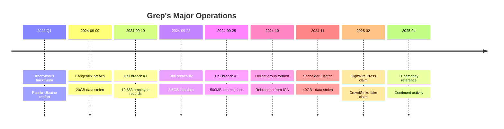
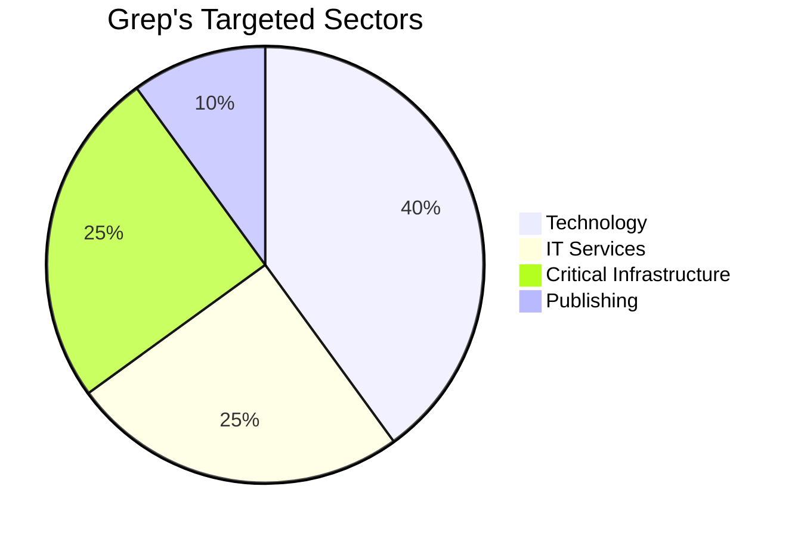

# Grep - Threat Actor Profile

**Report ID:** CTID-003-2025  
**Classification:** TLP:AMBER  
**Date:** December 27, 2025  
**Criticality:** MODERATE  
**Confidence:** MODERATE

---

## Executive Summary

[[Threat Actors/Grep]] (also known as "Greppy") is a threat actor operating as a founding member and key operator of the [[Threat Actors/Hellcat]] ransomware group. The actor gained notoriety in late 2024 through a series of high-profile data breaches targeting major enterprises including Dell Technologies, Capgemini, and Schneider Electric. Grep specializes in exploiting Atlassian Jira instances using stolen credentials obtained from infostealer malware, leveraging MiniOrange REST APIs for bulk data exfiltration.

Unlike Hellcat associates Pryx and Rey who were publicly unmasked by KELA in March 2025, Grep's true identity remains unknown as of December 2025. The actor maintains a confrontational public persona, actively taunting victims on X (formerly Twitter) and engaging with security researchers. Early reporting traces Grep's emergence to 2022, initially associated with Anonymous hacktivism during the Russia-Ukraine conflict before transitioning to financially-motivated cybercrime.

We assess with moderate confidence that Grep remains operationally active as of late 2025, continuing association with the Hellcat group despite the exposure of key associates and the arrest of affiliated member IntelBroker. Grep's continued anonymity suggests superior operational security practices compared to peers.

---

## Key Points

- **Identity:** Alias "Grep/Greppy" - true identity unknown; derived from Unix `grep` command suggesting technical background
- **Role:** Founding member and operator of Hellcat ransomware group alongside Pryx and Rey
- **Signature TTP:** Jira credential exploitation via infostealer-harvested credentials; MiniOrange REST API abuse for bulk data extraction
- **Major Breaches:** Dell Technologies (10,800+ records), Capgemini (20GB), Schneider Electric (40GB+)
- **Operational Style:** Public victim taunting on X/Twitter, staged data leaks, collaborative operations with BreachForums community
- **Status:** Likely active (April 2025 social media activity); no law enforcement actions or identity exposure

---

## Assessment

### Operational Profile

Grep demonstrates sophisticated understanding of enterprise software exploitation, particularly targeting Atlassian Jira environments. The actor's consistent focus on Jira credential exploitation represents an efficient attack methodology that bypasses traditional perimeter security by leveraging legitimate but compromised credentials. In the Schneider Electric breach, Grep exploited MiniOrange REST APIs to scrape 400,000 rows of user data—demonstrating capability to automate large-scale data extraction.

The actor's operational style is characterized by public engagement and staged disclosure. Rather than conducting silent exfiltration, Grep actively taunts victims on social media and releases stolen data in parts to maximize pressure and public attention. This approach, while increasing exposure risk, appears designed to pressure victims into ransom payment and establish reputation within the cybercriminal community.

### Group Dynamics

Grep's relationship with Hellcat originated from casual conversation on BreachForums. According to Pryx, the group formed after Grep commented "ICA is a cool name for a group" during a discussion about ICA.gov. This informal genesis underscores the fluid nature of cybercriminal collaboration, where groups form through forum interactions rather than formal recruitment.

Within Hellcat's structure, Grep functions as a technical operator handling breach execution, while Pryx provides leadership and Rey handles administrative functions. The collaborative model extends beyond Hellcat—Grep worked with threat actor "Chucky" on the Dell breach, indicating willingness to partner across group boundaries.

### Attribution Confidence

We assess Grep's involvement in the attributed breaches with **moderate-high confidence** based on:
- Self-attribution via BreachForums posts and X/Twitter communications
- Victim confirmation of breach incidents (Dell, Schneider Electric)
- Consistent TTP patterns across operations (Jira targeting, MiniOrange exploitation)
- Third-party reporting corroboration (BleepingComputer, Hackread, security researchers)

However, the February 2025 CrowdStrike data leak claim—which proved to be fabricated from public sources—demonstrates Grep (operating with Rey) is willing to make false claims for attention, warranting caution on unverified attribution.

---

## Threat Actor Summary

| Attribute | Details |
|-----------|---------|
| **Primary Alias** | Grep |
| **Alternate Aliases** | Greppy |
| **Type** | eCrime / Data Extortion |
| **Origin** | Unknown |
| **True Identity** | NOT EXPOSED |
| **Motivation** | Financial gain; possible hacktivism origins |
| **First Observed** | Early 2022 (Anonymous-aligned) |
| **Cybercrime Activity** | September 2024 - Present |
| **Status** | Likely Active |
| **Primary Group** | Hellcat Ransomware |
| **Secondary Affiliations** | BreachForums, Anonymous (historical) |

---

## TTPs Narrative

### Initial Access

Grep's signature initial access technique centers on the exploitation of Atlassian Jira credentials. The actor acquires credentials harvested by infostealer malware families including [[Malware/LummaStealer]], [[Malware/Raccoon Stealer]], [[Malware/RedLine Stealer]], and StealC. These credentials are either purchased from underground marketplaces or obtained through collaboration with infostealer operators.

Key characteristics of Grep's credential exploitation:
1. **Credential Longevity:** Some credentials used remain valid years after initial harvest (2021 credentials valid in 2025)
2. **Service Account Targeting:** Focus on service accounts with elevated permissions
3. **Chained Access:** Initial Jira access may chain to Confluence, Jenkins, and Bitbucket

### Collection and Exfiltration

Upon gaining Jira access, Grep employs automated data extraction techniques:

1. **MiniOrange REST API Exploitation:** Leveraging the MiniOrange plugin's REST API for bulk user data extraction. In the Schneider Electric breach, this technique extracted 400,000 rows of user data.

2. **Jira Data Scraping:** Systematic extraction of:
   - User tables (names, emails, internal IDs)
   - Project configurations and issues
   - Attachments and internal documents
   - Credential data in comments/descriptions

3. **Staged Exfiltration:** Data organized into structured datasets for incremental release, maximizing extortion pressure.

### Extortion Methodology

Grep's extortion approach differs from traditional ransomware:

1. **Public Disclosure Threat:** Initial announcement on BreachForums with data samples
2. **Social Media Taunting:** Active victim engagement on X/Twitter
3. **Staged Leaks:** Data released in parts over time
4. **Minimal Initial Demands:** Early breaches offered for trivial amounts (~$0.30) to build reputation
5. **Escalating Demands:** Later operations (with Hellcat) involve formal ransom demands ($125,000 for Schneider Electric)

---

## Infrastructure

Grep primarily leverages shared Hellcat group infrastructure rather than maintaining personal operational infrastructure. This shared model provides operational efficiency while complicating individual attribution.

### Communication Channels

| Platform | Usage |
|----------|-------|
| X/Twitter (@greppy) | Public victim taunting, announcements |
| BreachForums (grep) | Data leak announcements, community engagement |
| TOX Messenger | Secure ransom negotiations |

### Exfiltration Infrastructure

Grep utilizes Hellcat group infrastructure for data exfiltration and hosting:

| Domain | Purpose |
|--------|---------|
| `waifu[.]cat` | Data exfiltration |
| `dev.waifu[.]cat` | Development infrastructure |
| `api.waifu[.]cat` | API endpoint |
| `files.waifu[.]cat` | File hosting |

---

## Victims

### Campaign Timeline



### Sector Targeting



### Notable Victims Detail

| Victim | Date | Data Stolen | Attack Vector |
|--------|------|-------------|---------------|
| Dell Technologies | Sept 2024 | 10,863 employee records; 3.5GB Jira data; 500MB docs | Jira credential exploitation |
| Capgemini | Sept 2024 | 20GB (source code, credentials, API keys) | Unknown (likely Jira) |
| Schneider Electric | Nov 2024 | 40GB+ (400K user rows) | Jira + MiniOrange REST API |
| HighWire Press | Feb 2025 | 26M records claimed | Disputed attribution |

---

## Attribution

### Assessment

We assess with **moderate confidence** that Grep is a technically sophisticated threat actor specializing in enterprise software exploitation, operating as a core member of the Hellcat ransomware group.

### Supporting Evidence

| Evidence Type | Details | Confidence |
|---------------|---------|------------|
| Self-Attribution | BreachForums posts, X communications | High |
| Victim Confirmation | Dell, Schneider Electric acknowledged breaches | High |
| Third-Party Reporting | Multiple security news sources | Moderate-High |
| TTP Consistency | Jira exploitation pattern across operations | High |
| Group Association | Confirmed by Pryx interview | High |

### Identity Status

Unlike Hellcat associates:
- **Rey:** Exposed as Saif Khader (Amman, Jordan) - March 2025
- **Pryx:** Exposed as "Adem" (UAE-based) - March 2025
- **IntelBroker:** Arrested (Kai West) - February 2025
- **Grep:** **NOT EXPOSED** - Identity remains unknown

This disparity suggests Grep maintains superior operational security, possibly including:
- Limited personal information sharing with associates
- Careful separation of online and real-world identity
- Geographic jurisdiction that complicates investigation

---

## Key Intelligence Gaps

1. **True Identity:** Real name, location, nationality, and age remain unknown
2. **Pre-2022 Activity:** Limited visibility into skill development and early operations
3. **Financial Proceeds:** Unknown if Grep has received ransom payments
4. **Current Operational Tempo:** Unclear if actively conducting operations or reduced activity
5. **Personal Infrastructure:** Degree of personal vs. shared Hellcat infrastructure unknown
6. **Law Enforcement Interest:** Unknown if active investigations are targeting Grep specifically
7. **Relationship Depth:** Full extent of collaboration with other BreachForums actors unclear

---

<details>
<summary>MITRE ATT&CK Mapping (8 techniques)</summary>

| Tactic | Technique ID | Technique Name | Procedure |
|--------|--------------|----------------|-----------|
| Reconnaissance | T1589 | Gather Victim Identity Information | Identify Jira-using organizations |
| Resource Development | T1588.002 | Obtain Capabilities: Tool | MiniOrange REST API exploitation tools |
| Initial Access | T1078 | Valid Accounts | Infostealer-harvested Jira credentials |
| Initial Access | T1190 | Exploit Public-Facing Application | Jira server exploitation |
| Collection | T1213 | Data from Information Repositories | Jira project/issue data extraction |
| Collection | T1119 | Automated Collection | REST API scraping via MiniOrange |
| Exfiltration | T1567 | Exfiltration Over Web Service | Data transfer to attacker infrastructure |
| Impact | T1485 | Data Destruction | Data leaked on BreachForums if ransom unpaid |

</details>

---

<details>
<summary>Indicators of Compromise (8 indicators)</summary>

### Social Media Identifiers

| Platform | Identifier | Context |
|----------|------------|---------|
| X/Twitter | @greppy | Public communications |
| BreachForums | grep | Data leak announcements |

### Contact Methods

| Method | Identifier |
|--------|------------|
| TOX | `F97D66EB390592BA053CC7C25C16ECDBE42F3C266DD2A99CB9D1DDABE69F6A41EF5FB3D9EE7F` |

### Network Indicators - Domains (Hellcat Infrastructure)

| Indicator | Context |
|-----------|---------|
| `waifu[.]cat` | Data exfiltration |
| `dev.waifu[.]cat` | Development infrastructure |
| `api.waifu[.]cat` | API endpoint |
| `files.waifu[.]cat` | File hosting |
| `hellcakbszllztlyqbjzwcbdhfrodx55wq77kmftp4bhnhsnn5r3odad[.]onion` | Data leak site |

### Network Indicators - IP Addresses

| Indicator | Context |
|-----------|---------|
| `45[.]200[.]148[.]157` | C2 infrastructure |
| `185[.]247[.]224[.]8` | C2 infrastructure |
| `185[.]10[.]68[.]159` | C2 infrastructure |

</details>

---

## Detection Opportunities

### Jira-Specific Monitoring

**Unusual Jira Access Patterns:**
```splunk
index=jira_access sourcetype=jira:access
| stats count by user, src_ip, action
| where count > 1000 OR action="bulk_export" OR action="api_call"
```

**MiniOrange REST API Abuse:**
```splunk
index=web_proxy uri_path="*miniorange*" OR uri_path="*rest/api*"
| stats count by src_ip, dest_host, uri_path
| where count > 100
```

**Credential Stuffing Detection:**
```splunk
index=jira_access action="login_failed"
| stats count by user, src_ip
| where count > 10
| table user, src_ip, count
```

### Behavioral Indicators

1. Bulk API responses from Jira exceeding normal thresholds
2. Jira authentication from unexpected geolocations or off-hours
3. Service account interactive sessions
4. Sequential access to user profile endpoints
5. Large data transfers following Jira authentication

### Mitigation Recommendations

**Immediate Actions:**
1. Enable MFA on all Jira/Atlassian instances
2. Audit and rotate all Jira credentials
3. Review service account permissions and usage
4. Monitor for credentials in infostealer logs (Hudson Rock, KELA, SpyCloud)

**Long-Term Measures:**
1. Implement Jira access logging and alerting
2. Restrict API access to authorized applications only
3. Disable MiniOrange or similar third-party plugins if not required
4. Network segmentation for internal tooling
5. Regular credential rotation policy

---

## Probability Matrix

| Term | Probability Range | Definition |
|------|-------------------|------------|
| Almost Certainly | 95-99% | Very high confidence, strong evidence |
| Very Likely | 80-95% | High confidence, multiple sources |
| Likely | 55-80% | Moderate-high confidence |
| Roughly Even Chance | 45-55% | Uncertain, conflicting evidence |
| Unlikely | 20-45% | Low probability |
| Very Unlikely | 5-20% | Very low probability |

---

## Intelligence Requirements

1. Monitor BreachForums for new Grep data leak announcements
2. Track X/Twitter activity of @greppy handle
3. Assess credential exposure in infostealer logs affecting Atlassian products
4. Identify connections between Grep and other BreachForums operators
5. Monitor for law enforcement actions against Hellcat operators

---

## Feedback

For questions, corrections, or additional intelligence on this threat actor, contact your threat intelligence team or submit feedback through established channels.

---

## Data Sources

- Bridewell Cyber Intelligence
- KELA Cyber Intelligence
- BleepingComputer
- Hackread
- The Register
- Cyber Daily
- Push Security
- Picus Security
- SentinelOne Labs
- CSO Online
- Security Boulevard

---

## Threat Actor Metadata

| Field | Value |
|-------|-------|
| ATT&CK ID | N/A (not assigned) |
| First Seen | Early 2022 |
| Cybercrime Active | September 2024 |
| Last Activity | April 2025 |
| Identity Status | Unknown |
| Victim Count | 4+ confirmed |
| Primary TTP | Jira credential exploitation |
| Group Role | Founding member, operator |

---

## References

BleepingComputer. (2024, September 20). *Dell investigates data breach claims after hacker leaks employee info.* BleepingComputer. https://www.bleepingcomputer.com/news/security/dell-investigates-data-breach-claims-after-hacker-leaks-employee-info/

BleepingComputer. (2024, November). *Schneider Electric confirms dev platform breach after hacker steals data.* BleepingComputer. https://www.bleepingcomputer.com/news/security/schneider-electric-confirms-dev-platform-breach-after-hacker-steals-data/

Bridewell. (2025). *Who are Hellcat Ransomware Group?* Bridewell Insights. https://www.bridewell.com/insights/blogs/detail/who-are-hellcat-ransomware-group

Hackread. (2024, September). *Dell Hit by Third Data Leak in a Week Amid grep Cyberattacks.* Hackread. https://hackread.com/dell-data-leak-in-week-amid-grep-cyberattacks/

KELA. (2025, March 27). *Hellcat Hacking Group Unmasked: Rey and Pryx.* KELA Cyber Intelligence. https://www.kelacyber.com/blog/hellcat-hacking-group-unmasked-rey-and-pryx/

Push Security. (2025). *Why attackers are targeting Jira with stolen credentials.* Push Security Blog. https://pushsecurity.com/blog/why-attackers-are-targeting-jira-with-stolen-credentials/

The Register. (2024, September 12). *Capgemini confirms data breach, ThunderCat.* The Register. https://www.theregister.com/2024/09/12/capgemini_breach_data_dump/

---

## Related Intelligence

```dataview
TABLE created, report_type, confidence
FROM "Reports" OR "Threat Actors" OR "Campaigns"
WHERE contains(file.outlinks, this.file.link) OR contains(threat_actors, "[[Threat Actors/Grep]]") OR contains(threat_actors, "[[Threat Actors/Hellcat]]")
SORT created DESC
LIMIT 10
```

---

*Generated by Claude Code Threat Intelligence Research*
