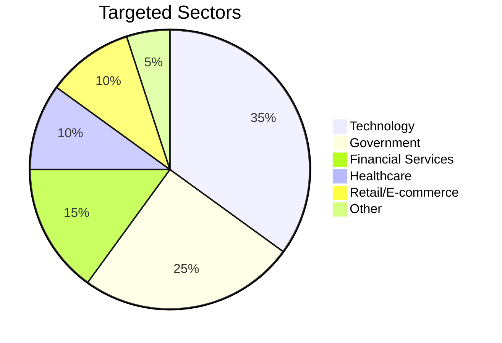
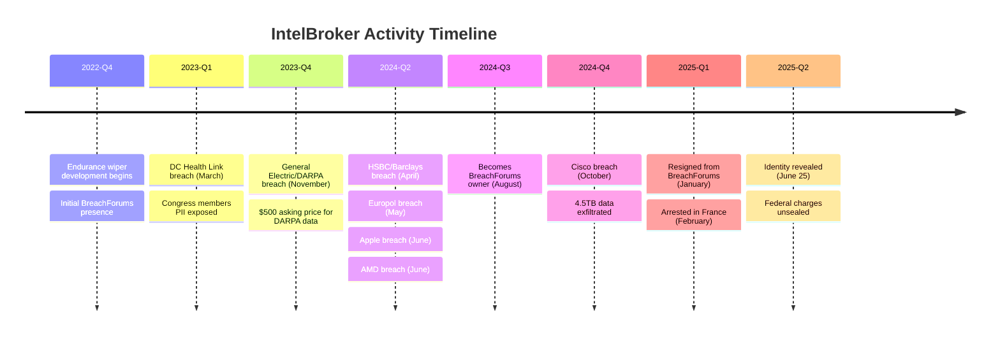

# Threat Actor Profile: IntelBroker (Kai West)

| Field | Value |
|-------|-------|
| **Report ID** | CTID-047-2025 |
| **Date** | December 27, 2025 |
| **TLP** | TLP:AMBER |
| **Criticality** | HIGH |
| **Confidence** | HIGH |

---

## Executive Summary

[[Threat Actors/IntelBroker]] emerged as one of the most prolific and impactful cybercriminal threat actors of 2023-2025, orchestrating over 80 documented data breaches against high-profile organizations including U.S. government agencies, major technology corporations, financial institutions, and critical infrastructure providers. Operating as both a sophisticated initial access broker and data extortionist, IntelBroker caused an estimated $25 million in damages worldwide before his arrest in February 2025.

The actor's significance extends beyond individual breaches—IntelBroker served as owner of BreachForums, the largest English-language cybercrime marketplace, from August 2024 to January 2025, providing him with unprecedented visibility into the broader cybercriminal ecosystem and access to collaborate with other threat actors. His arrest by French authorities, followed by U.S. federal indictment unsealed in June 2025, represents a major law enforcement success against the cybercrime-as-a-service ecosystem.

Organizations across all sectors should assess their exposure to IntelBroker's historical campaigns and review the technical indicators and TTPs documented in this report. While IntelBroker himself is in custody, his collaborators within the [[Threat Actors/CyberNiggers]] hacking collective remain active, and the techniques he popularized continue to be employed by successor actors.

---

## Key Points

- **Identity Revealed**: IntelBroker identified as Kai Logan West, 25-year-old British national, arrested February 2025 in France; faces up to 20 years in U.S. prison
- **Prolific Operations**: Over 80 documented data breaches/leaks, claimed access sales to 400+ organizations, causing $25 million+ in damages
- **High-Value Targets**: Compromised Apple, AMD, Cisco, Europol, General Electric, HSBC, T-Mobile, U.S. Congress members, and multiple government agencies
- **Forum Ownership**: Served as owner/administrator of BreachForums (August 2024 - January 2025), the largest English-language cybercrime marketplace
- **Primary TTPs**: Exploited public-facing applications (Jenkins CVE-2024-23897, Jira zero-days), harvested credentials from misconfigurations, developed custom [[Malware/Endurance Wiper]] tool
- **Collaborative Model**: Operated with CyberNiggers collective, notably collaborating with EnergyWeaponUser and zjj on major operations

---

## Assessment

IntelBroker represents a significant evolution in the cybercriminal threat landscape, demonstrating how a single determined actor can leverage vulnerability exploitation, credential harvesting, and dark web marketplace access to systematically compromise organizations at scale. We assess with high confidence that IntelBroker operated primarily as a financially motivated cybercriminal rather than a nation-state proxy, despite early speculation about potential Iranian state connections.

The actor's operational tempo was remarkable—from joining BreachForums in June 2023 to his arrest in February 2025, IntelBroker maintained consistent activity, averaging multiple high-profile breach announcements per month. His technical sophistication evolved over time, progressing from exploiting simple misconfigurations (such as the DC Health Link breach discovered via "Google dorking") to deploying zero-day exploits against enterprise software platforms.

IntelBroker's role as BreachForums administrator provided strategic advantages beyond marketplace access. The position enabled him to identify emerging vulnerabilities through forum discussions, recruit collaborators for specific operations, and establish himself as a trusted broker in the cybercriminal ecosystem. This dual role—both threat actor and platform operator—amplified his impact exponentially.

The law enforcement operation that led to IntelBroker's arrest demonstrates the effectiveness of international cooperation and cryptocurrency tracing. Investigators connected his IntelBroker persona to his real identity through a single Bitcoin transaction—when an undercover FBI agent insisted on Bitcoin payment rather than IntelBroker's preferred Monero, the resulting blockchain analysis led to a KYC-verified account under his real name. This operational security failure underscores that even sophisticated threat actors remain vulnerable to forensic investigation.

---

## Threat Actor Summary

| Attribute | Details |
|-----------|---------|
| **Primary Alias** | IntelBroker |
| **Other Aliases** | Kyle Northern, Endurance |
| **Real Identity** | Kai Logan West |
| **Nationality** | British |
| **Age** | 25 (born 1999/2000) |
| **Origin** | United Kingdom |
| **Status** | **ARRESTED** (February 2025, France) |
| **Sponsorship** | Unaffiliated (Cybercriminal) |
| **Motivation** | Financial gain, notoriety |
| **Active Period** | January 2023 - February 2025 |
| **Associated Groups** | CyberNiggers |
| **Known Collaborators** | EnergyWeaponUser, zjj (303), Wonder |
| **Forum Activity** | BreachForums owner (Aug 2024 - Jan 2025), 158+ threads, 335+ posts |

---

## TTPs Narrative

IntelBroker demonstrated a consistent operational methodology across campaigns, favoring vulnerability exploitation as the primary initial access vector while maintaining flexibility to adapt techniques based on target characteristics.

### Initial Access

IntelBroker's initial access techniques centered on exploiting publicly accessible applications and services. The actor demonstrated particular expertise with:

- **CVE-2024-23897 (Jenkins LFI)**: Exploited this critical vulnerability (CVSS 9.8) to read arbitrary files from Jenkins servers, extract credentials from `credentials.xml`, and pivot to connected repositories. This technique was employed in the BORN Group breach and likely others.

- **CVE-2024-1597 (Confluence)**: Leveraged vulnerabilities in Atlassian Confluence data centers for remote code execution.

- **Jira Zero-Day**: Multiple breaches were likely enabled through an undisclosed zero-day vulnerability targeting Atlassian Jira software via RCE.

- **Misconfiguration Exploitation**: The DC Health Link breach required no authentication—IntelBroker discovered the exposed data through Google dorking, demonstrating opportunistic scanning for low-hanging fruit.

- **Third-Party Compromise**: Several breaches (HSBC/Barclays, portions of Cisco data) were achieved through compromised third-party contractors and service providers.

### Post-Exploitation

Once initial access was established, IntelBroker executed a relatively standardized post-exploitation workflow:

1. **Credential Harvesting**: Extracted credentials from configuration files, environment variables, and credential stores. In Jenkins compromises, used the Script Console to decrypt stored credentials.

2. **Repository Access**: Leveraged stolen SSH keys and access tokens to access GitHub, GitLab, and other code repositories. This enabled access to source code, internal documentation, and hardcoded secrets.

3. **Privilege Escalation**: Manipulated accounts and escalated privileges to access sensitive systems and data stores.

4. **Data Exfiltration**: Systematically collected and exfiltrated sensitive data including source code, customer information, internal documents, SSL certificates, and API tokens.

### Monetization

IntelBroker's monetization strategy combined direct sales with reputation building:

- **BreachForums Listings**: Posted stolen data for sale, typically accepting only Monero (XMR) for enhanced anonymity
- **Access Sales**: Offered initial access to compromised systems for other actors to exploit
- **Negotiated Sales**: Conducted private negotiations for high-value datasets
- **Free Leaks**: Strategically released some data freely to build reputation and demonstrate capabilities

---

## Infrastructure

### Marketplace Presence

IntelBroker's primary operational infrastructure centered on BreachForums:

- **Platform Role**: Owner and administrator (August 2024 - January 2025)
- **Activity Metrics**: 158+ threads created, 335+ posts, 2,100+ comments
- **Business Volume**: 80+ documented sales/leaks, access offered to 400+ organizations

### Communication

- **Primary Channel**: Tox messenger (end-to-end encrypted)
- **Cryptocurrency**: Monero (XMR) exclusively for transactions; single Bitcoin use led to arrest

### Malware Repository

- **GitHub**: Maintained public repository "Endurance-Wiper" containing source code for custom wiper malware
- **Purpose**: Ransomware/wiper tool development and distribution

---

## Victims

IntelBroker demonstrated broad targeting across sectors and geographies, with emphasis on high-profile organizations that would generate maximum publicity and revenue.

### Victim Distribution by Sector



### Notable Victims by Category

**U.S. Government Agencies**
- DC Health Link (exposed Congress members' PII)
- U.S. Department of State
- U.S. Department of Homeland Security
- DARPA (via General Electric breach)
- National Geospatial-Intelligence Agency
- U.S. Army (dashboard access claimed)

**International Government/Law Enforcement**
- Europol (EPE platform, SIRIUS, EC3)

**Technology Companies**
- Apple (internal tool source code)
- AMD (future products, employee data)
- Cisco (4.5TB data including source code)
- Hewlett Packard Enterprise (HPE)
- Nokia
- Facebook Marketplace
- General Electric

**Financial Institutions**
- HSBC
- Barclays Bank

**Telecommunications**
- T-Mobile
- AT&T
- Verizon

**Retail/E-commerce**
- Home Depot
- Lulu Hypermarket (UAE)
- PandaBuy
- Weee!

**Healthcare**
- Multiple unnamed healthcare providers
- Patient care interference documented in at least one case

### Geographic Distribution

Primary targeting focused on:
- **United States**: Government agencies, technology companies, healthcare
- **European Union**: Europol, financial institutions
- **United Kingdom**: Financial sector
- **Global**: Multinational corporations with worldwide operations

---

## Attribution

We assess with **HIGH CONFIDENCE** that IntelBroker is Kai Logan West based on:

| Evidence Type | Details |
|---------------|---------|
| **Law Enforcement Confirmation** | FBI and French authorities confirmed identity via coordinated investigation |
| **Cryptocurrency Tracing** | Bitcoin payment traced to KYC-verified Coinbase/Ramp account under "Kai Logan West" |
| **IP Address Correlation** | Same IP addresses used for personal accounts and IntelBroker forum profiles |
| **Federal Indictment** | SDNY unsealed four-count indictment on June 25, 2025 |

### Previous Attribution Hypotheses (Now Dismissed)

Early analysis considered:
- **Iranian State Actor**: Pentagon noted similarities between Endurance malware and Shamoon 4 wiper; IntelBroker denied, claiming Serbian origin
- **Russian Nexus**: IntelBroker claimed DC Health Link breach was "born out of Russian patriotism" and stated he resided in Russia for safety

These alternative hypotheses are now dismissed based on definitive identification through law enforcement investigation.

---

## Key Intelligence Gaps

| Gap | Impact | Priority |
|-----|--------|----------|
| **Collaborator Identities** | EnergyWeaponUser, zjj remain unidentified; may continue operations | HIGH |
| **Full Victim Scope** | Only 80+ breaches documented; actual compromises likely higher | MEDIUM |
| **Zero-Day Inventory** | Unknown which vulnerabilities remain unpatched/undisclosed | HIGH |
| **Successor Operations** | CyberNiggers group status post-arrest unclear | MEDIUM |
| **Revenue Accounting** | True financial proceeds unknown; claimed $100K+ first year | LOW |

---

## Campaign Timeline



---

## MITRE ATT&CK Mapping

<details>
<summary>MITRE ATT&CK Techniques (14 techniques)</summary>

| Tactic | Technique ID | Technique Name | Procedure |
|--------|--------------|----------------|-----------|
| Initial Access | T1190 | Exploit Public-Facing Application | Exploited CVE-2024-23897 (Jenkins), CVE-2024-1597 (Confluence), Jira zero-days |
| Initial Access | T1078 | Valid Accounts | Used stolen credentials from infostealers and credential harvesting |
| Initial Access | T1133 | External Remote Services | Accessed exposed DevHub environments and developer portals |
| Persistence | T1098 | Account Manipulation | Created/modified accounts for persistent access |
| Credential Access | T1552 | Unsecured Credentials | Harvested credentials from exposed configuration files |
| Credential Access | T1552.001 | Credentials In Files | Extracted credentials from Jenkins `credentials.xml` |
| Credential Access | T1003 | OS Credential Dumping | Dumped credentials from compromised systems |
| Defense Evasion | T1027 | Obfuscated Files or Information | Obfuscated malicious payloads and exfiltration methods |
| Collection | T1005 | Data from Local System | Collected sensitive files from compromised hosts |
| Collection | T1213 | Data from Information Repositories | Exfiltrated source code from GitHub, GitLab, SonarQube |
| Exfiltration | T1567 | Exfiltration Over Web Service | Exfiltrated data to attacker-controlled infrastructure |
| Impact | T1486 | Data Encrypted for Impact | Endurance wiper encrypted files before deletion |
| Impact | T1561 | Disk Wipe | Endurance functioned primarily as wiper malware |
| Impact | T1561.001 | Disk Content Wipe | Overwrote file contents with random data |

</details>

---

## Malware Analysis: Endurance Wiper

| Attribute | Details |
|-----------|---------|
| **Name** | Endurance |
| **Classification** | Wiper (labeled as ransomware) |
| **Language** | C# |
| **Distribution** | Public GitHub repository |
| **Confirmation** | DoD Cyber Crime Center (DC3) confirmed use against U.S. government agencies |

### Capabilities

- Overwrites file contents with random data
- Renames files to obscure original names
- Deletes files after overwriting (no recovery possible)
- Does NOT encrypt for ransom—purely destructive

### Attribution Context

The Department of Defense Cyber Crime Center noted similarities between Endurance and the Shamoon 4 wiper associated with Iranian threat actors. IntelBroker denied any state affiliation, and subsequent investigation confirmed independent cybercriminal motivation.

---

## CVEs Exploited

| CVE | Product | CVSS | Exploitation Context |
|-----|---------|------|---------------------|
| CVE-2024-23897 | Jenkins | 9.8 | LFI vulnerability enabling arbitrary file read; used to extract credentials and SSH keys |
| CVE-2024-1597 | Confluence Data Center | 9.8 | RCE vulnerability in Atlassian Confluence |

---

## Indicators of Compromise

**Note**: Limited technical IOCs are publicly available for IntelBroker operations. The actor primarily targeted third-party systems and exfiltrated data rather than deploying persistent malware implants.

### Known Infrastructure

| Type | Indicator | Context |
|------|-----------|---------|
| Repository | `github[.]com/IntelBroker/Endurance-Wiper` | Public malware source code (now removed) |
| Communication | Tox messenger | Primary C2 channel for negotiations |
| Marketplace | BreachForums | Primary sales platform |

### Detection Recommendations

Organizations should prioritize:

1. **Jenkins Security**: Patch CVE-2024-23897 immediately; audit `credentials.xml` access; monitor CLI endpoint requests containing `@` character
2. **Confluence Security**: Ensure all Atlassian products patched against CVE-2024-1597
3. **Third-Party Risk**: Audit third-party contractor access; implement MFA on all developer portals
4. **Dark Web Monitoring**: Monitor BreachForums and successor platforms for organizational data listings
5. **Credential Hygiene**: Eliminate hardcoded credentials; rotate secrets exposed in any suspected compromise

---

## Probability Matrix

| Term | Probability Range |
|------|-------------------|
| Almost Certainly | 95-99% |
| Very Likely | 80-95% |
| Likely | 55-80% |
| Roughly Even Chance | 45-55% |
| Unlikely | 20-45% |
| Very Unlikely | 5-20% |

---

## Intelligence Requirements

- Monitor for CyberNiggers collective activity post-IntelBroker arrest
- Track EnergyWeaponUser and zjj for potential successor operations
- Assess BreachForums operational status and new administrator activity
- Identify any undisclosed zero-day vulnerabilities from IntelBroker campaigns
- Monitor extradition proceedings and potential cooperation agreements

---

## Feedback Section

Please provide feedback on this intelligence product to improve future reporting:
- Was this report actionable for your organization?
- What additional context would be valuable?
- Are there intelligence gaps we should prioritize?

Contact: [Intelligence Team Distribution]

---

## Data Sources

| Source Type | Sources Used |
|-------------|--------------|
| Law Enforcement | U.S. Department of Justice, FBI, French BL2C |
| Vendor Intelligence | CYFIRMA, Cyble, SOCRadar, CloudSEK |
| Media/OSINT | CyberScoop, BleepingComputer, Hackread, The Record |
| Primary Documentation | Federal indictment (SDNY), Wikipedia |

---

## Threat Actor Metadata

| Field | Value |
|-------|-------|
| Actor Name | IntelBroker |
| Real Name | Kai Logan West |
| Actor Type | Cybercriminal |
| Tier | Tier 2 (Organized Crime) |
| Capability | HIGH |
| Intent | Financial, Notoriety |
| Opportunity | HIGH (widespread vulnerable infrastructure) |
| Risk Rating | HIGH |
| Last Updated | 2025-12-27 |

---

## References

Cyble. (2025). *IntelBroker: Profile of a prolific global cybercriminal*. https://cyble.com/threat-actor-profiles/intelbroker/

CloudSEK. (2024). *Exposing the exploitation: How CVE-2024-23897 led to the compromise of GitHub repos via Jenkins LFI vulnerability*. https://www.cloudsek.com/blog/xposing-the-exploitation-how-cve-2024-23897-led-to-the-compromise-of-github-repos-via-jenkins-lfi-vulnerability

CyberScoop. (2023, March). *Hacker tied to D.C. Health Link breach says attack 'born out of Russian patriotism'*. https://cyberscoop.com/dc-health-link-breach-russia-hacker-congress/

CyberScoop. (2025, June). *Notorious cybercriminal 'IntelBroker' arrested in France*. https://cyberscoop.com/intelbroker-cybercriminal-kai-west-arrested/

CYFIRMA. (2024, November). *Data breach investigation on Cisco*. https://www.cyfirma.com/research/data-breach-investigation-on-cisco/

Hackread. (2024, October). *Intel Broker claims Cisco breach, selling stolen data from major firms*. https://hackread.com/intel-broker-cisco-data-breach-selling-firms-data/

The Record. (2025, June). *British hacker 'IntelBroker' charged in US over spree of company breaches*. https://therecord.media/british-hacker-intelbroker-spree-breaches

U.S. Department of Justice. (2025, June 25). *Serial hacker "IntelBroker" charged for causing $25 million in damages to victims*. https://www.justice.gov/usao-sdny/pr/serial-hacker-intelbroker-charged-causing-25-million-damages-victims

Wikipedia. (2025). *IntelBroker*. https://en.wikipedia.org/wiki/IntelBroker

Zafran. (2024). *State actor or cybercrime? The story of IntelBroker*. https://www.zafran.io/resources/state-actor-or-cybercrime

---

## Related Intelligence

```dataview
TABLE created, report_type, confidence
FROM "Reports" OR "Threat Actors" OR "Campaigns"
WHERE contains(file.outlinks, this.file.link)
SORT created DESC
LIMIT 10
```