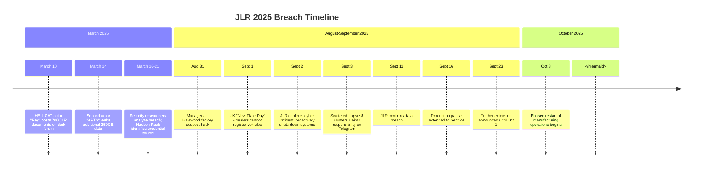
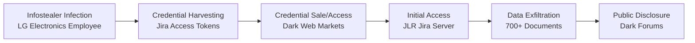
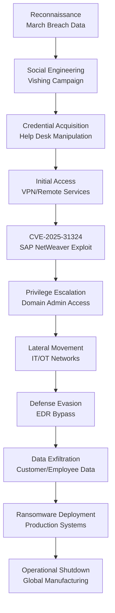

# 2025 Jaguar Land Rover Breach Campaign Report

| **Report ID** | CTID-JLR-2025 |
|---------------|---------------|
| **Date** | 2025-12-28 |
| **TLP** | TLP:AMBER |
| **Criticality** | CRITICAL |
| **Confidence** | HIGH |

---

## Executive Summary

The 2025 Jaguar Land Rover (JLR) cyberattack represents one of the most damaging cyber incidents in British corporate history, with estimated economic impact exceeding £1.9 billion. The campaign involved **two distinct attack phases**: a March 2025 data breach attributed to [[Threat Actors/HELLCAT]] ransomware group exploiting stolen Atlassian Jira credentials, followed by a catastrophic September 2025 operational shutdown claimed by [[Threat Actors/Scattered Spider]] (operating as "Scattered Lapsus$ Hunters") that halted global vehicle production for over five weeks.

The attacks demonstrate a sophisticated multi-vector approach combining infostealer-harvested credentials, exploitation of the critical SAP NetWeaver vulnerability (CVE-2025-31324), and advanced social engineering tactics. The September incident forced JLR to shut down manufacturing facilities across the UK, China, Slovakia, and India, with weekly revenue losses estimated at £50-70 million. The timing coincided with the UK's September registration plate release—traditionally one of the automotive industry's busiest periods.

**Key Findings:**
- Two separate but potentially related breaches occurred within six months
- Initial access vectors included compromised third-party credentials (LG Electronics employee) and SAP NetWeaver zero-day exploitation
- Threat actors maintained persistent access, likely from the March breach through September
- Attack involved collaboration between multiple English-speaking cybercrime groups
- JLR confirmed data theft affecting employees, customers, and proprietary information including source code

---

## Key Points

- **March 2025**: HELLCAT ransomware group (threat actor "Rey") leaked ~700 internal JLR documents via compromised Jira credentials; second actor "APTS" subsequently leaked 350GB additional data
- **September 2025**: Scattered Lapsus$ Hunters claimed responsibility for operational shutdown; exploited SAP NetWeaver CVE-2025-31324 and CVE-2025-42999
- **Production Impact**: Global manufacturing halted from September 1 to October 8, 2025 (~5+ weeks)
- **Financial Impact**: Estimated £1.7-2.4 billion total cost; £50-70 million weekly in lost production
- **Data Compromised**: Employee PII, source code, development logs, cloud credentials, infotainment system code, customer data

---

## Assessment

The JLR breach campaign demonstrates the evolving threat landscape facing critical manufacturing sectors, where operational technology (OT) and information technology (IT) convergence creates expanded attack surfaces. The attackers exhibited sophisticated tradecraft consistent with both HELLCAT's credential-harvesting methodology and Scattered Spider's social engineering expertise.

**Attack Attribution Confidence: HIGH**

The March 2025 breach is attributed to HELLCAT with high confidence based on:
- Consistent modus operandi (Jira credential exploitation via infostealer malware)
- Threat actor "Rey" identified as active HELLCAT member
- Pattern matches previous HELLCAT attacks on Telefónica, Schneider Electric, and Orange

The September 2025 attack is attributed to Scattered Spider/Lapsus$/ShinyHunters collective with high confidence based on:
- Self-attribution via Telegram channel "Scattered Lapsus$ Hunters"
- Consistent TTPs with 2025 UK retail attacks (M&S, Co-op, Harrods)
- Native English-speaking social engineering tactics
- SAP NetWeaver exploitation methodology

**Connection Assessment**: While the March and September attacks involve different primary threat actors, evidence suggests the March breach may have provided reconnaissance data or persistent access that enabled or facilitated the September attack. The incomplete remediation of the March breach likely left vulnerabilities that were later exploited.

---

## Campaign Timeline



---

## Kill Chain Analysis

### Phase 1: March 2025 Data Breach (HELLCAT)



**Initial Access Vector**: Compromised credentials from an LG Electronics employee infected with infostealer malware (likely Lumma Stealer). The credentials, dating back to 2021, provided third-party access to JLR's Atlassian Jira instance.

**Attack Execution**:
1. Infostealer malware harvested Jira credentials from infected LG Electronics employee device
2. Credentials remained valid for years due to lack of rotation/MFA enforcement
3. Threat actor "Rey" used credentials to access JLR's Jira server
4. Exfiltrated ~700 internal documents including development logs, source code, and employee data
5. Second actor "APTS" exploited similar credentials to extract additional 350GB

### Phase 2: September 2025 Operational Shutdown (Scattered Spider)



**Initial Access Vectors**:
1. **Social Engineering**: Vishing (voice phishing) campaign targeting employees, impersonating IT/help desk staff
2. **Vulnerability Exploitation**: SAP NetWeaver CVE-2025-31324 (CVSS 10.0) - unauthenticated file upload leading to RCE
3. **Valid Accounts**: Leveraged credentials obtained through social engineering or prior compromise

**Attack Progression**:
1. Targeted vishing campaign weeks before main attack obtained valid credentials
2. Exploited CVE-2025-31324 in SAP NetWeaver to upload malicious JSP webshells
3. Established persistence via multiple remote access tools
4. Escalated privileges using credential dumping (NTDS.dit theft)
5. Moved laterally across IT and OT networks
6. Disabled security controls using BYOVD techniques
7. Deployed ransomware across production systems
8. Forced complete operational shutdown

---

## Threat Actor Profiles

### HELLCAT Ransomware Group

| Attribute | Details |
|-----------|---------|
| **First Observed** | Mid-2024 |
| **Type** | Ransomware-as-a-Service (RaaS) |
| **Motivation** | Financial |
| **Key Members** | "Pryx" (founder), "Rey", "Grep" |
| **Notable Victims** | Schneider Electric, Telefónica, Orange, Pinger, JLR |
| **Signature TTP** | Infostealer credential harvesting → Jira exploitation |

HELLCAT specializes in exploiting Atlassian Jira credentials harvested via infostealer malware. The group employs double extortion tactics with psychological pressure and public humiliation of victims.

### Scattered Spider (Scattered Lapsus$ Hunters)

| Attribute | Details |
|-----------|---------|
| **Aliases** | UNC3944, Octo Tempest, Muddled Libra, Storm-0875, 0ktapus |
| **First Observed** | 2022 |
| **Type** | Cybercrime Collective |
| **Motivation** | Financial |
| **Demographics** | Young (19-22), primarily US/UK-based |
| **Ransomware Affiliations** | ALPHV/BlackCat, DragonForce |
| **Notable Victims** | MGM Resorts, Caesars Entertainment, M&S, Co-op, JLR |
| **Signature TTP** | Social engineering, help desk impersonation, SIM swapping |

Scattered Spider is a native English-speaking group known for sophisticated social engineering. In September 2025, they operated under the "Scattered Lapsus$ Hunters" identity, suggesting collaboration with Lapsus$ and ShinyHunters collectives.

---

## Vulnerabilities Exploited

### CVE-2025-31324 - SAP NetWeaver Visual Composer

| Attribute | Details |
|-----------|---------|
| **CVSS Score** | 10.0 (Critical) |
| **Type** | Missing Authorization / Arbitrary File Upload |
| **Affected Component** | SAP NetWeaver Visual Composer Metadata Uploader |
| **Exploitation** | Unauthenticated HTTP POST to `/developmentserver/metadatauploader` |
| **Impact** | Remote Code Execution via JSP webshell upload |
| **Patch Available** | SAP Security Note #3594142 (April 24, 2025) |
| **CISA KEV** | Yes |

### CVE-2025-42999 - SAP NetWeaver (Secondary)

| Attribute | Details |
|-----------|---------|
| **Type** | Remote Code Execution |
| **Relationship** | Chained with CVE-2025-31324 for enhanced exploitation |

---

## MITRE ATT&CK Mapping

<details>
<summary>MITRE ATT&CK Techniques (22 techniques)</summary>

| Tactic | Technique | ID | Procedure |
|--------|-----------|-----|-----------|
| **Reconnaissance** | Gather Victim Identity Information | T1589 | Collected employee PII for social engineering |
| **Resource Development** | Establish Accounts: Social Media | T1585.001 | Created fake profiles to backstop identities |
| **Initial Access** | Phishing | T1566 | Broad phishing campaigns targeting JLR employees |
| **Initial Access** | Phishing: Spearphishing Attachment | T1566.001 | Malicious attachments delivering infostealers |
| **Initial Access** | Phishing: Spearphishing Voice | T1566.004 | Vishing calls impersonating IT help desk |
| **Initial Access** | Valid Accounts | T1078 | Used stolen credentials for initial access |
| **Initial Access** | Valid Accounts: Domain Accounts | T1078.002 | Leveraged compromised domain credentials |
| **Initial Access** | Valid Accounts: Cloud Accounts | T1078.004 | Accessed cloud services with stolen credentials |
| **Initial Access** | Exploit Public-Facing Application | T1190 | Exploited SAP NetWeaver CVE-2025-31324 |
| **Initial Access** | External Remote Services | T1133 | Accessed via VPN using compromised credentials |
| **Execution** | Command and Scripting Interpreter: PowerShell | T1059.001 | Multi-stage PowerShell infection chains |
| **Persistence** | Create Account | T1136 | Created backdoor accounts for persistent access |
| **Persistence** | Remote Access Software | T1219 | Deployed multiple RMM tools (AnyDesk, Splashtop) |
| **Privilege Escalation** | Valid Accounts | T1078 | Used compromised admin credentials |
| **Defense Evasion** | Impair Defenses: Disable Security Tools | T1562.001 | BYOVD to kill EDR processes; AMSI bypass |
| **Defense Evasion** | Reflective Code Loading | T1620 | In-memory payload execution |
| **Credential Access** | OS Credential Dumping: NTDS | T1003.003 | Stole NTDS.dit from domain controllers |
| **Discovery** | Email Collection | T1114 | Searched Slack/Teams/Exchange for security response |
| **Lateral Movement** | Remote Services | T1021 | Used legitimate remote tools for lateral movement |
| **Command and Control** | Proxy | T1090 | Used proxy networks to mask location |
| **Exfiltration** | Exfiltration Over C2 Channel | T1041 | Data exfiltration via C2 infrastructure |
| **Impact** | Data Encrypted for Impact | T1486 | Ransomware deployment on production systems |

</details>

---

## Indicators of Compromise

### Network IOCs

| Attribution | Artifact | Details | Phase | First Seen |
|-------------|----------|---------|-------|------------|
| HELLCAT | Domain | `jlrint[.]com` | Internal Domain (Exposed) | March 2025 |
| Scattered Spider | Domain | Victim-specific phishing domains | Initial Access | Aug 2025 |

### Infrastructure Patterns

- **HELLCAT**: Targets Atlassian Jira instances; uses open directories for payload staging
- **Scattered Spider**: Uses commercial VPNs (Mullvad, NordVPN, ExpressVPN); deploys legitimate RMM tools

### Malware IOCs

| Tool | Type | Usage |
|------|------|-------|
| Lumma Stealer | Infostealer | Credential harvesting (March breach) |
| JSP Webshells | Backdoor | Persistence via SAP NetWeaver |
| DragonForce | Ransomware | Encryption payload (suspected) |
| Cobalt Strike | C2 Framework | Post-exploitation |
| ngrok | Tunneling | Proxy/lateral movement |

---

## Detection Signatures

### Sigma Rule - SAP NetWeaver Exploitation

```yaml
title: SAP NetWeaver CVE-2025-31324 Exploitation Attempt
id: 8a7b3c9d-1234-5678-9abc-def012345678
status: experimental
description: Detects HTTP POST requests to SAP NetWeaver Metadata Uploader endpoint
references:
    - https://onapsis.com/blog/active-exploitation-of-sap-vulnerability-cve-2025-31324/
logsource:
    category: webserver
    product: sap
detection:
    selection:
        cs-method: POST
        cs-uri-stem|contains: '/developmentserver/metadatauploader'
    condition: selection
falsepositives:
    - Legitimate development activity
level: critical
tags:
    - attack.initial_access
    - attack.t1190
    - cve.2025.31324
```

### Splunk Query - Suspicious SAP Activity

```spl
index=web sourcetype=sap:netweaver 
| search uri_path="*metadatauploader*" OR uri_path="*irj/portal*"
| where http_method="POST"
| stats count by src_ip, dest_ip, uri_path, http_status
| where count > 5
```

### KQL Query - Social Engineering Indicators

```kql
SigninLogs
| where TimeGenerated > ago(7d)
| where ResultType == 0
| where UserPrincipalName has_any ("helpdesk", "support", "it-")
| summarize 
    SuccessfulLogins = count(),
    UniqueIPs = dcount(IPAddress),
    UniqueLocations = dcount(Location)
    by UserPrincipalName, bin(TimeGenerated, 1h)
| where UniqueIPs > 3 or UniqueLocations > 2
```

---

## Recommendations

### Immediate Actions

1. **Patch SAP NetWeaver**: Apply SAP Security Note #3594142 immediately; disable Visual Composer if patching is not feasible
2. **Credential Rotation**: Force password reset for all accounts with Jira, SAP, or cloud service access
3. **MFA Enforcement**: Implement phishing-resistant MFA (FIDO2/WebAuthn) across all critical systems
4. **Review Third-Party Access**: Audit and restrict third-party vendor access; implement just-in-time access controls

### Strategic Recommendations

1. **Social Engineering Defenses**: Implement callback verification procedures for credential reset requests
2. **Network Segmentation**: Isolate IT and OT networks; implement zero-trust architecture
3. **Infostealer Detection**: Deploy endpoint detection for common infostealers (Lumma, Raccoon, Vidar)
4. **Credential Monitoring**: Subscribe to credential breach notification services; monitor dark web for exposed credentials
5. **Incident Response Planning**: Develop and test playbooks for ransomware and operational shutdown scenarios

### Detection Priorities

| Priority | Detection Focus | Log Sources |
|----------|-----------------|-------------|
| Critical | SAP NetWeaver exploitation | Web server logs, SAP audit logs |
| High | Help desk impersonation | Authentication logs, VoIP logs |
| High | RMM tool deployment | Endpoint telemetry, network flows |
| Medium | NTDS.dit access | Windows Security logs (4662, 4663) |
| Medium | Proxy/tunneling activity | Network firewall logs |

---

## Intelligence Gaps

- Exact ransomware variant deployed in September 2025 attack (DragonForce suspected but unconfirmed)
- Full scope of customer data exposure
- Potential persistent access vectors remaining from March breach
- Ransom demand amount and payment status (if any)
- Complete mapping of lateral movement paths between IT and OT networks

---

## Outlook

**Short-term (0-6 months)**: HIGH probability of continued targeting of UK/European automotive and manufacturing sectors by Scattered Spider affiliates. The success of the JLR attack will likely inspire copycat operations against similar high-value targets with complex supply chains.

**Medium-term (6-12 months)**: HELLCAT's credential-harvesting methodology will continue to pose risks to organizations using Atlassian products. Legacy credentials from historical infostealer infections remain a persistent threat vector.

**Long-term (12+ months)**: Convergence of IT/OT environments in manufacturing will continue to expand attack surfaces. Organizations should anticipate increased targeting of enterprise applications (SAP, Oracle) as threat actors recognize their value as pivot points to operational systems.

---

## References

1. CYFIRMA. (2025, September 24). Investigation Report on Jaguar Land Rover Cyberattack. https://www.cyfirma.com/research/investigation-report-on-jaguar-land-rover-cyberattack/

2. Hudson Rock. (2025, March 17). Jaguar Land Rover Breached by HELLCAT Ransomware Group Using Its Infostealer Playbook. https://www.infostealers.com/article/jaguar-land-rover-breached-by-hellcat-ransomware-using-its-infostealer-playbook-then-a-second-hacker-strikes/

3. SecurityWeek. (2025, March 21). Ransomware Group Claims Attacks on Ascom, Jaguar Land Rover. https://www.securityweek.com/ransomware-group-claims-attacks-on-ascom-jaguar-land-rover/

4. Dark Reading. (2025, October 3). Jaguar Land Rover Shows Cyberattacks Mean Business. https://www.darkreading.com/cyberattacks-data-breaches/jaguar-land-rover-cyberattacks-bad-business

5. BleepingComputer. (2025, September 16). Jaguar Land Rover extends shutdown after cyberattack by another week. https://www.bleepingcomputer.com/news/security/jaguar-land-rover-extends-shutdown-after-cyberattack-by-another-week/

6. Wikipedia. (2025). Jaguar Land Rover cyberattack. https://en.wikipedia.org/wiki/Jaguar_Land_Rover_cyberattack

7. Picus Security. (2025, March 13). HellCat Ransomware: Exposing the TTPs of a Rising Ransomware Threat in 2025. https://www.picussecurity.com/resource/blog/hellcat-ransomware

8. Bridewell. (2025, February 28). Who are Hellcat Ransomware Group? https://www.bridewell.com/insights/blogs/detail/who-are-hellcat-ransomware-group

9. CISA. (2023, November 16). Scattered Spider Advisory AA23-320A. https://www.cisa.gov/news-events/cybersecurity-advisories/aa23-320a

10. MITRE ATT&CK. (2025). Scattered Spider Group G1015. https://attack.mitre.org/groups/G1015/

11. Onapsis. (2025). SAP NetWeaver Flaw CVE-2025-31324 and CVE-2025-42999 Explained. https://onapsis.com/blog/active-exploitation-of-sap-vulnerability-cve-2025-31324/

12. Unit 42. (2025, June 25). Threat Brief: CVE-2025-31324. https://unit42.paloaltonetworks.com/threat-brief-sap-netweaver-cve-2025-31324/

---

## Related Intelligence

```dataview
TABLE created, report_type, confidence
FROM "Reports"
WHERE contains(threat_actors, "[[Threat Actors/Scattered Spider]]") OR contains(threat_actors, "[[Threat Actors/HELLCAT]]")
SORT created DESC
```

---

*Report generated: 2025-12-28*
*Classification: TLP:AMBER*
*Distribution: Authorized recipients only*
