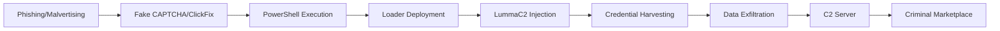
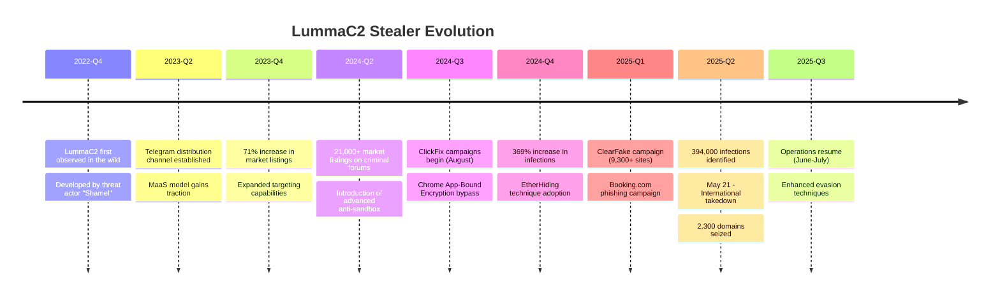

# LummaC2 Stealer: Comprehensive Malware Analysis

**Report ID:** CAM-2025-0128
**Date:** December 28, 2025
**TLP:** TLP:CLEAR
**Criticality:** HIGH

---

## Executive Summary

LummaC2 Stealer (also known as Lumma Stealer, LummaC, or Lummac) is a sophisticated information-stealing malware that has emerged as one of the most prolific infostealers in the cybercriminal ecosystem since its debut in late 2022. Developed and maintained by a Russian-speaking threat actor using the alias "Shamel," LummaC2 operates under a Malware-as-a-Service (MaaS) business model, providing subscription-based access to hundreds of cybercriminal affiliates worldwide.

Between November 2023 and May 2025, [[Threat Actors/Storm-2477]] and various affiliates deployed LummaC2 to compromise over **394,000 Windows systems globally**, targeting multiple U.S. critical infrastructure sectors. The malware's capabilities include harvesting browser credentials, cryptocurrency wallets, two-factor authentication tokens, and session cookies—with notable ability to bypass Chrome's App-Bound Encryption protection.

On May 21, 2025, a coordinated international operation led by Microsoft's Digital Crimes Unit, the U.S. Department of Justice, Europol, and multiple cybersecurity vendors resulted in the seizure of approximately **2,300 malicious domains** and disruption of LummaC2's command-and-control infrastructure. Despite this takedown, threat intelligence indicates LummaC2 operations resumed between June and July 2025 with enhanced evasion techniques.

---

## Key Points

- **Scale of Infection**: Over 394,000 Windows computers infected globally between March-May 2025; 369% increase in detections from H1 to H2 2024
- **MaaS Business Model**: Subscription-based service with tiered pricing ($250-$1,000/month), over 21,000 market listings for LummaC2 logs on criminal forums in Q2 2024
- **Advanced Evasion**: Employs trigonometry-based anti-sandbox detection analyzing human mouse movement patterns, Chrome App-Bound Encryption bypass, and multi-tier C2 with Cloudflare proxying
- **Distribution Methods**: Leverages ClickFix fake CAPTCHAs, EtherHiding via Binance Smart Chain contracts, malvertising, typosquatted domains, and spearphishing campaigns
- **Threat Actor Usage**: Deployed by ransomware groups including Octo Tempest, Storm-1607, and Storm-1674; used by [[Threat Actors/UNC5537]] in Snowflake cloud storage breaches
- **Law Enforcement Action**: May 2025 takedown seized 2,300 domains; infrastructure partially restored by July 2025

---

## Assessment

### Origins and Development

LummaC2 first emerged in late 2022 and quickly established itself as a premier information stealer within the cybercriminal underground. The malware is developed by a threat actor known as "Shamel" (or "Lumma"), believed to be based in Russia, who maintains the core codebase, command-and-control infrastructure, and the MaaS platform. Microsoft tracks this developer as Storm-2477.

The malware is marketed on Russian-speaking dark web forums and a dedicated Telegram channel (active since May 2023), offering tiered subscription packages ranging from approximately $250 to $1,000 per month. This low barrier to entry has enabled widespread adoption by cybercriminals of varying sophistication levels.

### Technical Capabilities

LummaC2 is a lightweight (~150-200 KB) Windows-focused stealer supporting operating systems from Windows 7 through Windows 11. Its core capabilities include:

**Data Theft Targets:**
- **Browser Data**: Credentials, cookies, autofill data, history, extensions, and session data from Chrome, Firefox, Edge, Brave, Opera, Vivaldi, and 20+ other browsers
- **Cryptocurrency Wallets**: Targeted theft from wallet applications and browser extensions
- **Two-Factor Authentication**: Extraction of 2FA browser extension data and authenticator tokens
- **Discord Tokens**: Decoding and exfiltration of base64-encoded Discord authentication tokens
- **Sensitive Files**: Scanning for files containing keywords like `seed.txt`, `wallet.txt`, `ledger.txt`, `trezor.txt`, `metamask.txt`, `bitcoin.txt`
- **Email and FTP Clients**: Credential harvesting from email applications and FTP clients
- **Remote Desktop**: Exfiltration of RDP credentials and session data

**Chrome App-Bound Encryption Bypass:**
LummaC2 developed a sophisticated bypass for Chrome's App-Bound Encryption introduced in Chrome 127. The technique scrapes the Chromium process internal memory for `chrome.dll`, locates the CookieMonster library address, and interacts with it directly to dump decrypted cookies to a text file for exfiltration.

**Incremental Exfiltration:**
Unlike traditional stealers that aggregate data before exfiltration, LummaC2 employs an incremental approach—exfiltrating each piece of stolen information immediately after collection. This resilience mechanism ensures partial data recovery even if the malware is detected mid-operation.

### Distribution Methods

LummaC2 employs multiple sophisticated distribution vectors:

**ClickFix Social Engineering:**
Since August 2024, threat actors have weaponized fake CAPTCHA pages that instruct victims to "verify they are human" by opening the Windows Run dialog (Win+R), pasting clipboard contents, and executing the command. This technique exploits user trust in verification mechanisms to execute Base64-encoded PowerShell commands that deploy loaders like [[Malware/Hijackloader]] or [[Malware/GoInjector]], which subsequently install LummaC2.

**EtherHiding:**
LummaC2 campaigns leverage Binance Smart Chain (BSC) contracts to host malicious code, making the attack chain more resilient to takedowns. Compromised websites communicate with `data-seed-prebsc-1-s1.bnbchain[.]org` to fetch ClickFix code from blockchain-hosted storage.

**ClearFake Campaign:**
As of March 2025, over 9,300 websites have been compromised with ClearFake, which uses fake browser update prompts and Cloudflare Turnstile verifications to distribute LummaC2 and other stealers.

**Additional Vectors:**
- Spearphishing emails with malicious attachments impersonating services like Booking.com (March 2025)
- Typosquatted domains spoofing legitimate software (e.g., `posrman[.]com` impersonating Postman)
- Malvertising campaigns targeting users seeking cracked software
- GitHub social engineering targeting developers with fake "security vulnerability" notifications

### Command-and-Control Infrastructure

LummaC2 maintains a robust, multi-tier C2 architecture designed for resilience:

**Tier 1 - Hardcoded C2s:**
The malware contains a regularly updated list of hardcoded C2 domains, all protected behind Cloudflare proxies to obscure the actual server infrastructure.

**Fallback Mechanisms:**
- **Telegram C2**: Checked first if available, encrypted with ChaCha20
- **Steam Profile C2**: Used when hardcoded C2s are unresponsive; C2 URLs are encoded in Steam profile names using ROT+11 Caesar cipher

**Encryption and Obfuscation:**
- ChaCha20 encryption for hardcoded C2 list and Telegram fallback URLs
- XOR algorithm for string encryption (v4.0+)
- Control flow flattening to complicate analysis
- MurmurHash2 for API hashing

### Anti-Analysis Techniques

**Trigonometry-Based Sandbox Evasion:**
LummaC2 v4.0 introduced a novel anti-sandbox technique that monitors cursor positions over brief intervals, using trigonometric calculations to detect genuine human mouse movement patterns. This surpasses traditional timer-based evasion and prevents detonation in automated analysis environments.

**Additional Evasion:**
- Debugger detection via process string inspection
- System resource and GPU querying to identify virtualized environments
- AMSI bypass by patching `AmsiScanBuffer` in memory
- Fileless execution and memory injection techniques
- SmartAssembly obfuscation for .NET components

### Threat Actor Associations

LummaC2's MaaS model has attracted various sophisticated threat actors:

| Threat Actor | Association | Notable Activity |
|-------------|-------------|------------------|
| Octo Tempest | Ransomware campaigns | Credential harvesting for network access |
| Storm-1607 | Distribution campaigns | Large-scale phishing operations |
| Storm-1113 | Distribution campaigns | Malvertising infrastructure |
| Storm-1674 | Distribution campaigns | Business email compromise |
| UNC5537 | Snowflake breaches | Credential theft leading to cloud storage compromises |
| [[Threat Actors/Stargazer Goblin]] | GitHub distribution | Compromised repositories and social engineering |

Stolen credentials from LummaC2 infections are frequently sold to Initial Access Brokers (IABs), who subsequently broker access to ransomware affiliates, creating a direct pipeline from infostealer infection to ransomware deployment.

### Law Enforcement Disruption

On May 21, 2025, an unprecedented international operation targeted LummaC2's infrastructure:

**Participating Organizations:**
- Microsoft Digital Crimes Unit (DCU)
- U.S. Department of Justice (DOJ)
- FBI
- Europol's European Cybercrime Center (EC3)
- Japan Cybercrime Control Center (JC3)
- ESET, BitSight, Lumen, Cloudflare, CleanDNS, GMO Registry

**Impact:**
- Seizure of approximately 2,300 malicious domains
- DOJ seized central command structure and criminal marketplaces
- Microsoft obtained court order from U.S. District Court, Northern District of Georgia
- Domains redirected to Microsoft-controlled sinkholes for monitoring

**Post-Takedown Status:**
Affiliates reported losing access to C2 panels on May 15, 2025. However, Trend Micro observed new LummaC2 campaigns emerging between June and July 2025, featuring more discrete distribution channels and enhanced evasion tactics, indicating the operation's resilience despite significant infrastructure disruption.

---

## MITRE ATT&CK Mapping

<details>
<summary>MITRE ATT&CK Techniques (35 techniques)</summary>

| Tactic | Technique ID | Technique Name | Procedure |
|--------|-------------|----------------|-----------|
| Initial Access | T1566.001 | Spearphishing Attachment | Malicious email attachments impersonating services like Booking.com |
| Initial Access | T1566.002 | Spearphishing Link | Phishing emails containing links to fake CAPTCHA pages |
| Initial Access | T1195 | Supply Chain Compromise | Distribution via typosquatted software download sites |
| Execution | T1059.001 | PowerShell | Base64-encoded PowerShell commands via ClickFix technique |
| Execution | T1059.006 | Python | Malicious Python scripts for payload execution |
| Execution | T1059.010 | AutoIt | AutoIt scripts and compiled executables |
| Execution | T1204 | User Execution | Fake CAPTCHA prompts trick users into executing commands |
| Execution | T1204.002 | Malicious File | Users open malicious executables from archives |
| Persistence | T1547.001 | Registry Run Keys | Creates keys at `HKCU:\SOFTWARE\Microsoft\Windows\CurrentVersion\Run` |
| Persistence | T1574.001 | DLL Search Order Hijacking | Side-loads malicious DLLs using legitimate applications |
| Persistence | T1176.001 | Browser Extensions | Installs malicious extensions targeting Chrome, Edge, Opera, Brave |
| Defense Evasion | T1140 | Deobfuscate/Decode Files | Base64 decoding via PowerShell; ChaCha20 decryption for C2 |
| Defense Evasion | T1027 | Obfuscated Files or Information | SmartAssembly obfuscation, control flow flattening |
| Defense Evasion | T1027.013 | Encrypted/Encoded File | AES-encrypted payloads within PowerShell scripts |
| Defense Evasion | T1036.008 | Masquerade File Type | Uses benign extensions (.mp3, .accdb) for malicious files |
| Defense Evasion | T1055.012 | Process Hollowing | Injects payloads into BitLockerToGo.exe, vbc.exe |
| Defense Evasion | T1497.001 | System Checks | Queries GPU and system resources to detect sandboxes |
| Defense Evasion | T1622 | Debugger Evasion | Checks for debugger process strings |
| Defense Evasion | T1562.001 | Disable or Modify Tools | Patches AmsiScanBuffer to bypass AMSI |
| Defense Evasion | T1564.003 | Hidden Window | Sets .NET CreateNoWindow to hide execution |
| Defense Evasion | T1620 | Reflective Code Loading | Loads payloads directly into memory |
| Defense Evasion | T1553.002 | Code Signing | Uses certificates from ConsolHQ LTD, Verandah Green Limited |
| Defense Evasion | T1218.005 | Mshta | Executes content via mshta.exe |
| Defense Evasion | T1218.015 | Electron Applications | Leverages Electron apps to disable GPU sandboxing |
| Credential Access | T1555.003 | Credentials from Web Browsers | Harvests credentials from 20+ browser families |
| Discovery | T1217 | Browser Information Discovery | Identifies and extracts 2FA extension data |
| Discovery | T1082 | System Information Discovery | Gathers system details from victim machines |
| Discovery | T1518.001 | Security Software Discovery | Uses tasklist/findstr to detect antivirus |
| Collection | T1119 | Automated Collection | Automated gathering of browser data, wallets, files |
| Collection | T1074.001 | Local Data Staging | Stages collected data in custom directories |
| Collection | T1113 | Screen Capture | Captures screenshots from victims |
| Collection | T1539 | Steal Web Session Cookie | Harvests cookies from multiple browsers |
| Command and Control | T1071.001 | Web Protocols | HTTP/HTTPS communication with C2 servers |
| Command and Control | T1573.002 | Asymmetric Cryptography | HTTPS for encrypted C2 communications |
| Command and Control | T1105 | Ingress Tool Transfer | Downloads additional payloads from remote servers |
| Exfiltration | T1041 | Exfiltration Over C2 Channel | Sends stolen data via HTTP/HTTPS POST requests |

</details>

---

## Kill Chain Visualization



---

## Campaign Timeline



---

## Key Intelligence Gaps

- **Developer Attribution**: Limited visibility into "Shamel's" identity, operational security, and development infrastructure
- **Affiliate Network**: Incomplete understanding of the full affiliate ecosystem and payment structures
- **Source Code**: No public disclosure of complete source code versions; analysis relies on reverse engineering
- **Post-Takedown Infrastructure**: Emerging C2 infrastructure following May 2025 disruption requires continued monitoring
- **Cryptocurrency Tracking**: Limited ability to trace ransom/payment flows through cryptocurrency tumbling services

---

## Indicators of Compromise

### File Hashes

<details>
<summary>Malware Hashes (12 indicators)</summary>

| Attribution | Tool Name | Hash Type | File Hash | First Seen | Last Seen |
|------------|-----------|-----------|-----------|------------|-----------|
| LummaC2 | Stealer Binary | SHA256 | `19CC41A0A056E503CC2137E19E952814FBDF14F8D83F799AEA9B96ABFF11EFBB` | 2024-11 | 2025-05 |
| LummaC2 | Stealer Binary | SHA256 | `2F31D00FEEFE181F2D8B69033B382462FF19C35367753E6906ED80F815A7924F` | 2024-11 | 2025-05 |
| LummaC2 | Stealer Binary | SHA256 | `4D74F8E12FF69318BE5EB383B4E56178817E84E83D3607213160276A7328AB5D` | 2024-11 | 2025-05 |
| LummaC2 | Stealer Binary | SHA256 | `325daeb781f3416a383343820064c8e98f2e31753cd71d76a886fe0dbb4fe59a` | 2024-11 | 2025-05 |
| LummaC2 | Stealer Binary | SHA256 | `76e4962b8ccd2e6fd6972d9c3264ccb6738ddb16066588dfcb223222aaa88f3c` | 2024-11 | 2025-05 |
| LummaC2 | Stealer Binary | SHA256 | `7a35008a1a1ae3d093703c3a34a21993409af42eb61161aad1b6ae4afa8bbb70` | 2024-11 | 2025-05 |
| LummaC2 | Stealer Binary | SHA256 | `a9e9d7770ff948bb65c0db24431f75dd934a803181afa22b6b014fac9a162dab` | 2024-11 | 2025-05 |
| LummaC2 | Stealer Binary | SHA256 | `b287c0bc239b434b90eef01bcbd00ff48192b7cbeb540e568b8cdcdc26f90959` | 2024-11 | 2025-05 |
| LummaC2 | Stealer Binary | SHA256 | `ca47c8710c4ffb4908a42bd986b14cddcca39e30bb0b11ed5ca16fe8922a468b` | 2024-11 | 2025-05 |
| LummaC2 | Stealer Binary | SHA256 | `6cea1bd0874cdae42c64f89d4ff3093b89117fcc319e6c55c95d4863b5934bed` | 2024-10 | 2024-10 |
| LummaC2 | Stealer Binary | SHA256 | `bf0d2ef3a7d8d0f8c00d33f53df9b4e76bb4106712fd934796fd011cba094d71` | 2024-10 | 2024-10 |
| LummaC2 | Stealer Binary | MD5 | `4AFDC05708B8B39C82E60ABE3ACE55DB` | 2024-11 | 2025-05 |

</details>

### Network Indicators

<details>
<summary>Network IOCs (28 indicators)</summary>

| Attribution | Type | Indicator | Intrusion Phase | First Seen | Last Seen |
|------------|------|-----------|-----------------|------------|-----------|
| LummaC2 | Domain | `pinkipinevazzey[.]pw` | C2 | 2024-11 | 2025-05 |
| LummaC2 | Domain | `fragnantbui[.]shop` | C2 | 2024-11 | 2025-05 |
| LummaC2 | Domain | `medicinebuckerrysa[.]pw` | C2 | 2024-11 | 2025-05 |
| LummaC2 | Domain | `blast-hubs[.]com` | C2 | 2024-11 | 2025-05 |
| LummaC2 | Domain | `blastikcn[.]com` | C2 | 2024-11 | 2025-05 |
| LummaC2 | Domain | `stormlegue[.]com` | C2 | 2024-11 | 2025-05 |
| LummaC2 | Domain | `tibedowqmwo[.]shop` | C2 | 2024-08 | 2024-10 |
| LummaC2 | Domain | `posrman[.]com` | Distribution (Typosquat) | 2024-10 | 2024-10 |
| LummaC2 | Domain | `crowdstrike-office365[.]com` | Distribution (Phishing) | 2024-07 | 2024-07 |
| LummaC2 | Domain | `data-seed-prebsc-1-s1.bnbchain[.]org` | EtherHiding | 2025-04 | 2025-05 |
| LummaC2 | IP | `144[.]126[.]129[.]4` | Payload Delivery | 2024-10 | 2024-10 |
| LummaC2 | TLD Pattern | `*[.]fun` | C2 | 2024-01 | 2025-12 |
| LummaC2 | TLD Pattern | `*[.]shop` | C2 | 2024-01 | 2025-12 |
| LummaC2 | TLD Pattern | `*[.]pw` | C2 | 2024-01 | 2025-12 |
| LummaC2 | TLD Pattern | `*[.]xyz` | C2 | 2024-01 | 2025-12 |
| LummaC2 | TLD Pattern | `*[.]store` | C2 | 2024-01 | 2025-12 |
| LummaC2 | TLD Pattern | `*[.]site` | C2 | 2024-01 | 2025-12 |
| LummaC2 | DLL | `iphlpapi.dll` | Execution | 2024-11 | 2025-05 |
| LummaC2 | DLL | `winhttp.dll` | Execution | 2024-11 | 2025-05 |

</details>

---

## Detection Signatures

### YARA Rules

```yara
rule LummaC2_Stealer_PDB {
    meta:
        author = "@malgamy12"
        description = "Detects LummaC2 Stealer based on PDB path"
        date = "2022-11"
        reference = "https://github.com/MalGamy/YARA_Rules"
    strings:
        $pdb = "LummaC\\Release\\LummaC.pdb" ascii
    condition:
        uint16(0) == 0x5A4D and
        filesize < 7MB and
        $pdb
}

rule LummaC2_Stealer_Strings {
    meta:
        author = "BGD e-GOV CIRT"
        description = "Detects LummaC2 Stealer campaign artifacts"
        date = "2024-10"
    strings:
        $s1 = "wallet.txt" ascii wide
        $s2 = "seed.txt" ascii wide
        $s3 = "ledger.txt" ascii wide
        $s4 = "trezor.txt" ascii wide
        $s5 = "metamask.txt" ascii wide
        $s6 = "CookieMonster" ascii
        $s7 = "chromium" ascii wide nocase
        $s8 = "/api" ascii
    condition:
        uint16(0) == 0x5A4D and
        filesize < 7MB and
        6 of them
}
```

### Sigma Rules

```yaml
title: LummaC2 Stealer Suspicious TLD Communication
id: 8a7b9c0d-1e2f-4a5b-6c7d-8e9f0a1b2c3d
status: experimental
description: Detects POST requests to suspicious TLDs commonly used by Lumma Stealer C2
author: NTT Security (SamuraiMDR)
references:
    - https://www.cisa.gov/news-events/cybersecurity-advisories/aa25-141b
logsource:
    category: proxy
detection:
    selection:
        cs-method: POST
        cs-uri-path|contains: '/api'
        cs-referer: ''
    suspicious_tld:
        cs-host|endswith:
            - '.fun'
            - '.shop'
            - '.pw'
            - '.xyz'
            - '.store'
            - '.site'
    condition: selection and suspicious_tld
falsepositives:
    - Legitimate applications using these TLDs
level: high
```

```yaml
title: LummaC2 Stealer Process Injection Pattern
id: 9b8c7d6e-5f4a-3b2c-1d0e-9f8a7b6c5d4e
status: experimental
description: Detects execution of more.com and vbc.exe related to LummaC Stealer injection
author: Google Threat Intelligence
logsource:
    category: process_creation
    product: windows
detection:
    selection_parent:
        ParentImage|endswith:
            - '\more.com'
    selection_child:
        Image|endswith:
            - '\vbc.exe'
    condition: selection_parent and selection_child
falsepositives:
    - Legitimate Visual Basic compilation workflows
level: high
```

### Snort/Network Detection

```
alert http $HOME_NET any -> $EXTERNAL_NET any (msg:"MALWARE-CNC Win.Infostealer.LummaC2 outbound connection"; flow:to_server,established; content:"POST"; http_method; content:"/api"; http_uri; content:!"Referer"; http_header; pcre:"/\.(fun|shop|pw|xyz|store|site)$/Hi"; classtype:trojan-activity; sid:1000001; rev:1;)
```

---

## Recommendations

### Immediate Actions

1. **Block Known IOCs**: Implement network and endpoint blocks for domains, IPs, and file hashes listed in this report
2. **Monitor TLD Patterns**: Alert on HTTP POST requests to `/api` endpoints on suspicious TLDs (.fun, .shop, .pw, .xyz, .store, .site) with empty referer headers
3. **Audit Browser Extensions**: Review installed browser extensions across the organization for unauthorized additions
4. **Credential Reset**: Consider credential rotation for users with suspected exposure to infostealer campaigns

### Detection Improvements

1. **Deploy YARA Rules**: Implement provided YARA rules on endpoint detection platforms
2. **Enable PowerShell Logging**: Ensure Script Block Logging (Event ID 4104) and Module Logging are enabled
3. **Monitor Process Injection**: Alert on suspicious parent-child process relationships (more.com → vbc.exe, BitLockerToGo.exe injection)
4. **AMSI Monitoring**: Detect attempts to patch AmsiScanBuffer in process memory

### User Awareness

1. **ClickFix Training**: Educate users on fake CAPTCHA social engineering tactics that request command execution
2. **Software Download Policies**: Reinforce policies against downloading software from unofficial sources
3. **Phishing Recognition**: Update training to include travel booking and software update impersonation schemes

---

## Intelligence Requirements

- Continued monitoring of post-takedown LummaC2 infrastructure developments
- Tracking of new distribution campaigns and affiliate threat actor adoption
- Analysis of any newly identified evasion techniques or capability enhancements
- Correlation of LummaC2 infections with downstream ransomware incidents

---

## Probability Matrix

| Assessment | Confidence | Rationale |
|------------|------------|-----------|
| LummaC2 will continue operations despite takedown | High | Historical resilience; new campaigns observed June-July 2025 |
| Developer "Shamel" remains active | Moderate | No arrest announced; infrastructure reconstitution indicates continued development |
| Ransomware groups will continue using LummaC2 | High | Established MaaS ecosystem; proven credential harvesting capabilities |
| New evasion techniques will emerge | High | Pattern of innovation (trigonometry sandbox evasion, Chrome encryption bypass) |

---

## Data Sources

- CISA Advisory AA25-141B (May 21, 2025)
- FBI Cyber Division Intelligence
- Microsoft Security Blog (May 21, 2025)
- Microsoft Digital Crimes Unit
- MITRE ATT&CK (S1213)
- Europol Press Release (May 2025)
- ESET Research
- CrowdStrike Intelligence
- Mandiant Threat Intelligence
- Unit 42 (Palo Alto Networks)
- Trend Micro Research
- SOCRadar Threat Intelligence
- Outpost24 Research
- Netskope Threat Labs

---

## References

Cybersecurity and Infrastructure Security Agency. (2025, May 21). *Threat Actors Deploy LummaC2 Malware to Exfiltrate Sensitive Data from Organizations* (Advisory AA25-141B). https://www.cisa.gov/news-events/cybersecurity-advisories/aa25-141b

Microsoft Digital Crimes Unit. (2025, May 21). *Disrupting Lumma Stealer: Microsoft leads global action against favored cybercrime tool*. Microsoft On the Issues. https://blogs.microsoft.com/on-the-issues/2025/05/21/microsoft-leads-global-action-against-favored-cybercrime-tool/

Microsoft Threat Intelligence. (2025, May 21). *Lumma Stealer: Breaking down the delivery techniques and capabilities of a prolific infostealer*. Microsoft Security Blog. https://www.microsoft.com/en-us/security/blog/2025/05/21/lumma-stealer-breaking-down-the-delivery-techniques-and-capabilities-of-a-prolific-infostealer/

MITRE ATT&CK. (n.d.). *Lumma Stealer, Software S1213*. https://attack.mitre.org/software/S1213/

Europol. (2025, May). *Europol and Microsoft disrupt world's largest infostealer Lumma*. https://www.europol.europa.eu/media-press/newsroom/news/europol-and-microsoft-disrupt-world%E2%80%99s-largest-infostealer-lumma

ESET. (2025, May). *ESET takes part in global operation to disrupt Lumma Stealer*. https://www.eset.com/us/about/newsroom/research/eset-takes-part-in-global-operation-to-disrupt-lumma-stealer-one-of-the-most-prevalent-infostealers/

CrowdStrike. (2024, July). *Malware Distributed Using Falcon Sensor Update Phishing Lure*. https://www.crowdstrike.com/en-us/blog/lumma-stealer-with-cypherit-phishing-lure/

Trend Micro. (2025, July). *Back to Business: Lumma Stealer Returns with Stealthier Methods*. https://www.trendmicro.com/en_us/research/25/g/lumma-stealer-returns.html

Outpost24. (n.d.). *LummaC2 stealer: Everything you need to know*. https://outpost24.com/blog/everything-you-need-to-know-lummac2-stealer/

---

## Related Intelligence

```dataview
TABLE created, report_type, confidence
FROM "Reports" OR "Threat Actors" OR "Campaigns"
WHERE contains(file.outlinks, this.file.link)
SORT created DESC
LIMIT 10
```

---

*Report generated by Claude Code Threat Intelligence*
*Report ID: CAM-2025-0128*
