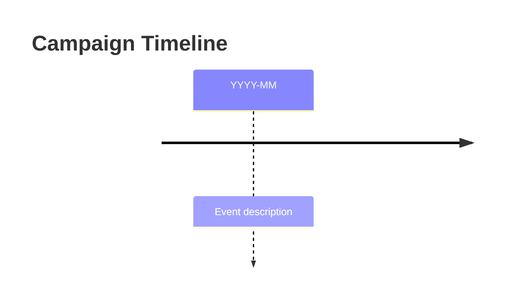
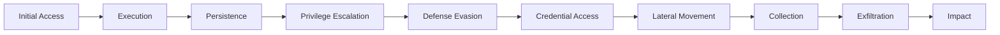

# {{title}}

## Overview

## Threat Actor

[[Threat Actors/Threat_Actor_Name]]

## Timeline



## Targeted Sectors

- [[Sector_Name]]

## Targeted Countries

- [[Country_Name]]

## Attack Chain



## TTPs

### Initial Access

### Execution

### Persistence

### Command and Control

## Malware Used

- [[Malware/Malware_Name]]

## MITRE ATT&CK

| Tactic | Technique | Procedure |
|--------|-----------|-----------|
|        |           |           |

## IOCs

<details>
<summary>Network Indicators</summary>

| Type | Indicator | Context | First Seen |
|------|-----------|---------|------------|
|      |           |         |            |

</details>

<details>
<summary>File Indicators</summary>

| Hash Type | Hash | Filename | Description |
|-----------|------|----------|-------------|
|           |      |          |             |

</details>

## CVEs Exploited

| CVE | CVSS | Description |
|-----|------|-------------|
|     |      |             |

## Detection Signatures

### YARA

### Sigma

## Intelligence Gaps

-

## References

-

---

## Related Intelligence

```dataview
TABLE created, threat_actors, malware
FROM "Reports"
WHERE contains(campaigns, this.file.link)
SORT created DESC
LIMIT 10
```
