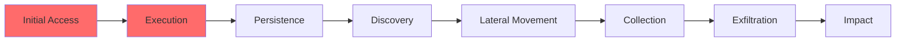

# {{title}}

## Executive Summary

## Incident Details

**Incident ID:**
**Target:** [[Company_Name]]
**Sector:** [[Sector_Name]]
**Date Detected:**
**Attribution:** [[Threat Actors/Threat_Actor_Name]]

## Timeline

```mermaid
timeline
    title Incident Timeline
    YYYY-MM-DD HH:MM : Event description
```

## Kill Chain Analysis



## Attack Vectors

- [[Attack_Vector_Name]]

## Malware Identified

- [[Malware/Malware_Name]]

## TTPs Observed

| Tactic | Technique | Evidence |
|--------|-----------|----------|
|        |           |          |

## TTPs Predicted (Based on Actor History)

| Tactic | Technique | Likelihood |
|--------|-----------|------------|
|        |           |            |

## IOCs

<details>
<summary>Network Indicators</summary>

| Type | Indicator | Context | Observed |
|------|-----------|---------|----------|
|      |           |         |          |

</details>

<details>
<summary>Host Indicators</summary>

| Type | Indicator | Context |
|------|-----------|---------|
|      |           |         |

</details>

## Hunting Guidance

### Log Sources

### Detection Queries

## Alternative Attribution

| Threat Actor | Confidence | Rationale |
|--------------|------------|-----------|
|              |            |           |

## Impact Assessment

## Recommendations

### Immediate Actions

1.

### Short-term Actions

1.

### Long-term Actions

1.

## Intelligence Gaps

-

## References

-

---

## Related Intelligence

```dataview
TABLE created, threat_actors, campaigns
FROM "Reports"
WHERE contains(file.outlinks, this.file.link)
SORT created DESC
LIMIT 10
```
