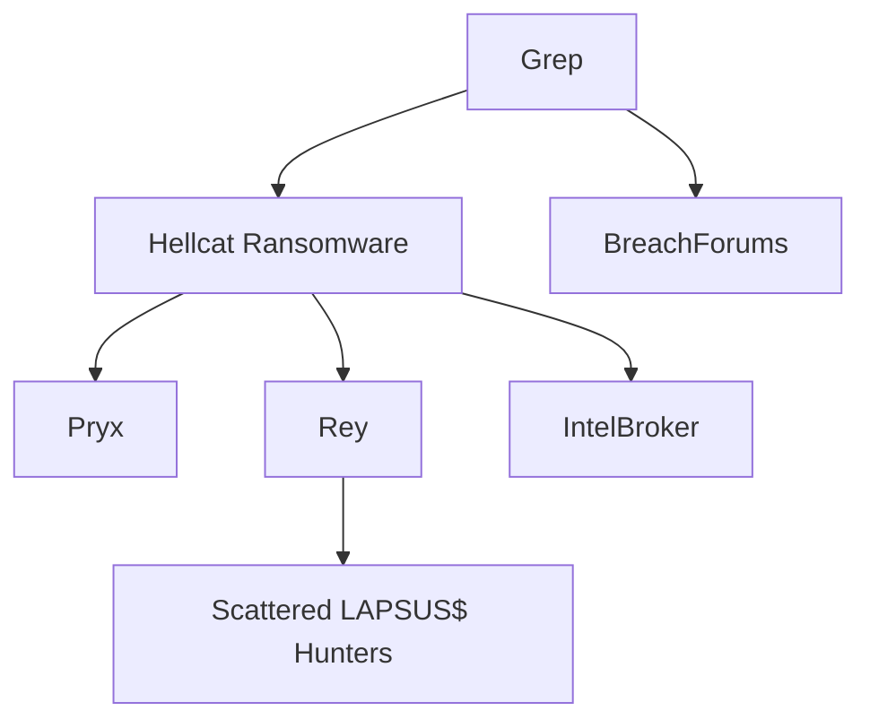

# Grep - Threat Actor Profile
---
aliases:
  - Greppy
  - grep
type: threat-actor
classification: eCrime
origin: Unknown
status: likely-active
first_seen: 2022-Q1
motivation:
  - financial
tags:
  - "#threat-actor"
  - "#hellcat"
  - "#breachforums"
  - "#jira-exploitation"
  - "#active-threat"
---

> [!info] Formal Report Available
> See [[Reports/CTID-003-2025_Grep_Threat_Actor_Profile]] for the complete threat intelligence report.


**Classification:** eCrime / Financially Motivated
**Status:** Likely Active
**Confidence:** Moderate-High
**Last Updated:** 2025-12-27

---

## Overview

Grep (also known as "Greppy") is a threat actor operating as a founding member and key operator of the [[Hellcat]] ransomware group. The actor is an active participant in the BreachForums cybercriminal community and gained prominence in late 2024 through high-profile data breaches targeting Dell Technologies, Capgemini, and Schneider Electric.

## Aliases

| Alias | Platform | Context |
|-------|----------|---------|
| **Grep** | BreachForums | Primary alias |
| **Greppy** | X/Twitter | Public communications |

## Attribution

**Identity Status:** NOT EXPOSED

Unlike Hellcat associates [[Rey]] and Pryx, Grep's true identity remains unknown. Key observations:
- Alias derived from Unix/Linux `grep` command - suggests technical background
- Active since early 2022 with Anonymous hacktivism (Russia-Ukraine conflict)
- Superior operational security compared to exposed associates

## Group Affiliations



### Hellcat Ransomware Group
- **Role:** Founding member, operator
- **Origin Story:** Grep commented "ICA is a cool name for a group" in BreachForums shoutbox, leading Pryx to form the group
- **Rebranding:** ICA → Hellcat (after discovering ICA had terrorist associations)

### BreachForums
- Active member for data leak announcements
- Coordinates with other threat actors
- Posts stolen data samples

## Active Period

| Period | Status | Activity |
|--------|--------|----------|
| Early 2022 | Emergence | Anonymous hacktivism |
| Sept 2024 | Peak Activity | Dell, Capgemini breaches |
| Oct 2024 | Group Formation | Co-founded Hellcat |
| Nov 2024 | Operations | Schneider Electric breach |
| Apr 2025 | Active | Posted about "IT company" theft |

## Attributed Breaches

### Dell Technologies (September 2024)
Three breaches in one week:
1. **Sept 19:** 10,863 employee records leaked
2. **Sept 22:** 3.5GB Jira/Jenkins data (with "Chucky")
3. **Sept 25:** 500MB internal documents, MFA data

### Capgemini (September 9, 2024)
- **Data:** 20GB
- **Content:** Source code, credentials, API keys, T-Mobile VM logs
- **Impact:** Employee names, emails, password hashes exposed

### Schneider Electric (November 2024)
- **Method:** MiniOrange REST API exploitation
- **Data:** 40GB+ (400,000 user rows, 75,000 emails)
- **Ransom:** $125,000 demanded in "baguettes" (joke) / Monero

### HighWire Press (February 2025)
- Initial claim of 26 million records
- Later disputed by other actors

## TTPs

### MITRE ATT&CK Mapping

| Technique | ID | Implementation |
|-----------|-----|----------------|
| Valid Accounts | T1078 | Infostealer-harvested Jira credentials |
| Exploit Public-Facing Application | T1190 | Jira server exploitation |
| Data from Information Repositories | T1213 | Jira project/issue extraction |
| Automated Collection | T1119 | MiniOrange REST API scraping |
| Exfiltration Over Web Service | T1567 | Transfer to attacker infrastructure |

### Attack Methodology

1. **Credential Acquisition:** Leverages infostealer-harvested credentials (Lumma, Raccoon, RedLine)
2. **Initial Access:** Authenticates to target Jira instances
3. **Data Scraping:** Exploits MiniOrange REST API for bulk extraction
4. **Exfiltration:** Large-scale data transfer
5. **Extortion:** BreachForums disclosure, social media taunting

### Operational Characteristics
- Social media victim taunting (X/Twitter)
- Staged data leaks for maximum pressure
- Early breaches offered for trivial amounts (~$0.30)
- Collaborative operations (Chucky, Rey, Pryx)

## Tools

| Tool | Purpose |
|------|---------|
| MiniOrange REST API | Data scraping |
| Atlassian Suite | Initial access (Jira, Confluence, Jenkins) |
| BreachForums | Data distribution |
| TOX Messenger | Secure communication |

## IOCs

### Contact Methods
- BreachForums username: `grep`
- X/Twitter: `@greppy`

### Hellcat Infrastructure
```
waifu[.]cat
dev.waifu[.]cat
api.waifu[.]cat
45[.]200[.]148[.]157
185[.]247[.]224[.]8
```

## Detection

### Jira Monitoring
```splunk
index=jira_access sourcetype=jira:access
| stats count by user, src_ip, action
| where count > 1000 OR action="bulk_export"
```

### Recommendations
1. Enable MFA on all Jira/Atlassian instances
2. Audit and rotate Jira credentials
3. Monitor for credentials in infostealer logs
4. Implement Jira access logging and alerting
5. Disable unnecessary third-party plugins (MiniOrange)

## Intelligence Gaps

- [ ] True identity unknown
- [ ] Pre-2022 activities unclear
- [ ] Financial proceeds not tracked
- [ ] Law enforcement interest status unknown

## Related Actors

- [[Hellcat]] - Parent ransomware group
- [[Rey]] - Hellcat associate (exposed)
- [[Pryx]] - Hellcat leader (exposed)
- [[IntelBroker]] - BreachForums owner (arrested)
- [[SLSH]] - Related alliance

## Sources

- [Bridewell - Hellcat Ransomware Group](https://www.bridewell.com/insights/blogs/detail/who-are-hellcat-ransomware-group)
- [KELA - Hellcat Unmasked](https://www.kelacyber.com/blog/hellcat-hacking-group-unmasked-rey-and-pryx/)
- [BleepingComputer - Dell Breach](https://www.bleepingcomputer.com/news/security/dell-investigates-data-breach-claims-after-hacker-leaks-employee-info/)
- [Hackread - Dell Triple Breach](https://hackread.com/dell-data-leak-in-week-amid-grep-cyberattacks/)
- [The Register - Capgemini Breach](https://www.theregister.com/2024/09/12/capgemini_breach_data_dump/)

---

#threat-actor #hellcat #breachforums #jira-exploitation #ransomware
