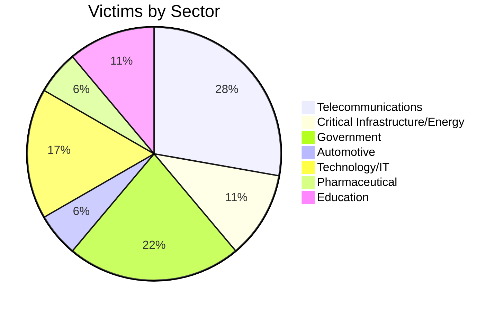
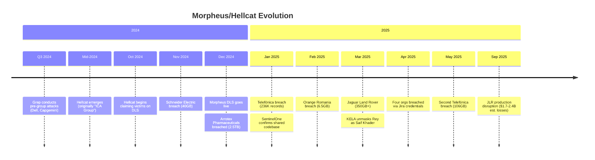

# Morpheus Ransomware - Threat Actor Profile

| **Report ID** | CTID-MORPHEUS-2025-001 |
|---------------|------------------------|
| **Date** | 2025-12-27 |
| **TLP** | TLP:AMBER |
| **Criticality** | HIGH |
| **Confidence** | HIGH |

---

## Executive Summary

[[Threat Actors/Morpheus]] is a ransomware operation that emerged in December 2024, operating on an identical technical foundation to [[Threat Actors/Hellcat]]—a confirmed shared codebase discovered by SentinelOne researchers in January 2025. This connection represents a significant threat intelligence finding: organizations defending against one operation must account for TTPs from both groups.

The groups have collectively compromised telecommunications giants (Telefónica, Orange Romania), critical infrastructure (Schneider Electric), and automotive manufacturers (Jaguar Land Rover) through a signature attack methodology exploiting stolen Atlassian Jira credentials harvested via infostealer malware. Despite Hellcat publicly denying any connection to Morpheus, forensic analysis revealed byte-for-byte identical code between ransomware payloads—strongly suggesting shared affiliates or a common builder application.

Morpheus operates as a semi-private Ransomware-as-a-Service (RaaS) with lower visibility than Hellcat, which functions as a transparent RaaS with active affiliate recruitment. Both operations are financially motivated with no identified nation-state sponsorship. The confirmed partial unmasking of Hellcat leadership provides defenders with actionable intelligence for attribution and detection.

---

## Key Points

- **Shared Codebase**: Morpheus and Hellcat ransomware payloads share identical code (~18KB 64-bit PE files) except for victim-specific contact information
- **Jira Exploitation Specialty**: Both groups primarily leverage stolen Atlassian Jira credentials from infostealer malware for initial access
- **High-Value Targeting**: Victims include Schneider Electric (40GB), Jaguar Land Rover (350GB+), Telefónica (total 342GB across two breaches)
- **Leadership Unmasked**: Hellcat operator "Rey" identified as Saif Khader from Amman, Jordan; "Pryx" partially identified as "Adem" from UAE
- **No Extension Modification**: Unlike most ransomware, neither operation modifies file extensions after encryption—a distinctive detection opportunity

---

## Assessment

Morpheus represents a semi-private ransomware operation that Very Likely (80-95% confidence) shares operational infrastructure with Hellcat based on confirmed identical codebase analysis. The group demonstrates sophisticated capabilities in credential harvesting, enterprise targeting, and double-extortion operations.

The operational tempo has accelerated significantly since emergence, with major breaches occurring monthly in Q1-Q2 2025. The signature Jira credential exploitation methodology distinguishes these actors from traditional vulnerability-focused ransomware groups, emphasizing the critical threat posed by infostealer malware in enabling initial access.

Morpheus maintains lower public visibility than Hellcat, suggesting either a more selective affiliate model or deliberate operational security measures. The transition of affiliated operators to [[Threat Actors/Scattered Spider]] suggests these threat actors will continue adapting tactics while leveraging proven infrastructure and affiliate networks.

---

## Threat Actor Summary

| **Attribute** | **Details** |
|---------------|-------------|
| **Primary Name** | Morpheus |
| **Aliases** | Great Morpheus |
| **Associated Groups** | Hellcat, Scattered LAPSUS$ Hunters |
| **Origin** | Unknown (Hellcat leadership: Jordan, UAE) |
| **Sponsorship** | None (financially motivated cybercrime) |
| **Motivation** | Financial (double extortion), stated anti-US/Israel ideology |
| **First Observed** | December 2024 |
| **Status** | Active |

### Hellcat Leadership (Linked Operations)

| **Persona** | **Real Identity** | **Origin** | **Status** |
|-------------|-------------------|------------|------------|
| Rey (Hikki-Chan, ggyaf, o5tdev) | Saif Khader | Amman, Jordan | Active |
| Pryx (HolyPryx, Sp1d3r) | "Adem" (partial) | UAE | Active; claims age 17 |
| Grep | Unknown | Unknown | Member |
| IntelBroker | Unknown | Unknown | BreachForums owner; affiliated |

---

## TTPs Narrative

Morpheus and Hellcat have developed a distinctive attack chain centered on Atlassian Jira exploitation. Rather than traditional CVE exploitation, the groups primarily leverage credentials stolen by commodity infostealer malware ([[Malware/LummaStealer]], Raccoon, StealC) from employee and contractor devices.

### Attack Sequence

The attack proceeds through five phases:

1. **Infostealer Deployment**: Commodity infostealers harvest Jira credentials from infected employee devices
2. **Initial Access**: Stolen Jira tokens enable legitimate authentication to enterprise Jira instances
3. **Privilege Escalation**: Escalation to admin/root within target environments
4. **Data Exfiltration**: SFTP-based exfiltration (sometimes to waifu[.]cat file hosting)
5. **Ransomware Deployment**: Double extortion with demands up to 32 BTC (~$3M USD)

### Multi-Stage PowerShell Infection Chain

The attack deploys through a sophisticated PowerShell chain:
- **S1.ps1** → Establishes persistence via registry Run key
- **Payload.ps1** → Secondary downloader
- **Isma.ps1** → AMSI bypass
- **Shellcode.ps1** → Reflective loader
- **Stager.woff** → [[Malware/SliverC2]] implant

When CVE exploitation occurs, the groups target [[Vulnerabilities/CVE-2024-0012]] (Palo Alto PAN-OS authentication bypass) and [[Vulnerabilities/CVE-2024-9474]] (PAN-OS privilege escalation).

---

## Infrastructure

### Data Leak Sites (Tor)

| **Operation** | **Onion Address** |
|---------------|-------------------|
| Hellcat DLS | `hellcakbszllztlyqbjzwcbdhfrodx55wq77kmftp4bhnhsnn5r3odad[.]onion` |
| Morpheus DLS | `izsp6ipui4ctgxfugbgtu65kzefrucltyfpbxplmfybl5swiadpljmyd[.]onion` |

### Associated Infrastructure

| **Type** | **Indicator** | **Context** |
|----------|---------------|-------------|
| IP Address | `45[.]200[.]148[.]157` | Open directory hosting payloads |
| IP Address | `185[.]247[.]224[.]8` | C2 infrastructure |
| IP Address | `185[.]10[.]68[.]159` | C2 infrastructure |
| IP Address | `154[.]16[.]16[.]189` | C2 infrastructure |
| Domain | `waifu[.]cat` | Exfiltration infrastructure |
| Domain | `pryx[.]pw` | Threat actor blog |
| Domain | `dangerzone[.]cx` | Cybercrime forum (operated by Pryx) |
| Domain | `hellcat[.]locker` | File service |

### Technical Characteristics

- Both payloads are ~18KB 64-bit PE executables
- Uses Windows BCrypt API for AES-256 encryption
- Excluded extensions: .dll, .sys, .exe, .drv, .com, .cat
- Excluded paths: \\Windows\\System32
- **No file extension modification** (distinctive characteristic)

---

## Victims

### Sector Distribution



### Geographic Focus

Primary targeting concentrates on the **United States and Israel** (explicit religious/political motivation stated by Pryx). European victims span France, Spain, Germany, UK, Romania, Poland, and Italy. APAC includes Australia; Middle East includes Iraq, Jordan, UAE, and Saudi Arabia.

### Notable Breaches

| **Victim** | **Date** | **Data Exfiltrated** | **Key Details** |
|------------|----------|----------------------|-----------------|
| Jaguar Land Rover | Mar 2025 | 350GB+ | Source code, 700+ internal documents |
| Telefónica (second) | May 2025 | 106.3GB | 385,311 files in 12-hour window |
| Ascom | Mar 2025 | ~44GB | Technical ticketing system |
| Schneider Electric | Nov 2024 | 40GB | 400,000 user rows; "$125K in baguettes" demand |
| Orange Romania | Feb 2025 | 6.5GB | 380,000 email addresses |
| Arrotex Pharmaceuticals | Dec 2024 | 2.5TB | Claimed by Morpheus |

---

## Campaign Timeline



---

## Attribution

| **Factor** | **Assessment** |
|------------|----------------|
| **Morpheus-Hellcat Link** | HIGH confidence - byte-for-byte identical code confirmed by SentinelOne |
| **Rey Identity** | HIGH confidence - KELA traced via infostealer infections on personal devices |
| **Pryx Identity** | MEDIUM confidence - partial identification as "Adem" from UAE |
| **Nation-State Sponsorship** | UNLIKELY - financially motivated with no state indicators |
| **Scattered Spider Connection** | MEDIUM confidence - Rey linked to Scattered LAPSUS$ Hunters |

---

## Key Intelligence Gaps

1. **Morpheus Leadership**: Operators remain anonymous despite shared codebase with Hellcat
2. **Builder Origin**: Unknown whether shared builder is sold, rented, or indicates organizational unity
3. **Full Affiliate Network**: Complete affiliate roster and operational relationships unclear
4. **Technical Evolution**: Limited samples prevent comprehensive capability analysis
5. **No CISA/FBI Advisory**: No official government advisory exists for either group

---

## MITRE ATT&CK Mapping

<details>
<summary>Complete MITRE ATT&CK Table (18 techniques)</summary>

| **Tactic** | **Technique** | **Procedure** |
|------------|---------------|---------------|
| Initial Access | T1566.001/Spear Phishing Attachment | Malicious email attachments for initial compromise |
| Initial Access | T1190/Exploit Public-Facing Application | Jira exploitation, CVE-2024-0012, CVE-2024-9474 |
| Initial Access | T1078/Valid Accounts | Infostealer-harvested Jira credentials |
| Execution | T1059.001/PowerShell | Multi-stage infection: S1.ps1 → Payload.ps1 → Isma.ps1 → Shellcode.ps1 → Stager.woff |
| Persistence | T1547.001/Registry Run Keys | "maintenance" value in HKCU\\Software\\Microsoft\\Windows\\CurrentVersion\\Run |
| Persistence | T1098.004/SSH Authorized Keys | New admin users with SSH backdoors |
| Privilege Escalation | T1068/Exploitation for Privilege Escalation | Elevation to root/admin levels |
| Defense Evasion | T1562.001/Disable or Modify Tools | AMSI bypass via isma.ps1 |
| Defense Evasion | T1620/Reflective Code Loading | In-memory SliverC2 shellcode execution |
| Defense Evasion | T1070.004/File Deletion | Self-deletion via _-_.bat post-encryption |
| Defense Evasion | T1036/Masquerading | PowerShell scripts disguised as executables |
| Discovery | T1046/Network Service Discovery | Netscan for target identification |
| Lateral Movement | T1021.004/Remote Services: SSH | SSH for lateral movement |
| Credential Access | T1555/Credentials from Password Stores | LummaStealer credential harvesting |
| Exfiltration | T1048/Exfiltration Over Alternative Protocol | SFTP as primary exfiltration method |
| Exfiltration | T1567/Exfiltration Over Web Service | MegaSync, Restic, waifu[.]cat |
| Impact | T1486/Data Encrypted for Impact | AES-256 via Windows BCrypt API |
| Impact | T1657/Financial Theft | Double extortion; demands up to 32 BTC |

</details>

---

## Indicators of Compromise

### File Indicators

| **Type** | **Value** | **Context** |
|----------|-----------|-------------|
| SHA1 | `f86324f889d078c00c2d071d6035072a0abb1f73` | Morpheus payload |
| SHA1 | `b834d9dbe2aed69e0b1545890f0be6f89b2a53c7` | Hellcat payload |
| SHA1 | `f62d2038d00cb44c7cbd979355a9d060c10c9051` | er.bat deployment script |
| Filename | `_README_.txt` | Ransom note (dropped in C:\\Users\\Public\\) |

### Network Indicators

| **Type** | **Value** | **Context** |
|----------|-----------|-------------|
| IP | `45[.]200[.]148[.]157` | Payload hosting |
| IP | `185[.]247[.]224[.]8` | C2 infrastructure |
| IP | `185[.]10[.]68[.]159` | C2 infrastructure |
| IP | `154[.]16[.]16[.]189` | C2 infrastructure |
| Domain | `waifu[.]cat` | Exfiltration |
| Domain | `hellcakbszllztlyqbjzwcbdhfrodx55wq77kmftp4bhnhsnn5r3odad[.]onion` | Hellcat DLS |
| Domain | `izsp6ipui4ctgxfugbgtu65kzefrucltyfpbxplmfybl5swiadpljmyd[.]onion` | Morpheus DLS |
| Email | `h3llr4ns[@]onionmail[.]com` | Hellcat contact |
| Email | `morpheus[@]onionmail[.]com` | Morpheus contact |

---

## CVEs Exploited

| **CVE** | **Product** | **CVSS** | **Context** |
|---------|-------------|----------|-------------|
| [[Vulnerabilities/CVE-2024-0012]] | Palo Alto PAN-OS | 9.8 | Authentication bypass |
| [[Vulnerabilities/CVE-2024-9474]] | Palo Alto PAN-OS | 7.2 | Privilege escalation |

---

## Detection and Hunting

### Sigma Detection Rules

| **Rule** | **ID** | **Description** |
|----------|--------|-----------------|
| Sliver C2 Service Installation | 31c51af6-e7aa-4da7-84d4-8f32cc580af2 | Detects malicious service from Sliver PsExec |
| AMSI Bypass Pattern | e0d6c087-2d1c-47fd-8799-3904103c5a98 | Detects isma.ps1 bypass patterns |

### Hunting Queries (KQL)

**Registry Persistence Detection:**
```kql
DeviceRegistryEvents
| where RegistryKey contains "\\Software\\Microsoft\\Windows\\CurrentVersion\\Run"
| where RegistryValueName == "maintenance"
```

**AMSI Bypass Indicators:**
```kql
DeviceEvents
| where ActionType == "PowerShellScriptBlockLogging"
| where AdditionalFields contains "amsiInitFailed" or AdditionalFields contains "[Ref].Assembly.GetType"
```

**Ransom Note Creation:**
```kql
DeviceFileEvents
| where FileName == "_README_.txt"
| where FolderPath contains "\\Users\\Public"
```

### Behavioral Indicators

- PowerShell downloading remote scripts from IP addresses
- Registry Run key additions with "maintenance" value name
- BCrypt API calls from PowerShell processes
- File creation without extension modification in bulk
- SFTP exfiltration to unknown destinations

---

## Probability Matrix

| **Scenario** | **Likelihood** | **Timeframe** |
|--------------|----------------|---------------|
| Continued Jira-focused targeting | Almost Certain (95-99%) | Ongoing |
| New vulnerability exploitation (beyond PAN-OS) | Very Likely (80-95%) | 3-6 months |
| Morpheus/Hellcat merger or consolidation | Likely (55-80%) | 6-12 months |
| Additional operator unmasking | Likely (55-80%) | 3-6 months |
| CISA/FBI joint advisory publication | Likely (55-80%) | 6 months |

---

## Intelligence Requirements

1. Monitor for new Morpheus/Hellcat samples to track technical evolution
2. Track Jira-related credential sales on underground forums
3. Monitor Dangerzone forum and BreachForums for affiliate recruitment
4. Assess connections between Hellcat leadership and other ransomware operations
5. Identify additional Morpheus operator personas through OPSEC failures

---

## Recommendations

1. **Patch Immediately**: Apply updates for Atlassian Jira and Palo Alto PAN-OS (CVE-2024-0012, CVE-2024-9474)
2. **Enable PowerShell Logging**: Event ID 4104 Script Block Logging and Constrained Language Mode
3. **Deploy EDR**: Solutions with behavioral detection for AMSI bypass and reflective code loading
4. **Network Segmentation**: Limit lateral movement potential
5. **Offline Backups**: Maintain regular offline, immutable backups
6. **Monitor Registry**: Watch Run keys for unauthorized persistence (especially "maintenance" value)
7. **Block IOCs**: Add known indicators to network perimeter controls
8. **Credential Hygiene**: Implement MFA for all Jira instances; monitor for credential exposure in infostealer logs

---

## Data Sources

- SentinelOne - Shared codebase analysis (January 2025)
- KELA Cyber - Rey unmasking investigation (March 2025)
- Picus Security - TTP analysis
- Bridewell - Hellcat group profile
- SOC Prime - Detection content
- Splunk Security Research - Analytics story
- InfoStealers.com - Jira exploitation methodology
- The Hacker News - Technical reporting

---

## References

KELA Cyber. (2025, March). *Hellcat hacking group unmasked: Investigating Rey and Pryx*. https://www.kelacyber.com/blog/hellcat-hacking-group-unmasked-rey-and-pryx/

SentinelOne. (2025, January). *HellCat and Morpheus: Two brands, one payload as ransomware affiliates drop identical code*. https://www.sentinelone.com/blog/hellcat-and-morpheus-two-brands-one-payload-as-ransomware-affiliates-drop-identical-code/

Picus Security. (2025). *HellCat ransomware: Exposing the TTPs of a rising ransomware threat in 2025*. https://www.picussecurity.com/resource/blog/hellcat-ransomware

Bridewell. (2025). *Who are Hellcat ransomware group?* https://www.bridewell.com/insights/blogs/detail/who-are-hellcat-ransomware-group

SOC Prime. (2025). *Detect Hellcat ransomware attacks*. https://socprime.com/blog/hellcat-ransomware-detection/

Splunk. (2025). *Analytics story: Hellcat ransomware*. https://research.splunk.com/stories/hellcat_ransomware/

---

## Related Intelligence

```dataview
TABLE 
    report_type as "Type",
    criticality as "Criticality",
    date as "Date"
FROM "Reports" OR "Threat Actors" OR "Campaigns"
WHERE contains(threat_actors, this.file.link) OR contains(malware, [[Malware/Ransomware/Morpheus Ransomware]]) OR contains(file.outlinks, this.file.link)
SORT date DESC
LIMIT 10
```

---

*Report generated: 2025-12-27 | Analyst: Claude | Classification: TLP:AMBER*
