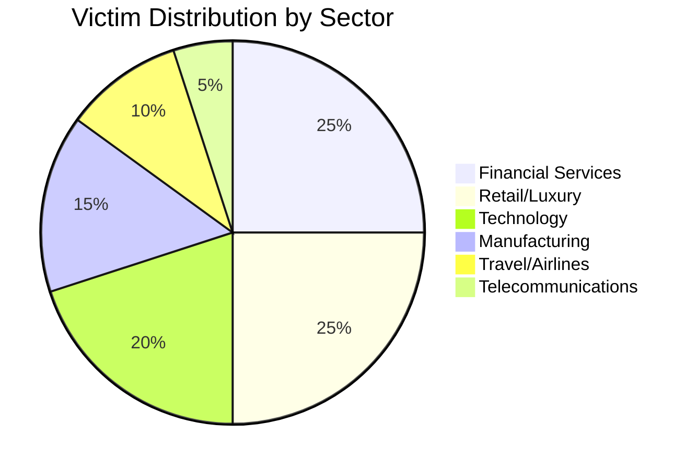

# Threat Actor Profile: Yuka (Yukari/Cvsp)

| **Report ID** | CTID-012-2025 |
|---------------|---------------|
| **Date** | December 28, 2025 |
| **TLP** | TLP:AMBER |
| **Criticality** | HIGH |
| **Confidence** | HIGH |

---

## Executive Summary

**Yuka** (also known as **Yukari**, **Cvsp**, **Yuki**, **yukimane**, and **yukafeet**) is a financially motivated threat actor assessed with high confidence to be a core member of the [[Threat Actors/ShinyHunters]] and [[Threat Actors/Scattered Spider]] cybercriminal collectives. This threat actor operates as an **initial access broker (IAB)**, **exploit developer**, and **SIM-swapping specialist** within the English-speaking cybercrime ecosystem known as "**The Com**."

Yuka is a central participant in the [[Threat Actors/SLSH|Scattered LAPSUS$ Hunters (SLSH)]] alliance, which emerged publicly in August 2025 and represents an unprecedented collaboration between three of the most prolific cybercriminal collectives of recent years: Scattered Spider, ShinyHunters, and [[Threat Actors/LAPSUS$]].

The threat actor's technical capabilities are significant, including the development and sale of zero-day exploits valued at over **$3 million USD** and active participation in the development of [[Malware/Ransomware/ShinySp1d3r]] ransomware. Yuka's targeting spans multiple sectors including financial services, manufacturing, telecommunications, luxury retail, and technology companies across North America, Western Europe, and Japan.

Organizations should consider Yuka and the broader SLSH alliance a **high-priority threat** given their demonstrated capability to compromise enterprise cloud environments (Salesforce, Snowflake, Okta), execute sophisticated social engineering campaigns using AI-powered voice tools, and deploy ransomware for maximum impact.

---

## Key Points

- **Core SLSH Member**: Yuka operates as a critical node within the Scattered LAPSUS$ Hunters alliance, providing technical capabilities (exploit development, SIM swapping) that complement Scattered Spider's social engineering and ShinyHunters' data exfiltration expertise

- **Exploit Developer**: Offered three zero-day exploits on BreachForums with combined asking prices exceeding $3 million (VMware ESXi VME: $1.3M, Outlook RCE: $1.7M, Windows LPE: $150K)

- **Multi-Vector Initial Access**: Leverages CVE-2021-35587 (Oracle Access Manager), AI-powered vishing campaigns, Okta SSO phishing, and SIM-swapping attacks to gain initial network access

- **Ransomware Developer**: Associated with ShinySp1d3r ransomware development, with Windows variants observed in the wild since November 2025

- **High-Value Targeting**: Victims include national banks, Japanese automakers, major airlines (Qantas, Air France-KLM), and luxury retail brands (Louis Vuitton, Dior, Chanel, Cartier, Tiffany & Co.)

- **Active and Unidentified**: Unlike several SLSH-affiliated actors, Yuka has not been publicly identified or arrested as of December 2025, indicating effective operational security

---

## Assessment

### Capabilities Assessment

We assess with **high confidence** that Yuka possesses advanced technical capabilities that place this threat actor among the more sophisticated operators within the cybercriminal ecosystem. The actor's demonstrated ability to develop zero-day exploits for high-value targets (VMware ESXi, Microsoft Outlook, Windows kernel) indicates substantial reverse engineering and exploit development expertise that exceeds the capabilities of typical cybercriminal actors.

Yuka's operational role within the SLSH alliance appears focused on three primary functions: (1) initial access acquisition through exploit deployment and credential theft, (2) SIM-swapping operations to bypass multi-factor authentication, and (3) technical support for the ShinySp1d3r ransomware-as-a-service operation. This division of labor maximizes the collective capability of the SLSH alliance.

### Evolution and Operational Tempo

The threat actor's activity has intensified significantly since mid-2024. The "Cvsp" persona first appeared on BreachForums in May 2024 offering zero-day exploits, while the "Yukari" alias became associated with ShinyHunters operations during the Snowflake breach campaign affecting 160+ organizations. By August 2025, Yuka had fully integrated into the newly-formed SLSH alliance, participating in coordinated attacks against Salesforce environments affecting at least 91 organizations.

The operational tempo suggests Yuka maintains consistent attack cadence, with new victims appearing regularly. The federation model employed by SLSH allows rapid reconstitution after law enforcement disruptions—when one Telegram channel is banned, another emerges within hours, enabling continuous operations.

### Strategic Significance

The emergence of SLSH represents a qualitative shift in the cybercrime landscape. We assess that this "cybercrime supergroup" combines:

- **Scattered Spider's** sophisticated social engineering and help-desk impersonation capabilities
- **ShinyHunters'** expertise in cloud data theft and extortion operations
- **LAPSUS$'s** reputation for aggressive insider recruitment and source code theft

Yuka serves as a technical enabler within this structure, providing exploits and initial access that allow other alliance members to execute their specialized functions. This federated model presents significant challenges for defenders as attribution becomes more complex and attack capabilities become more diverse.

---

## Threat Actor Summary

| Attribute | Details |
|-----------|---------|
| **Primary Alias** | Yuka |
| **Known Aliases** | Yukari, Cvsp, Yuki, yukimane, yukafeet |
| **Suspected Origin** | Unknown; English-speaking "The Com" network |
| **Active Period** | 2024 - Present |
| **Status** | **ACTIVE** |
| **Motivation** | Financial |
| **Sponsorship** | None (Cybercriminal) |
| **Group Affiliations** | ShinyHunters, Scattered Spider, SLSH, The Com |
| **Primary Role** | Initial Access Broker, Exploit Developer, SIM-Swapping Specialist |

---

## TTPs Narrative

### Initial Access Operations

Yuka employs multiple initial access vectors tailored to target environments:

**Voice Phishing (Vishing)**

The threat actor participates in sophisticated vishing campaigns characteristic of Scattered Spider operations. These attacks leverage:

- VoIP platforms including Twilio, Google Voice, and 3CX for call origination
- AI-powered voice synthesis tools (Vapi, Bland) to enhance social engineering
- Native English speakers impersonating IT help desk personnel
- Scripts designed to convince victims to authorize malicious connected applications or reset credentials

**Exploit Deployment**

Yuka has demonstrated capability to exploit CVE-2021-35587, a pre-authentication remote code execution vulnerability in Oracle Access Manager (CVSS 9.8). This vulnerability affects organizations using Oracle Fusion Middleware for single sign-on (SSO) functionality. Confirmed exploitation includes compromise of a national bank and Japanese automobile manufacturer in early 2024.

**SSO Phishing Infrastructure**

Since early 2025, Yuka has operated Okta SSO lookalike phishing pages to harvest enterprise credentials. Infrastructure patterns include:

- Domain registration through GMO Internet
- Privacy protection via PrivacyGuardian services
- VPN obfuscation using Mullvad VPN
- Domains mimicking target organization branding with Okta authentication themes

### Credential Access and Persistence

**SIM Swapping**

Yuka facilitates SIM-swapping attacks to bypass SMS-based multi-factor authentication. These operations involve social engineering or bribing telecommunications employees to transfer victim phone numbers to attacker-controlled SIM cards, enabling:

- Interception of SMS-based MFA codes
- Account recovery abuse
- High-value account takeover

**Cloud Application Manipulation**

Post-compromise activity focuses on manipulating cloud application permissions to maintain persistence and enable data exfiltration. In Salesforce environments, this involves abusing connected app authorizations to establish persistent API access that survives password resets.

### Data Collection and Exfiltration

Yuka and affiliated actors target cloud data repositories including:

- Salesforce customer relationship management systems
- Snowflake data warehouses
- Enterprise file shares and document repositories

Data exfiltration occurs via cloud APIs, with stolen data subsequently leveraged for extortion or sold on underground forums.

### Ransomware Operations

The ShinySp1d3r ransomware represents SLSH's entry into the ransomware-as-a-service market. Yuka's involvement in development is indicated by the ransomware's alignment with ShinyHunters' operational patterns. Current capabilities include Windows encryption; Linux/ESXi variants are anticipated.

---

## Infrastructure

### Operational Patterns

| Component | Details |
|-----------|---------|
| **VPN Provider** | Mullvad VPN (primary obfuscation) |
| **Domain Registrar** | GMO Internet |
| **Privacy Service** | PrivacyGuardian |
| **Communication** | Telegram (16+ channel iterations since August 2025) |
| **Forum Presence** | BreachForums (multiple accounts) |
| **VoIP Providers** | Twilio, Google Voice, 3CX |
| **AI Voice Tools** | Vapi, Bland |

### Command and Control

ShinySp1d3r ransomware C2 infrastructure remains under investigation. A placeholder data leak site has been identified:

```
hxxp://sh1nysp1d3rxyz123456789abcdefghijklmnopqrstuvwxyz[.]onion/
```

---

## Victims

### Sectoral Targeting



### Confirmed and Attributed Victims

| Sector | Organizations | Target Assets |
|--------|---------------|---------------|
| **Financial Services** | National banks, investment banking firms, payment processors | Cloud environments, SSO platforms, transaction data |
| **Retail/Luxury** | Adidas, Louis Vuitton, Dior, Chanel, Cartier, Tiffany & Co., Pandora | Salesforce instances, customer PII |
| **Technology** | Google, Cisco, Salesforce | Enterprise cloud applications |
| **Manufacturing** | Japanese automobile manufacturers | Production databases, OT/IT networks |
| **Travel/Airlines** | Qantas, Air France-KLM, Toyota | Customer databases |
| **Telecommunications** | Major telecom providers | Customer data, billing systems |

### Geographic Focus

| Region | Priority |
|--------|----------|
| United States | Primary |
| United Kingdom | Primary |
| Canada | Secondary |
| Australia | Secondary |
| Western Europe | Secondary |
| Japan | Secondary |

---

## Attribution

### Attribution Evidence

We assess with **high confidence** that the aliases Yuka, Yukari, and Cvsp represent the same individual based on:

| Evidence Type | Details | Weight |
|---------------|---------|--------|
| **Temporal Overlap** | Activity under all aliases occurs during consistent timeframes with no conflicting operations | High |
| **Technical Focus** | All aliases demonstrate consistent specialization in exploit development and initial access | High |
| **Forum References** | Multiple threat intelligence vendors correlate these aliases through forum activity analysis | High |
| **Operational Integration** | All aliases appear in SLSH-affiliated communications and operations | High |
| **TTP Consistency** | Social engineering techniques and infrastructure patterns remain consistent across personas | Moderate |

### Associated Personas

| Persona | Relationship | Status |
|---------|--------------|--------|
| **Rey** (Saif Al-Din Khader) | SLSH administrator; collaborates with Yuka | Identified (KrebsOnSecurity) |
| **ShinyCorp** | ShinyHunters leader; direct collaboration | Active |
| **Sevy** | SIM-swapping operations partner | Active |
| **Judische/Waifu** (Connor Moucka) | Previous collaborator (Snowflake breach) | Arrested (October 2024) |

### Location Assessment

Yuka's geographic location remains uncertain. While the actor operates within the English-speaking "The Com" network, some forum references suggest possible Russian connections for the "Cvsp" persona specifically. This assessment carries **low confidence** and requires additional collection.

---

## Key Intelligence Gaps

| Gap | Details | Collection Priority |
|-----|---------|---------------------|
| **True Identity** | Real-world identity remains unknown despite significant operational footprint | Critical |
| **Geographic Location** | Specific country/region of operation unconfirmed | High |
| **Age/Demographics** | Unknown if minor like other Scattered Spider/SLSH members | High |
| **Law Enforcement Status** | Current law enforcement attention or investigation status | High |
| **$500K Bounty Context** | August 2025 XMR bounty on "Yukari" - legitimate dispute or trolling | Medium |
| **Zero-Day Sales Outcome** | Whether listed exploits were sold or remain in possession | Medium |
| **Russian Affiliation** | Forum references to "Cvsp" as Russian require validation | Medium |
| **ShinySp1d3r Development Role** | Specific contribution to ransomware development vs. operations | Medium |

---

## MITRE ATT&CK Mapping

<details>
<summary>MITRE ATT&CK Techniques (14 techniques)</summary>

| Tactic | Technique ID | Technique Name | Procedure |
|--------|--------------|----------------|-----------|
| Reconnaissance | T1589 | Gather Victim Identity Information | Pre-compromise PII collection to support social engineering operations |
| Resource Development | T1588.005 | Obtain Capabilities: Exploits | Development and acquisition of zero-day exploits for VMware ESXi, Windows, Outlook |
| Resource Development | T1587.001 | Develop Capabilities: Malware | ShinySp1d3r ransomware development |
| Initial Access | T1566.004 | Phishing: Spearphishing Voice | AI-enabled vishing campaigns impersonating IT help desk staff |
| Initial Access | T1190 | Exploit Public-Facing Application | CVE-2021-35587 (Oracle Access Manager) exploitation for initial access |
| Initial Access | T1078 | Valid Accounts | Credential theft via phishing, SIM swapping, and help-desk social engineering |
| Credential Access | T1660 | SIM Swap | SIM-swapping attacks to bypass SMS-based MFA |
| Credential Access | T1557 | Adversary-in-the-Middle | Okta SSO phishing pages to intercept credentials |
| Persistence | T1098 | Account Manipulation | Manipulation of cloud application permissions and connected app authorizations |
| Defense Evasion | T1656 | Impersonation | Impersonating IT support staff during vishing operations |
| Collection | T1530 | Data from Cloud Storage | Exfiltration from Salesforce, Snowflake cloud environments |
| Exfiltration | T1567 | Exfiltration Over Web Service | Data theft via cloud APIs |
| Impact | T1486 | Data Encrypted for Impact | ShinySp1d3r ransomware deployment |

</details>

---

## Indicators of Compromise

### ShinySp1d3r Ransomware Hashes (Unit 42, November 2025)

<details>
<summary>File Hashes (9 indicators)</summary>

| Hash Type | Hash Value | Description |
|-----------|------------|-------------|
| SHA256 | `d12e44a6c04ab4cafda1471a1204fbe3b6f0d01ca4017e3d8ae13fa8870c7689` | ShinySp1d3r sample |
| SHA256 | `e41dd341f317cb674ff12c83a17365e5c5aa3240d912ab3801ff4cf09a00ccb2` | ShinySp1d3r sample |
| SHA256 | `50d18f4b11c5d9de7fc16cbc6ca71e65c5e8e9df7d8f3fb192565f035e5adf8a` | ShinySp1d3r sample |
| SHA256 | `670a269d935f1586d4f0e5bed685d15a38e6fa790f763e6ed5c9fdd72dce3cf2` | ShinySp1d3r sample |
| SHA256 | `9ff1051bd0fa917ffa3829e67f5e056ef467333bd2a1d2e11fe527484257932c` | ShinySp1d3r sample |
| SHA256 | `62dc6ed7c83769648b5c59ad9cc2a4e26daec96a952eb44c93fd45f2011a3444` | ShinySp1d3r sample |
| SHA256 | `e225da072f5664bac05e5553ce9707e00e6b4773a24451d836150be6ab0d3c66` | ShinySp1d3r sample |
| SHA256 | `285aadef3f3cdb367bd89ecbaaa698cc12cdf29fa38f03bfa064de54ab9c6a12` | ShinySp1d3r sample |
| SHA256 | `3bf53cddf7eb98d9cb94f9aa9f36c211a464e2c1b278f091d6026003050281de` | ShinySp1d3r sample |

</details>

### Network Indicators

| Type | Indicator | Context |
|------|-----------|---------|
| Onion | `hxxp://sh1nysp1d3rxyz123456789abcdefghijklmnopqrstuvwxyz[.]onion/` | ShinySp1d3r data leak site (placeholder) |

---

## CVEs Exploited

| CVE | Product | CVSS | Exploitation Status |
|-----|---------|------|---------------------|
| CVE-2021-35587 | Oracle Access Manager | 9.8 (Critical) | Confirmed in-the-wild exploitation by Yuka (2024) |

---

## Probability Matrix

| Term | Probability Range |
|------|-------------------|
| Almost Certainly | 95-99% |
| Very Likely | 80-95% |
| Likely | 55-80% |
| Roughly Even Chance | 45-55% |
| Unlikely | 20-45% |
| Very Unlikely | 5-20% |

---

## Intelligence Requirements

### Priority Intelligence Requirements (PIRs)

1. What is the true identity and location of the individual operating as Yuka/Yukari/Cvsp?
2. What is the current law enforcement status regarding SLSH alliance members including Yuka?
3. What zero-day exploits does Yuka currently possess that have not been publicly disclosed?

### Specific Intelligence Requirements (SIRs)

1. What organizations have been compromised using Yuka's Okta SSO phishing infrastructure?
2. What is the relationship between Yuka and Russian-speaking cybercriminal forums?
3. What is Yuka's specific role in ShinySp1d3r ransomware development and operations?
4. What additional telecommunications providers have been compromised to enable SIM-swapping operations?

---

## Feedback Section

This report was produced by the Threat Intelligence team. For questions, corrections, or additional intelligence on this threat actor, please contact the reporting analyst.

**Feedback Categories:**
- [ ] Accuracy - Factual corrections needed
- [ ] Completeness - Missing information identified
- [ ] Timeliness - Information outdated
- [ ] Actionability - Additional context needed for defensive action
- [ ] Other

---

## Data Sources

| Source Type | Sources |
|-------------|---------|
| Government Advisories | CISA AA23-320A (Scattered Spider) |
| Vendor Intelligence | EclecticIQ, Trustwave SpiderLabs, Unit 42, Resecurity, ReliaQuest, Obsidian Security, SOCRadar, KELA, Picus Security |
| OSINT | KrebsOnSecurity, The Hacker News, DataBreaches.Net, Hackread, CPO Magazine |
| Frameworks | MITRE ATT&CK |

---

## Threat Actor Metadata

| Field | Value |
|-------|-------|
| **Actor Name** | Yuka |
| **Aliases** | Yukari, Cvsp, Yuki, yukimane, yukafeet |
| **First Observed** | 2024 |
| **Last Observed** | December 2025 |
| **Status** | Active |
| **Motivation** | Financial |
| **Sophistication** | Advanced |
| **Resource Level** | Group-supported |
| **Primary Targets** | Financial Services, Retail/Luxury, Technology, Manufacturing |
| **Geographic Focus** | North America, Western Europe, Japan |
| **Associated Groups** | ShinyHunters, Scattered Spider, SLSH, LAPSUS$, The Com |

---

## References

CISA. (2023, November 16). *Scattered Spider* (Advisory AA23-320A). Cybersecurity and Infrastructure Security Agency. https://www.cisa.gov/news-events/cybersecurity-advisories/aa23-320a

EclecticIQ. (2025). *ShinyHunters Calling: Financially Motivated Data Extortion Group Targeting Enterprise Cloud Applications*. EclecticIQ Threat Research. https://blog.eclecticiq.com/shinyhunters-calling-financially-motivated-data-extortion-group-targeting-enterprise-cloud-applications

KELA. (2025). *Hellcat Hacking Group Unmasked: Rey and Pryx*. KELA Cyber Intelligence. https://www.kelacyber.com/blog/hellcat-hacking-group-unmasked-rey-and-pryx/

Krebs, B. (2025, November). *Meet Rey, the Admin of 'Scattered Lapsus$ Hunters'*. KrebsOnSecurity. https://krebsonsecurity.com/2025/11/meet-rey-the-admin-of-scattered-lapsus-hunters/

MITRE. (2024). *Scattered Spider, G1015*. MITRE ATT&CK. https://attack.mitre.org/groups/G1015/

Obsidian Security. (2025). *ShinyHunters and Scattered Spider: A Merger of Chaos in the 2025 Salesforce Attacks*. Obsidian Security Blog. https://www.obsidiansecurity.com/blog/shinyhunters-and-scattered-spider-a-merger-of-chaos-in-the-2025-salesforce-attacks

Picus Security. (2025). *Scattered LAPSUS$ Hunters: 2025's Most Dangerous Cybercrime Supergroup*. Picus Security Blog. https://www.picussecurity.com/resource/blog/scattered-lapsus-hunters-2025s-most-dangerous-cybercrime-supergroup

ReliaQuest. (2025). *Threat Spotlight: ShinyHunters Data Breach Targets Salesforce Amid Scattered Spider Collaboration*. ReliaQuest Blog. https://reliaquest.com/blog/threat-spotlight-shinyhunters-data-breach-targets-salesforce-amid-scattered-spider-collaboration/

Resecurity. (2025). *Trinity of Chaos: The LAPSUS$, ShinyHunters, and Scattered Spider Alliance Embarks on Global Cybercrime Spree*. Resecurity Blog. https://www.resecurity.com/blog/article/trinity-of-chaos-the-lapsus-shinyhunters-and-scattered-spider-alliance-embarks-on-global-cybercrime-spree

SOCRadar. (2025). *Dark Web Profile: Scattered LAPSUS$ Hunters*. SOCRadar Blog. https://socradar.io/blog/dark-web-profile-scattered-lapsus-hunters/

Trustwave SpiderLabs. (2025). *Scattered LAPSUS$ Hunters: Anatomy of a Federated Cybercriminal Brand*. Trustwave Blog. https://www.trustwave.com/en-us/resources/blogs/spiderlabs-blog/scattered-lapsuss-hunters-anatomy-of-a-federated-cybercriminal-brand/

Unit 42. (2025, November). *The Golden Scale: ShinySp1d3r Ransomware*. Palo Alto Networks. https://unit42.paloaltonetworks.com/new-shinysp1d3r-ransomware/

Unit 42. (2025, November 21). *IOCs for ShinySp1d3r Ransomware*. GitHub. https://github.com/PaloAltoNetworks/Unit42-timely-threat-intel/blob/main/2025-11-21-IOCs-for-ShinySp1d3r-ransomware.txt

---

## Related Intelligence

```dataview
TABLE created, report_type, confidence
FROM "Reports" OR "Threat Actors" OR "Campaigns"
WHERE contains(file.outlinks, this.file.link) OR contains(threat_actors, "[[Threat Actors/Yuka]]") OR contains(threat_actors, "[[Threat Actors/Scattered Spider]]") OR contains(threat_actors, "[[Threat Actors/ShinyHunters]]")
SORT created DESC
LIMIT 10
```

---

*Report generated: December 28, 2025*
*Classification: TLP:AMBER*
*Analyst confidence in overall assessment: HIGH*
